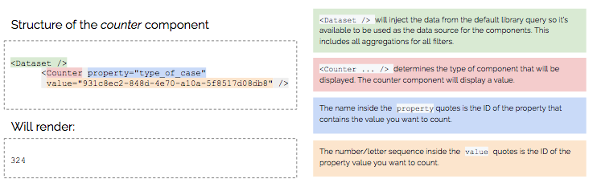
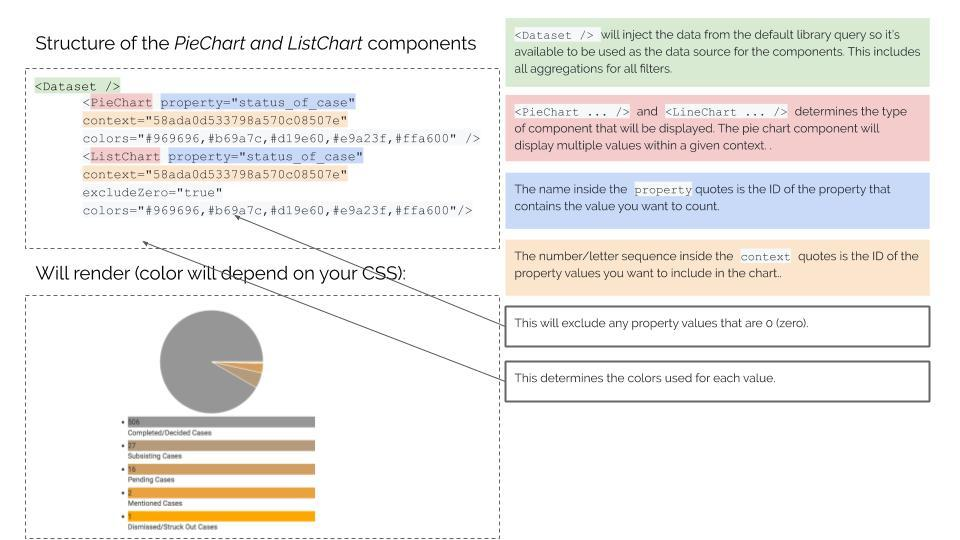
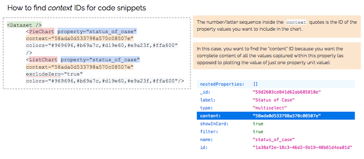
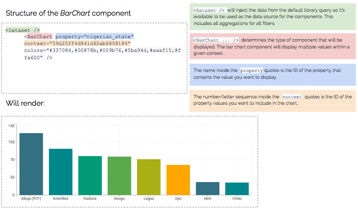
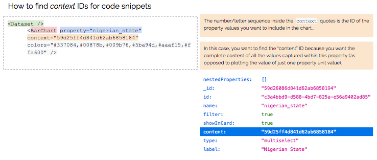
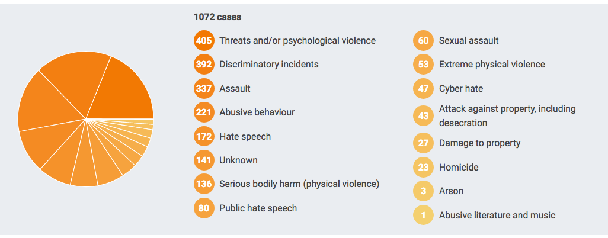
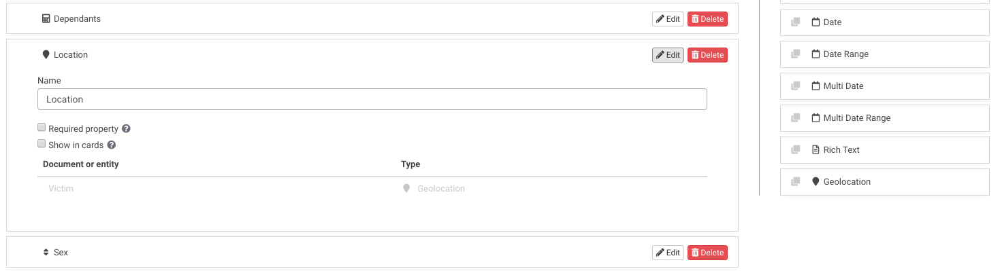
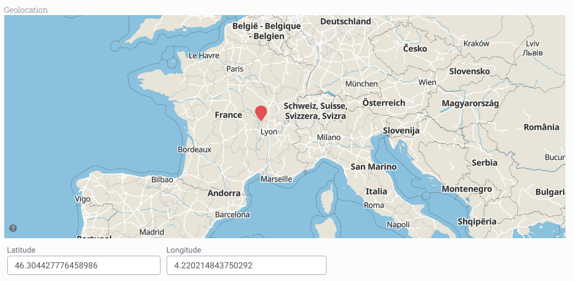

# ANALYSING & VISUALISING YOUR COLLECTION

## How to Access the API for Your Instance	

> An API allows one program to request data from another. API stands for application programming interface. An API provides you with data its programmers have made available to outside users.


The server has the data and sets the language, while the client uses that language to ask for information from the server. To make some of data available to the public, programmers "expose endpoints," meaning they publish a portion of the language they’ve used to build their program. Endpoints return text that’s meant for computers to read.
There are four types of actions an API can take:

- GET: requests data from a server — can be status or specifics (like last_name)
- POST: sends changes from the client to the server; think of this as adding information to the server, like making a new entry
- PUT: revises or adds to existing information
- DELETE: deletes existing information

You can access the API instructions and options for your Uwazi instance by adding _/api_ to the end of your URL, like this:[ https://yourinstancename.uwazi.io/api](https://yourinstancename.uwazi.io/api). Uwazi requires **authorization** for POST and DELETE actions. Uwazi does not require authorization for GET actions. Uwazi currently does not use PUT actions via the API.

These are a few examples of some endpoints that Uwazi currently offers:

| /search | /entities | /attachments |
| ------- | --------- | ------------ |
|         |           |              |

Additional notes regarding the /**entities** endpoint:

- The templateId parameter sent in GET /entities/count_by_template is the mongo \_id for a particular template type. For the time being, you could ask the API for templates (you can use [https://yourinstancename.uwazi.io/api/templates](https://yourinstancename.uwazi.io/api/templates)) and then get the \_id from those results. Alternatively, the ID is shown in the URL if you et:dit a particular template.

Additional notes regarding the /**search** endpoint:

- There is currently no maximum amount of results returned by GET /search. The search can return anywhere from 0 to all the documents. The default is 30 but the LIMIT property (as you can check by selecting 'load more' in the library) can be set to any number you wish. Higher numbers will take longer, be bigger and put extra toll on the server, so be careful.

Uwazi provides a list of "models" that describe the objects you have access to via the API:

|     |     |
| --- | --- |
|     |     |


## How to Build Data Visualisation Components	

You can add charts and other data visualisation elements to **pages** and **rich text fields**, using the code snippets explained below.

### Basic structure of a code snippet


### Counter component




### Pie chart and list chart components





### Bar chart component





### Examples of analysis and data visualisation

Just to give you an idea of what is possible in Uwazi, please take a look at some of the public projects that are documenting human rights violations for advocacy, but please note that these require some technical proficiency in working with HTML, CSS and Javascript.

- TGEU works with 5 ProTrans partners from Eastern Europe and Central Asia on monitoring violence and human rights violations against trans people in this region. [https://tgeu.uwazi.io/](https://tgeu.uwazi.io/)



- Justice Project Pakistan shares open source data sets based on existing research on death row and on age determination under the Juvenile Justice Systems Ordinance. This project marks the beginning of the process of making the information publicly available, allowing the public and academic institutions to generate their own findings and base their campaigns on verified data. [https://data.jpp.org.pk](https://data.jpp.org.pk)


## How to Display Your Information on a Map

> In Uwazi, there are two ways to display your information on a geographic map: by using the map toggle in the Uwazi library, and by using a map visualisation component in a page. These instructions will help you configure your information to include geographic data and display that geographic data on a map.

### Configure your information to include geographic data

Step 1: Open the entity template that you want to be displayed on a map.

Step 2: To configure this entity template to include geolocation coordinates, you can drag and drop the **Geolocation** property to the entity template.



Step 3: **Save** the template.

Step 4: Create a new entity of the type you just configured. Geographic coordinates can be set via map-click or manually typing the coordinates.



### Display your information using the map toggle in the Uwazi library

When the database has entities with geolocation properties, the map toggle button  will appear as an option in Uwazi's library. Filters and searches can be used to narrow down the information displayed in the map. Users can toggle the filter/search results between map and card list view.


The map will automatically group pins in clusters. Clicking on a map pin or one of the results in the cluster,will display the entity details in the right side panel. Clicking on a cluster will display list of the included geolocated entities:


### Display your information using a map visualisation component in a page

Step 1: In your Uwazi library, narrow down the information that you want to display in your map by selecting the filters on the right side panel. When you have finished narrowing down the collection of cards in the library, copy the URL from ".../library/…"

Step 2: Open the page that you want to display your map

Step 3: The code snippet you will need to include in the page starts with:

```jsx
<Dataset geolocation="true" />

<Map />
```

Step 4: Then you will add the URL snippet that you copied from the library:

```jsx
<Dataset url="/library/?q=(_types:!(%275bfbb1a0471dd0fc16ada146%27,%275d2d9f4622220717a93dbfcd%27),limit:0,order:desc,sort:creationDate,types:!(%275bfbb1a0471dd0fc16ada146%27,%275d2d9f4622220717a93dbfcd%27))" geolocation="true" />

<Map />
```

Renders:


 ## How to Configure EntityInfo Components

> EntityInfo is a collection of data visualization components that allows an entity’s information to display by opening the side panel and loading its data inside. It assigns that flow to the "click" event of whatever tag element you define. The default is a DIV, but you can configure this to a button or any other element. (Note: This requires programming knowledge.)

EntityInfo allows you to create any HTML element (and HTML children) in a custom page. That element is assigned an _onClick_ event. That click opens the side panel and displays that entity’s info on the panel. It mimics the behavior of clicking a Card in the library: the entity’s info is shown on the side panel.

This component allows you to leave the design to the page coder, so there are no styles applied. You can turn this into a button, it could be an entire section of the page, or even an area inside a graph. You decide where to use it and Uwazi provides the "click" functionality.

```jsx
<EntityInfo entity="entitySharedId" tag="div" classname="classes">More Info</EntityInfo>
```

Creates an HTML element of the type described in tag ("div" is default and can be omitted) bound to a "click" event that will load and display in the side panel, the info of the entity described in the "entity" property. The element allows further HTML structure inside, which allows you to tailor the 'button' look however you want.

### Query component

This component allows you to do API request to fetch data you may need and expose it in a react [context](https://reactjs.org/docs/context.html) ([https://reactjs.org/docs/context.html](https://reactjs.org/docs/context.html)) for that page, for example:

```jsx
<Query name="entities" url="search?limit=10&order=desc&sort=creationDate"/>
```

Will search for the last 10 entities created and will store them in the "entities" dataset to be consumed. You can access this dataset with Value or Repeat for example.

## Value component

This component prints the value in a given path of the context . For example:

```jsx
<Query name="entities" url="search?limit=10&order=desc&sort=creationDate"/>
<Value path="entities.rows.0.title"/>
```

This example will request 10 entities and then print the title of the first one.

Repeat component

The purpose of this component is to iterate over data in the context and print its contents for each entry, for example:

```jsx
<Query name="entities" url="search?limit=10&order=desc&sort=creationDate"/>

<ul>
<Repeat path="entities.rows">
     <li><Value path="title"/></li>
</Repeat>
</ul>
```

### EntityLink component

This component will generate a link to the correct entity viewer based on a given entity property.

```jsx
<Query name="entities" url="search?limit=10&order=desc&sort=creationDate"/>

<ul>
<Repeat path="entities.rows">
    <li>
         <EntityLink><Value path="title"/></EntityLink>
    </li>
</Repeat>
</ul>
```

### EntityLink implementation

Right now EntityLink is a very basic component that expects an Entity object in the property key "entity" to generate a Link to that Entity. Because of this reason, when used in the Pages it needs to be wrapped in a Value component that is connected to the context and passes the entity down, like in the example:

```jsx
<Value propkey="entity"><EntityLink>Some text</EntityLink></Value>
```
