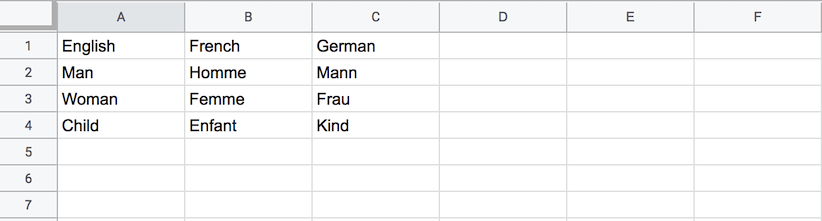
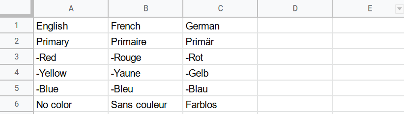

# Building Your Information Architecture

## How to create templates

An Uwazi collection is made up of types of information called **Entities** that live in the **Library** . An entity has **Properties**, can hold **Primary Documents** and/or **Supporting Files**, and can have **Relationships** to other entities. Before you can create an entity in the **Library**, you must create a **Template** for it, which gives an entity a standardised structure.

To create a template:

Step 1: Navigate to the **Settings**  area and click on **Templates**.

Step 2: Click on the **Add template** button.

Step 3: Name your template and select a color for it. The combination of the name and color will be used to label entities that utilise this template in the **Library** .

Step 4: On the right side of the screen is a list of **Properties**. Drag and drop one property at a time onto the template, or click on the plus icon to add the property.

Step 5: For each property, click **Edit** and give it a **Name** or **Label**. Configure any necessary settings required for the particular property in question. Be sure to review the other options available for the property, which may include the following:

- **Priority sorting** means that this property will be used as default sorting criterion in the **Library**.
- **Generated ID** in the **Name** property means that Uwazi will assign an automatically generated unique ID code as the name of the entity.
- **Select List**: For **Select** and **Multiselect** properties, you must choose which **Thesaurus** will be used for this property.
- **Hide label** means that this property will be displayed without its **Name** or **Label**.
- **Required property** will prevent the entity from being saved if this property isn’t filled in.
- **Show in cards** means that when the entities in the **Library** are viewed as cards, this property will be displayed on the card, making it visible without having to click on an entity to see it in its entirety.

:::{note}
  The cards in the **Library** will also show a person’s current sorting criterion even if that property is not configured to **Show in cards**. For example, this happens frequently with the **Date added** property, which is the default sorting criterion in the **Library**. When the cards are sorted by the date they were added, the **Date added** property is visible in the cards to demonstrate why the cards are in their current order.
:::

- **Use as filter** makes it possible to use this property as a filter in the **Library**. When someone visits the **Library** and selects the corresponding type of template among the **Primary Filters** in the **Library**’s sidebar, the option to further filter all of the entities by this property will then appear. [Learn more about how to configure filters](organising-your-collection.md#configuring-and-using-the-filters-sidebar-in-the-library).
- **Default filter** makes it so the property always shows as a filter in the **Library**’s sidebar by default, no matter if the corresponding type of template among the **Primary Filters** is selected or not.
- **Full width** will show this property using the full width available (applies to **Media**, **Image**, and **Preview** properties).

Step 6: Remember to click on **Save** after creating or making changes to each template.

:::{note}
If you intend to add your entities in bulk using CSV import, remember that the property names on these templates must match the property names in the CSV file. [Learn more about CSV import](working-with-entities-in-your-collection.md#how-to-add-entities-in-bulk-with-csv-import).
:::

## Understanding properties

**Properties** are descriptive attributes that are assigned to entities. All entity templates include three default properties: **Name**, **Date added** and **Date modified**. The rest are up to you. You can add as few or as many as you wish. Each property that you add to your template will provide a consistent space to include details about the entity.

There are several types of properties available, including:

-  Plain text
-  Numeric
-  Select (can be configured as a single select or multiple select; each requires a **Thesaurus**)
-  Relationship (to create connections between this type of entity and another type)
-  Date (can be configured as single date, multiple date, single date range or multiple date range)
-  Rich text
-  External link
-  Image (to attach an image)
-  Preview (to display a thumbnail image of the first page of a **Primary Document**)
-  Media (to embed video or audio)
-  Geolocation (to add latitude and longitude coordinates that can be displayed on a map)
-  Generated ID (to assign an automatically generated unique ID code to each entity)

Some properties are a bit more complex and/or require extra steps to configure them correctly. These include **Select**, **Geolocation**, **Relationships** and **Generated ID**.

## Select property

A **Select** property allows you to assign a single attribute or multiple attributes to your entity from a dropdown list of predefined terms. Before you can complete the configuration of a **Select** property to a template, you must create your list of predefined terms. In Uwazi, this list of terms is called a **Thesaurus**.

### How to create thesauri

Step 1: Navigate to the **Settings**  area and click on **Thesauri**. Here you will see all the **Thesauri** that have been created so far.

Step 2: Click on the **Add thesaurus** button.

:::{note}
You will also see the **Add thesaurus** button as an option when editing an entity template. Here, you can quickly create, name and save a **Thesaurus**, but you can only add terms to the **Thesaurus** later by navigating to the **Settings**  area, clicking on **Thesauri** and clicking the **Edit** button next to the **Thesaurus** you wish to edit.
:::

Step 3: Name your **Thesaurus**.

Step 4: Add terms to your **Thesaurus** by typing them in the spaces provided.

Step 5: Organise your **Thesaurus**. There are three main ways to organise the terms on your list:

1. Moving items around by dragging and dropping.

2. Clicking the **Sort** button to order the items alphabetically.

3. Grouping certain terms together. Click on the **Add group** button. Give the group a name. Underneath the name, you can add terms by typing them in the spaces provided.

Step 6: When you have finished, click **Save**.

### How to import thesauri from a CSV file

It may be that you have a list of terms already prepared that you would like to include in a **Thesaurus**. Typing the terms one by one could become tedious, so for situations such as these, Uwazi makes it possible to upload in bulk by preparing and then importing a comma-separated values (CSV) file. This import feature can be used to add terms to new or existing **Thesauri**.

Step 1: Create a CSV file on your computer:

- If you only have one language configured in your instance, then you should only have one column in your file. The column label should be the name of the language written in English (e.g., English, Russian, Spanish).
- If you have more than one language configured in your instance and you want to import a list of terms at the same time as their corresponding translations, then each language should have its own separate column. Use the name of the language written in English (e.g. English, Russian, Spanish).

:::{note}
If your CSV file has columns for languages that are not configured in your Uwazi instance, they will be ignored. [Learn more about enabling different languages in Uwazi](translating-your-collection.md#how-to-configure-the-available-languages-for-your-collection).
:::

Step 2: Populate the CSV file with the terms. Each term should occupy its own row.

If your **Thesaurus** is a simple list of terms without any hierarchy (i.e. there are no groupings of terms), your CSV file should look like the sample below when viewed as plain text:

```text
English,French,German
Man,Homme,Mann
Woman,Femme,Frau
Child,Enfant,Kind
```

And here’s the same file viewed in a spreadsheet program:



If your **Thesaurus** includes a hierarchy (i.e. there are groupings of terms), your CSV file must follow a different format: list the group name, then immediately follow it by the terms that belong to that group, with those terms prefixed by a hyphen (-).  

For example, imagine you have a list about colors that includes the terms “Primary” and “No Color”. As it turns out, “Primary” encompasses more than one color, so “Primary” is a parent term that groups together three other terms: “Red”, “Yellow” and “Blue”. “No Color”, however, does not group together any other terms; it stands alone. A CSV file viewed as plain text for this example list of terms would look like the following:

```text
English,French,German
Primary,Primaire,Primär
-Red,-Rouge,-Rot
-Yellow,-Yaune,-Gelb
-Blue,-Bleu,-Blau
No color,Sans couleur,Farblos
```

And here’s the same file viewed in a spreadsheet program:



:::{warning}
In all cases, avoid including duplicate values in the same column, as this will cause a validation error and prevent the import from working successfully.
:::

Step 3: Save the CSV file in UTF-8 format on your computer.

Step 4: Navigate to the **Settings**  area and click on **Thesauri**. Click on the **Add thesaurus** button and give the **Thesaurus** a name. Alternatively, if you would like to add to an existing **Thesaurus**, click the **Edit** button next to it.

Step 5: Click the **Import** button. Using the file browser to navigate your computer’s storage, find and select the CSV file. Once the import has finished, the terms will appear in the **Thesaurus**.

Step 6: Click the **Save** button.

:::{note}
If you imported more than one language, navigate to the **Settings**  area and click on **Translations**. Click on the **Thesaurus** name, and you will see all the terms and their translations that have been imported. [Learn more about translating an Uwazi collection](translating-your-collection.md).
:::

### How to configure a select property

Step 1: Once you have created your **Thesaurus**, navigate to the **Settings**  area and click on **Templates**. Locate the template to which you want to add a **Select** property and click **Edit**.

Step 2: Drag and drop the **Select** property from the right side of the screen into the template, or add it by clicking on the plus icon next to the property.

Step 3: Click **Edit** and give the property a **Name** or **Label**. Next, identify the **Type** of **Select** property. To allow a single attribute to your entity, chose **Single select**. To allow multiple attributes, choose **Multiple select**. Then, choose the **Thesaurus** that you want to reference in this property from the **Thesauri** dropdown.

:::{note}
If you have not already created a relevant **Thesaurus** in advance, you can create one at this stage by clicking the **Add thesaurus** button at the bottom of the screen. When you click the button, a pop-up will appear where you can directly label and create a **Thesaurus**. Once you click **Save**, the new **Thesaurus** will appear in the **Thesauri** dropdown on the **Select** property. After finishing configuring this property, you can go back to the **Settings** area, click **Thesauri** and add relevant items to the **Thesaurus** you just created.
:::

Step 4: Review the other options for the property as explained previously in this chapter, such as “Use as filter” or “Hide label”. When you have finished, click **Save**.

:::{note}
If you are an **Admin** user, you can add terms to an already existing **Thesaurus** while browsing entities in the **Library** without going into the **Settings** area. Choose the entity you want to review and click the **Edit** button at the bottom of the screen. Below every **Select** property within the entity, you will see an **add value** option. Once you click **add value**, a pop-up will appear where you can directly add a term to the **Thesaurus** that is linked to the property. Once you click **Save**, you can go back to the **Settings** area, click **Thesauri** and see the new term now incorporated into the **Thesaurus**.
:::

## Media property

The **Media** property allows you to embed an audio or video file to an entity. If you have a media file saved in your device, you can directly upload it under your media property. If you want to upload a media URL from external platforms, you can add the URL to your media property.

### How to add timelinks to media files

In Uwazi, you can add timelinks to your media file so that users can quickly jump to specific parts of the file.

Step 1: Create a media property in your template.

Step 2: Add a media file to your entity by clicking the **Add file** button under the media property. A pop-up will appear where you can add your media file, and you can upload your media file in two ways.

- If you want to add a media file saved in your device, click **Select from computer** button. Choose your media file and click **Save**.

- If you want to add a media URL from an external platform, simply copy and paste the URL in the **Paste URL here** box and click the **Add from URL** button.

Once you save your media file, click the Edit button to add timelinks to your file.

Step 3: Navigate to the specific part of your media file where you want to add a time link. There is an **Add timelink** button right below your media file. When you click on the **Add timelink** button, the time will automatically be stamped and added to the timelink list below the media file. You can also manually type the timestamps to add a timelink.

Step 4: Label your timelink by entering a title in the list.

Step 5: Click the Save button.

## Geolocation property

The **Geolocation** property allows you to add latitude and longitude coordinates to an entity, which can then be displayed as a point on a map. An entity template can have multiple **Geolocation** properties. Depending on the order in which they appear on the template, these geolocation points can be displayed separately on their own individual maps or together in one combined map within the entity.

### How to display multiple geolocation properties on separate maps within the same template

Step 1: Navigate to the **Settings**   area and click on **Templates**. Locate the template to which you want to add Geolocation properties and click **Edit**.

Step 2: Drag and drop the **Geolocation** property from the right side of the screen into the template, or add it by clicking on the plus icon next to the property.

Step 3: Click **Edit** and give the property a **Name** or **Label**. Review the other options for the property as explained previously in this chapter, such as “Use as filter” or “Hide label”.

Step 4: Repeat the above process until you have created all of the geolocation properties that you want.

Step 5: Using the drag and drop function, move the geolocation properties around so that they are not adjacent to each other on the template. In other words, they should be separated by one or more other non-geolocation properties.

This ensures that each geolocation property will display on its own separate map, each labeled with the **Name** or **Label** that you have given it.

Step 6. When you have finished, click **Save**.

### How to display multiple geolocation properties on one combined map within the same template

Step 1: Navigate to the **Settings**  area and click on **Templates**. Locate the template to which you want to add geolocation properties and click **Edit**.

Step 2: Drag and drop the **Geolocation** property from the right side of the screen into the template, or add it by clicking on the plus icon next to the property.

Step 3: Click **Edit** and give the property a **Name** or **Label**. Review the other options for the property as explained previously in this chapter, such as “Use as filter” or “Hide label”.

Step 4: Repeat the above process until you have created all of the geolocation properties that you want.

Step 5: Using the drag and drop function, move the geolocation properties around so that they are all adjacent to each other on the template. In other words, they should not be separated by any other non-geolocation properties placed between them.

When geolocation properties are ordered one after the other, they will display on one map labeled **Combined Geolocations**.

Step 6. When you have finished, click **Save**.

## Relationship property

A **Relationship** property allows you to create a connection to another entity template. The connection can be basic, such that it points in general to a different template. The connection can also be more complex, such that it inherits a specific property from another template.

Before you can complete the configuration of a **Relationship** property, you must first create the **Relationship Type** that will be used to define the nature of the connection.

### How to create relationship types

Step 1: Navigate to the **Settings**  area and click on **Relationship types**.

Step 2: Click on the **Add relationship type** button. Give the **Relationship type** a descriptive name.

:::{note}
You will also see the **Add relationship type** button as an option when editing an entity template. Here, you can quickly create, name and save a **Relationship Type**. Later on, if you navigate to the **Settings** area  and click on **Relationship types**, you will see it listed there.
:::

Step 3: Click **Save**.

### How to configure a basic relationship property

Step 1: Once you have created the **Relationship Type**, navigate to the **Settings**  area and click on **Templates**. Locate the template to which you want to add a **Relationship** property and click **Edit**.

Step 2: Drag and drop the **Relationship** property from the right side of the screen into the template, or add it by clicking on the plus icon next to the property.

Step 3: Click **Edit** on the newly added property, and give it a descriptive **Name** or **Label**.

Step 4: Using the dropdown list called **Relationship\***, select the **Relationship Type** that you would like to use as part of this property. (The * indicates that it is mandatory.)
:::{note}
If you have not already created a relevant **Relationship Type** in advance, you can create one at this stage by clicking the **Add relationship type** button at the bottom of the screen. When you click the button, a pop-up will appear where you can directly label and create a **Relationship Type**. Once you click **Save**, the new **Relationship Type** will appear in the **Relationship** dropdown.
:::

Step 5: By default, the property will allow you to create a connection to any entity template (option **Any entity or document**). However, you also have the option to restrict a connection to only entities that use one specific template. To do so, click on the **Entities** dropdown list and select whichever template you want.

:::{note}
The dropdown won’t contain the template that is currently being edited. [Learn more about how to connect entities of the same template](organising-your-collection.md#how-to-create-relationships-between-entities-in-the-information-hub).
:::

Step 6: Review the other options for the property as explained previously in this chapter, such as “Use as filter” or “Hide label”. When you have finished, click **Save**.

Now, whenever you create a new entity using the template that includes this **Relationship** property, you will be presented with a multiselect list of all the existing entities in your collection which meet the criteria that you have configured (i.e. a connection to another specific template or a connection to **Any entity or document**). Simply select the relevant existing entity (or entities) from the list, and then its **Name** property will be displayed as part of the new entity’s metadata.

:::{note}
You can also establish a basic connection on an ad hoc basis between entities by creating a Relationship directly in the Information Hub of an entity (without utilising the Relationship property). [Learn more](organising-your-collection.md#how-to-create-relationships-between-entities-in-the-information-hub).
:::

### How to configure a relationship property that inherits a property from another template

If you would like to configure a **Relationship** property that inherits a property from another template, you can follow [the previously explained process for configuring a basic Relationship property](#how-to-configure-a-basic-relationship-property) with a few modified or additional steps:

Step 5 modified: By default, the property will allow you to create a connection to any entity template (**Any entity or document**). However, in order to activate the more advanced option of inheriting properties from another template, you must specify the template from which you want to inherit. To do so, click on the **Entities** dropdown list and select the relevant template.

Step 6 modified: If you choose a specific template in the previous step, another option will automatically appear: a checkbox called **Inherit property**. Tick the box and a dropdown will appear containing all of the properties contained within the other template that you have selected. Choose a property from the list to inherit. Be sure to also review the other options for the property as explained previously in this chapter.

Step 7: Review the other options for the property as explained previously in this chapter. When you have finished, click **Save**.

Now, whenever you create a new entity using the template that includes this **Relationship** property, you will be presented with a multiselect list of all the existing entities in your collection which meet the criteria that you have configured (i.e. a connection to another specific template that inherits one of that template’s specific properties).

Simply select the relevant existing entity (or entities) from the list, and then the property that you have chosen to inherit will be displayed as part of the new entity’s metadata.

### How to configure a relationship property that inherits multiple properties from another template

If you would like to configure a **Relationship** property that inherits multiple properties from another template, you can follow the [previously explained process for configuring a basic relationship property](#how-to-configure-a-basic-relationship-property) with a few modified or additional steps:

Step 5 modified: By default, the property will allow you to create a connection to any entity template (**Any entity or document**). However, in order to activate the more advanced option of inheriting properties from another template, you must specify the template from which you want to inherit. To do so, click on the **Entities** dropdown list and select the relevant template.

Step 6 modified: If you choose a specific template in the previous step, another option will automatically appear: a checkbox called **Inherit property**. Tick the box and a dropdown will appear containing all of the properties contained within the other template that you have selected. Choose a property from the list to inherit. Be sure to also review the other options for the property as explained previously in this chapter.

Step 7: Repeat the above process as many times as needed: add another **Relationship** property to the template, ensuring that it is configured with the same template from the **Entities** dropdown list and the same **Relationship Type** as previously selected.

Step 8: When you have finished, click **Save**.

Now, whenever you create a new entity using this template, within each of these **Relationship** properties you will be presented with a multiselect list of all the existing entities in your collection which meet the criteria that you have established (i.e. a connection to another specific template that inherits one of that template’s specific properties).

Select the relevant existing entity (or entities) from the list contained within whichever **Relationship** property happens to appear first. Once you do, the same entity (or entities) will also be automatically selected on the other **Relationship** properties.

:::{note}
When you inherit multiple properties in this way, any changes made to one of the **Relationship** properties of an entity that utilises this template will affect the other **Relationship** properties on this template that share the same connection. For example, if you untick a particular entity within one **Relationship** property, it will also automatically be unticked in the other **Relationship** properties. This is because you have ultimately created one connection with multiple inheritance of properties, instead of multiple separate connections.
:::

Once you save the new entity, the properties that you have chosen to inherit will then be displayed as part of the new entity’s metadata.

### When to inherit properties from other entities

Depending on how you have chosen to structure your collection (in other words, your data model), it can be useful for one entity to inherit a property from another entity because it prevents you from having to enter the same information over and over again.

Here’s a simple example: Imagine that there is a type of entity template in your collection called Country. This entity includes all sorts of details about individual countries, including their geolocation on a map.

Now, imagine that you want to create another type of entity template called Person. You want this template to include all sorts of details about individual people, including the geolocation of their country of birth on a map.

The geolocation of countries is information that already exists in your collection – as a property on the Country entity template – so you can opt to “inherit” it by setting up a connection between the Person template and the Country template. You would do so by following the steps outlined in the previous section:

- Define the **Relationship Type** (e.g. “Country geolocation”)
- Add a **Relationship** property to the Person template
- Select the previously defined **Relationship Type** from the dropdown list
- Select the Country template from the **Entities** dropdown list
- Select the **Inherit Property** checkbox
- Choose the **Geolocation** property to inherit

From this point on, whenever you create a new Person entity in the future, you will be able to select which specific Country entity – from among all of the Country entities in your collection – is connected to the person. Simply select the relevant country and click Save. By doing so, the new Person entity will include the same Geolocation information that is already found on the selected Country entity.

## Generated ID property

Adding a **Generated ID** property to a template means that any time an entity is created using that template, Uwazi will assign it an automatically generated unique ID code. Depending on the configuration you choose, the **Generated ID** can be just another property on the template or it can take the place of the template’s default text-based **Name** property.

### How to add a generated id property to a template

[Follow the steps for creating an entity template and adding properties](#how-to-create-templates) as explained previously in this chapter. **Generated ID** will appear among the property options listed on the right side of the screen. When finished, click **Save**.

### How to use a generated id as the name/title of an entity

[Follow the steps for creating an entity template](#how-to-create-templates) as explained previously. In the **Name** property, select the checkbox **Generated ID** to activate the option. When finished, click **Save**.
:::{note}
You do not have to add a separate **Generated ID** property for this feature to work. If you do add a separate **Generated ID** property, each entity that you create using this template will consequently have two different unique ID codes assigned to it.
:::
