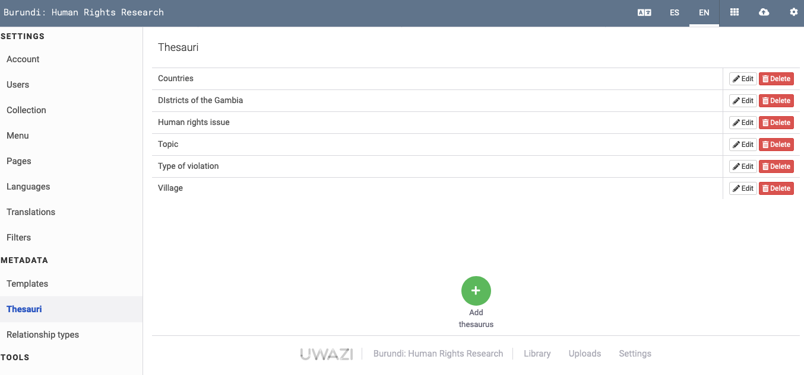

# BUILDING YOUR INFORMATION ARCHITECTURE

## How to create templates and add properties

An Uwazi collection is made up of types of information called entities that live in the Library . But before you can add an entity, you must create a template for it. A template gives an entity a standardised structure. It contains metadata properties of various formats, including: 

- Plain text 
- Numeric 
- Single select dropdown (requires a **Thesaurus**) 
- Multiselect dropdown (requires a **Thesaurus**) 
- Date, date range, multi date, multi date range 
- Rich text 
- Geolocation 
- External link 
- Image and media (to embed image, video or audio) 
- Relationship (to create connections between this type of entity and another type) 
- Preview (to display a thumbnail image of the first page of a **Primary Document**)  
- Generated ID (to assign an automatically generated unique ID code to each entity)

### Add different properties to a template

All templates include three default properties: Title (Name), Date Added and Date Modified. The rest are up to you! You can add as few or as many as you wish. Each property that you add to your template will provide a consistent space to include details about the entity.

Step 1: Navigate to the **Settings** area and click on **Templates**. 

Step 2: Click on the green **Add Template** button.

Step 3: Name your template and select a color for it.

Step 4: On the right side is a list of **Properties**.  Drag and drop one property at a time onto the template or click on the + icon to add the property. 

Step 5: For each property, click **Edit** and give it a **Name** or **Label**. Review the other options for the property, which may include the following: 

- **Priority sorting** means that this property will be used as default sorting criterion in the Library.
- **Generated ID** in the Title property means that Uwazi will assign an automatically generated unique ID code as the title of the entity. 
- **Select list**: For Select and Multi Select properties, you must choose which **Thesaurus** will be used for this property. 
- **Hide label** means that this property will be displayed without its name or label. 
- **Required property** will prevent the entity from being saved if this property isn’t filled in.
- **Show in cards** means that when the entities in the Library are viewed as cards, this property will be displayed on the card, making it visible without having to click on an entity to see it in its entirety.
  - Note: the cards in the Library will also show a person’s current sorting criterion even if that property is not configured to “Show in cards.” For example, this happens frequently with the “Date added” property, which is the default sorting criterion in the library. When the cards are sorted by “Date added,” the “Date added” property is visible in the cards to demonstrate why the cards are in their current order. 
- **Use as filter** makes it possible to use this property as a  filter in the Library. When someone visits the Library and selects the corresponding type of template among the main filters in the Library’s sidebar, the option to further filter all of the entities by this property will then appear. Learn more about how to configure filters.
- **Default filter** makes it so the property always shows as a filter in the Library’s sidebar by default, no matter if the corresponding type of template among the main filters is selected or not. 
- **Full width** will show this property using the full width available (applies to Media, Image, and Preview properties). 

Step 6: Remember to click on **Save** after creating or making changes to each template.

- [Watch a screencast](https://drive.google.com/open?id=1pqcKphveaHFJqrrBPT53b2jE5lo75BMf).
- If you intend to add your entities in bulk using CSV import, remember that the property names on these templates must match the property names in the CSV file. [Learn more about CSV import](https://uwazi.readthedocs.io/en/latest/admin-docs/working-with-entities-in-your-collection.html#how-to-import-in-bulk).

> **Warning:** Uwazi does not support the use of non-Latin characters (such as Arabic text or accented characters) on template configuration. This includes template titles and property names. In order to use non-Latin characters in template titles or property names, you must first create them in Latin characters, and then translate those phrases under the "Translations" tab in Settings as described in [How to translate your content](https://uwazi.readthedocs.io/en/latest/admin-docs/translating-your-collection.html#how-to-translate-your-content). If this is not done, it will trigger a known bug. Our developers are working to fix it.

## How to create Thesauri

In Uwazi, **Thesauri** refers to lists of terms that are referenced in Select and Multiselect properties. Thesauri is the plural form of thesaurus. Using a **Thesaurus** will make your entities more precise and consistent.

Step 1: Navigate to the **Settings** area and click on **Thesauri**. Here you will see all the Thesauri that have been created so far.

Step 2: Click on the green **Add thesaurus** button.

Step 3: Name your **Thesaurus**.

Step 4: Add terms to your Thesaurus by typing them in the spaces provided.

Step 5: Organise your Thesaurus. There are three main ways to organise the terms on your list:
- Moving items around by dragging and dropping
- Clicking the blue Sort button to order the items alphabetically
- Grouping certain terms together. Click on the **Add group** button. Give the group a name. Underneath the name, you can add terms by typing them in the spaces provided. Alternatively, you can drag and drop existing terms into the group.

Step 6: When you are finished, click **Save**. 

### Import Thesauri from a CSV file

It may be that you have a list of terms already prepared that you would like to include in a **Thesaurus**. Typing the terms one by one could become tedious, so for situations such as these, Uwazi makes it possible to upload in bulk by preparing and then importing a Comma-Separated Values (CSV) file. This import feature can be used to add terms to new or existing Thesauri.

Step 1: Create a CSV file on your computer:
- If you only have one language configured in your instance, then you should only have one column in your file. The column header name should be the name of the language written in English (e.g. English, Russian, Spanish).
- If you have more than one language configured in your instance and you want to import a list of terms at the same time as their corresponding translations, then each language should have its own separate column. Use the name of the language written in English (e.g. English, Russian, Spanish).
  - Note: If your CSV file has columns for languages that are not configured in your Uwazi instance, they will be ignored. Learn more about enabling different languages in Uwazi.

Step 2: Populate the CSV file with the terms. Each term should occupy its own row. For example, here’s a sample CSV file viewed as plain text:

Here's a sample CSV file viewed as plain text:

English,French,German
Man,Homme,Mann
Woman,Femme,Frau
Child,Enfant,Kind

Here's the same file viewed in a spreadsheet program:

  - Note: Avoid including duplicate values in the same column, as this will cause a validation error and prevent the import from working successfully.

Step 3: Save the CSV file in UTF-8 format on your computer.

Step 4: Navigate to the **Settings** area and click on **Thesauri**. Click on the green **Add thesaurus** button and give the Thesaurus a name. Alternatively, if you would like to add to an existing Thesaurus, click the **Edit** button next to it.

Step 5: Click the blue **Import** button. Using the file browser to navigate your computer’s storage, find and select the CSV file. Once the import has finished, the terms will appear in the Thesaurus. 

Step 6: Click the green **Save** button.. 

Step 7: If you imported more than one language, navigate to the **Settings** area and click on **Translations**. Click on the Thesaurus name, and you will see all the terms and their translations that have been imported.

### View the newly imported thesauri

If you imported more than one language into a thesaurus. Then you can follow the next steps to look at your newly added thesaurus.

- Click on **Settings**, click on **Translations**.

- Select the thesaurus that you imported data into. It will display all the languages that have been imported.

## How to connect properties on different templates

Uwazi has a property called **Relationship** that can be added to your templates. This property allows you to create a connection between different types of entities. But before you can configure a **Relationship** property, you must first define the type(s) of relationship(s) that will be used in your collection.

Step 1: Navigate to the **Settings** area and click on **Relationship types**.

Step 2: Click on the **Add connection** button. Give the relationship a descriptive name and click **Save**.

Step 3: Return to the **Settings** area and click on **Templates**. Click **Edit** next to the template you want to change, or click **Add template** to create a new template.

Step 4: Drag the **Relationship** property from the right sidebar onto your template. Alternatively, click on the + icon to add the property.

Step 5: Click **Edit** on the newly added property, and give it a descriptive **Label**.

Step 6: Using the dropdown list called **Relationship***, select the Relationship type that you would like to use as part of this property. (The * indicates that it is mandatory.)

Step 7: By default, the property will allow you to create a connection to any type of entity (“Any entity or document”). However, you also have the option to restrict a connection to only entities that use one specific template. To do so, click on the **Entities** dropdown list and select the template you would like.

  - Note: The dropdown won’t contain the template that is currently being edited. [Learn more](https://uwazi.readthedocs.io/en/latest/admin-docs/organising-your-collection.html#how-to-create-relationships) about how to connect entities of the same template. 

Step 8: If you choose a specific template in Step 7, another option will automatically appear: a checkbox called **Inherit property**. If you select this option, a dropdown will appear containing the properties of the template selected in Step 7. You can then choose a property from the list to “inherit”, meaning that this specific property, which resides on a different template than the one you are currently editing, will nevertheless also be displayed on this type of entity too.

Step 9: Click **Save**.

  - Note: You can also create a **Relationship** between entities without utilising the Relationship property by creating it directly in the **Information Hub** of an entity. Learn more about creating Relationships.

### When to inherit properties from other entities

Depending on how you have chosen to structure your collection (in other words, your data model), it can be useful for one type of entity to inherit a property from another type of entity because it prevents you from having to enter the same information twice. 

Here’s a simple example: Imagine that there is a type of entity in your collection called Country. This entity includes all sorts of details about individual countries, including their geolocation on a map.

Now, imagine that you want to create another type of entity called Person. You want this entity to include all sorts of details about individual people, including the geolocation of their country of birth on a map.

The geolocation of countries is information that already exists in your collection – as a property on the Country entity – so you can opt to “inherit” it by setting up a connection between the Person entity and the Country entity. You would do so by following the steps outlined in the previous section: 
- Define the **Relationship type** (e.g. “Country geolocation”)
- Add a **Relationship** property to the Person template
- Select the previously defined **Relationship type** from the dropdown list
- Select the Country template from the **Entities** dropdown list
- Select the **Inherit property** checkbox
- Choose the **Geolocation** property to inherit

From this point on, whenever you create a new Person entity in the future, you will be able to select which specific Country entity – from among all of the Country entities in your collection – is connected to the person. Simply select the relevant country and click Save. By doing so, the new Person entity will include the same Geolocation information that is already found on the selected Country entity.
