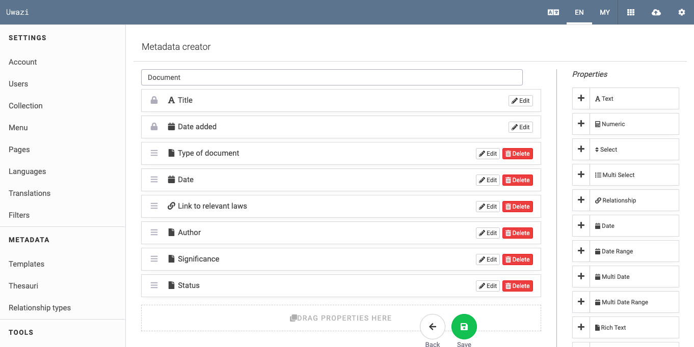
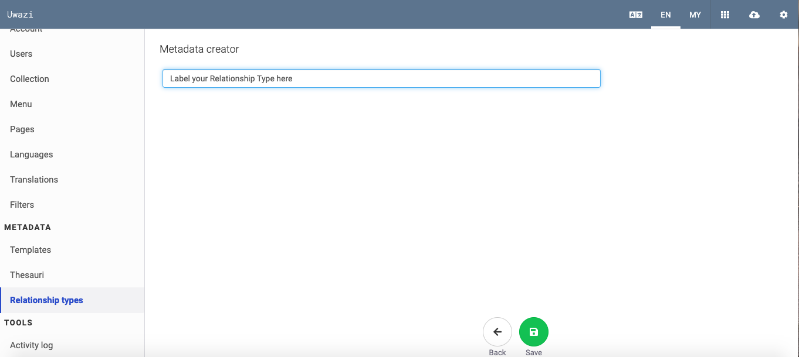
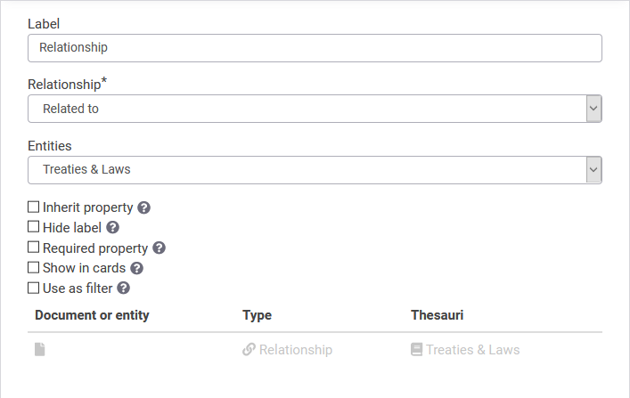

# BUILDING YOUR INFORMATION ARCHITECTURE

## How to create templates and add properties

Templates are the foundation of your Uwazi platform as they allow you to attribute consistent, structured metadata to your entities. Within each template, you can assign a variety of properties like:

- Text

- Numerics

- Select (needs thesaurus)

- Multi-select (needs thesaurus)

- Date, date range, multi date, multi date range

- Rich text

- Geolocation

- External links

- Media (for video and audio embedding or self hosting)

- Relationship - allow you to create connections between this entity and another one

### Add different properties to a template

Properties provide an important way for users to view important metadata at a glance and filter the collection to better understand and analyse the collection.

Step 1: From **Settings**, click on **Templates**.

Step 2: Click on the green **Add Template** button.

- There will be two default properties: Title and Date Added.

Step 3: Name your template and select a color for it.

Step 4: On the right side panel, there is a list of **Properties**. Each property will provide the user with more information about your entity. You can add as few or as many as you wish. Drag and drop one property at a time onto the template.

Step 5: For each added property, click **Edit** and give it a name (Label). Review the other options for the property, which may include the following:

- **Select list** - for Select and Multi Select properties, choose which Thesaurus will be used for this property. Related to: [How to create thesauri](https://uwazi.readthedocs.io/en/latest/admin-docs/building-info-architecture.html#how-to-create-thesauri).
- **Hide label** will show this property without the label/name.
- **Required property** will prevent the entity from being saved if this property isn't filled in.
- **Show in cards** means this property will appear in the Uwazi library cards as part of the basic info.
  - Note that the Uwazi library cards will also show the user's _current sorting criterion_ even if that property is not configured with "Show in cards." For example, this happens frequently with the "Date added" property, which is the default sorting criterion in the library. When the cards are sorted by "Date added," the "Date added" property is visible in the cards to show the user why the cards are in the current order.
- **Use as filter** means this property will be able to be used to filter the library view.
- **Default filter** means this property will be used as a default filter in the library view.
- **Priority sorting** means this property will be used as default sorting criterion.
- **Full width** will show this property using the full width available (applies to Media, Image, and Preview properties).

Step 6: Remember to click on **Save** after you have created properties for each template.

Watch a [screencast](https://drive.google.com/open?id=1pqcKphveaHFJqrrBPT53b2jE5lo75BMf).

> If you intend to do a CSV import to bring your metadata into Uwazi in bulk, remember that the property names on these templates must match your field names in the CSV file. This will allow the data migration to be imported successfully with all the metadata in the correct template. Related to: [How to migrate data with csv import](https://uwazi.readthedocs.io/en/latest/admin-docs/working-with-entities-in-your-collection.html#import-your-documents-through-csv-import-data-migration).
> 
> **Warning:** Uwazi does not support the use of non-Latin characters (such as Arabic text or accented characters) on template configuration. This includes template titles and property names. In order to use non-Latin characters in template titles or property names, you must first create them in Latin characters, and then translate those phrases under the "Translations" tab in Settings as described in [How to translate your content](https://uwazi.readthedocs.io/en/latest/admin-docs/translating-your-collection.html#how-to-translate-your-content). If this is not done, it will trigger a known bug. Our developers are working to fix it.

## How to create thesauri

> In Uwazi, a thesaurus is a list of terms that are referred to throughout an Uwazi instance to provide structured details. These terms are also referenced as properties within each entity. Thesauri is the plural form of thesaurus.

Using a thesaurus will make data entry and retrieval more precise, coherent and easy.

Step 1: Go to **Settings**, click on **Thesauri**.

- Here you will see all the thesauri that have been created so far.

Step 2: Click on the green **Add thesaurus** button.

Step 3: Name your thesaurus, then you can start typing items to include on this list.

- You can move items around by dragging and dropping.

- You can also use the **Sort** option to organize your list alphabetically.

- For certain thesauri, nesting values together with the **Add Group** option can make information more accessible.

Step 4: When you are finished, click **Save**.

### Import thesauri from csv files

This feature allows you to import terminology lists to use as an Uwazi thesaurus. The import feature can be used to include lists in new and existing thesauri.

Step 1: Prepare the csv file to import the thesaurus.

- If you have your data saved in a spreadsheet like Microsoft Excel or Google Sheets, be sure to convert the file to csv format before you import it into Uwazi.

- If you only have one language in your instance, then you will only have that one column in your file and the name of the column will be that language.

- However, if you are importing terminology lists in different languages all at once, the csv file should have a separate column for each language that you want to import.

- Please ensure the language is used as the name of the column. Use the name of the language written in English, e.g. "English," “Arabic,” “Spanish.”

- Each row should contain a term and its translations in different languages.

Here's a sample CSV file viewed as plain text:

English,French,German

Man,Homme,Mann

Woman,Femme,Frau

Child,Enfant,Kind

Here's the same file viewed in a spreadsheet program:

Step 2: Click the blue **Import** button, and locate and open the csv file.

Step 3: **Save** the thesauri.

**Note:**

- If your csv file has columns for languages that are not enabled in your Uwazi instance in the Languages section, they will be ignored.

- Be careful not to have rows with duplicate values in the same column as this will cause a validation error.

### View the newly imported thesauri

If you imported more than one language into a thesaurus. Then you can follow the next steps to look at your newly added thesaurus.

- Click on **Settings**, click on **Translations**.

- Select the thesaurus that you imported data into. It will display all the languages that have been imported.

## How to connect properties on different templates

Uwazi has a relationship property that can be added as a field on a template. This will allow you to build a connection, or "relationship", with another entity.

Step 1: Go to **Settings** and click on **Relationship types** to add a "type of connection."

- **Note:** You must define your relationship type(s) first in order to connect properties. Doing Step 1 ensures that the relationship type(s)that you just created will appear as a dropdown option in the Relationship\* field on your template (see Step 3).

Step 2: Go back to **Settings**, and click on **Templates**. Click **Edit** next to the template you want to change, or click **Add template** to create a new template.

Step 3: Drag the **Relationship** property from the right sidebar onto your template, click **Edit** on the newly added line, and rename the **Label**.

Step 4: Now select the relationship type under the **Relationship\*** field. The **\*** indicates that this field is mandatory. This dropdown contains the relationship type(s) that have been defined in Step 1.

Step 5: In the Entities dropdown, you can select which template the template you’re currently editing will be connected to. You can either pick "Any entity or document" or you have the option to make the connection to only one specific template.

- Note: this dropdown does not contain the template that is currently being edited. If you want to connect entities of the same template (for example, connecting two Person entities), click [here](https://uwazi.readthedocs.io/en/latest/admin-docs/organising-your-collection.html#how-to-create-relationships) to see **How to Create Relationships**.

Step 6: If you choose a **specific template** in Step 5, another option will automatically appear -- it is a checkbox called **Inherit property**. If you select the **Inherit property** checkbox, a dropdown appears containing the properties of the template selected in Step 5. Once you choose a property from your options, this property will be inherited from the related entities and be visible as metadata for this type of entity.

### When to inherit properties from other entities

There are times when it is useful to display a property on more than one entity.

For example, if your data model includes an entity type that captures information about prisoners, and an entity type that captures information about the jail in which they detained, you may want to be able to display the location of the prisoners on a map via the location of the jails.

Instead of duplicating the geolocation property and collecting the same data twice (once in the **prisoner** entity template, and again in the **jail** template), Uwazi supports the ability to inherit a property from one entity type to another, via a relationship.

The first step is to create the property for which you want to be inherited. To use the example above, you will create the geolocation property on the **jail** entity template. This will serve as the one place to capture the geolocation of the jails.

The next step is to [create a relationship type](https://uwazi.readthedocs.io/en/latest/admin-docs/building-info-architecture.html#how-to-connect-properties-on-different-templates) that will represent the relationship between the **jail** and the **prisoner**. You may want to call this something like "location" or "jail". For this example, we'll use the name "jail".

The next step is to create a relationship property _from_ the entity template that you want to inherit a property, _to_ the entity type that has the property you want to inherit. To use the example above, you will edit the **prisoner** entity template to add a relationship property. The name of this relationship property is whatever you named the relationship in the previous step ("jail"). As you are creating this relationship property, you will be asked to select which entity type you want the relationship to include and you will select "Jail" because that is the entity type that has the geolocation property you want to inherit. Then you will be asked if you want to inherit a property from the "Jail" entity template. Here is where you can select the geolocation property.

Now that these two entity types have this relationship established and the inherited property, when you create a relationship between prisoner X and jail Y, the prisoner X entity will inherit the geolocation of jail Y, allowing you to show the location of the prisoner (or prisoners) on a map.

This is the equivalent to a foreign key in a relation database that gets resolved to a particular property of the linked record.
