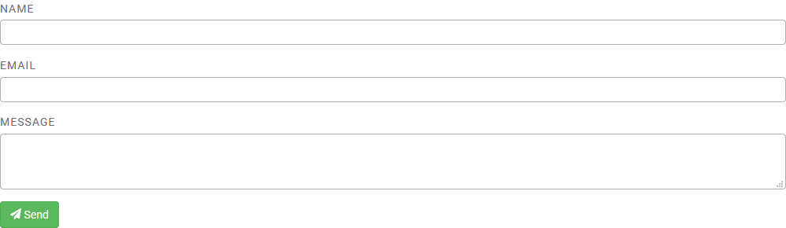

# DESIGNING YOUR WEBSITE

## How to Configure the Menu / Navigation Bar

### Add pages to the main header

Menu links are useful because they direct users to either the results of a specific filter or a static page. To configure links on the navigation bar of your website:

Step 1: Go to **Settings**, and click on **Menu**.

Step 2: Click on the **Add link** button, or **Edit** any of the existing links.

Step 3: Add a title for your item and the corresponding URL.

Step 4: Click **Save** when you are finished.

### Customise the header

To edit the header from the **Settings**, please follow the directions below:

1. Upload the picture in settings > collection > custom uploads (you'll find this option at the bottom).

2. Add some custom CSS in settings > collection > custom CSS.

Here are some sample CSS to help you out:

    header {
    background-color: #191916;
    border-bottom: 0;
    }

    .logotype {
    background-image: url(/uploaded_documents/1532354013023uzqh9gcnmztchlw8iacibpgb9.png);
    background-size: auto 30px;
    background-position: left 15px center;
    background-repeat: no-repeat;
    text-indent: -9999px;
    width: 265px;
    }
    
    
## How to Create New Web Pages

You can add static pages to your Uwazi collection in order to share information on what the purpose of your collection is, how the general public can contact you, etc.

Step 1: Go to **Settings**, and click **Pages**.

Step 2: Create a new page by clicking **Add Page**. Add your page content and click **Save**.

Step 3: After saving a new page, you will see the unique URL assigned to it in a blue box. You may, for example, want to copy this URL and add it to the [main menu / navigation bar](https://uwazi.readthedocs.io/en/initial-setup/admin-docs/how-to-configure-the-menu-navigation-bar.html).

### Format the content of a page

When you create a new page, you will notice there is no content or design yet. It appears as a blank page. To add elements onto the page requires some understanding of HTML or [Markdown](https://guides.github.com/features/mastering-markdown/). This syntax can help you to add images, lists, charts, headers, quotes and other formatting preferences to your page. If you need help using Markdown, click on [**Help**](https://guides.github.com/features/mastering-markdown/) above the text box on the page.

We have also extended the Markdown options to include some custom syntax for Uwazi users. This allows users to embed lists of entity cards, based on filter results and embed YouTube Videos.

### Add a search box to a page

This code snippet `<SearchBox />` added to any page or rich text field will render a search box that will run queries on your collections of documents:

For example: `<SearchBox placeholder="Search corruption cases..." />`

Renders: 

### Display a selection of cards on a page

This code snippet added to any page or rich text field will render a card view:

{list}([https://your_uwazi_url/en/library/?q=(order:desc,sort:creationDate)](<https://your_uwazi_url/en/library/?q=(order:desc,sort:creationDate)>))(limit:3)

Renders: 

- This syntax will display an arbitrary number of cards, defined by the param "limit", based on a library query URL. In this case, the limit is 3 cards.

## How to Create a Contact Form

A contact form allows your users to message you and share their ideas.

You can quickly create a contact form on a page by placing this code snippet: `<ContactForm/>`. You may add additional text in HTML around the contact form, if you wish.

This form will send a message to the e-mail address that is configured in your **Settings** > **Collection** > **Contact Email**.

## How to Create a Public Intake Form on Your Website

An intake or submission form allows visitors to submit a form that creates an unpublished/private entity in your database.

Step 1: You need to define a template for this form in your instance.

Step 2: To any page, you can add this code snippet with the template ID (the numbers in your template URL): `<PublicForm template="ID_OF_THE_TEMPLATE" />`

Step 3 (_optional_):

- A document is a PDF that gets shown in the main section of Uwazi when an entity is viewed. To add a document field to the form, add this line of code: `<PublicForm template="ID_OF_THE_TEMPLATE" file />`

- Attachments are attached to an entity and available for download, but their contents are not visible in Uwazi. To add an attachment field, add this line of code: `<PublicForm template="ID_OF_THE_TEMPLATE" attachments />`

In order for the form to sync into its corresponding template, you must also do the following:

Step 1: Go to **Settings**, and click on **Collection**.

Step 2: Add the template ID (the number in the template URL) under **Allowed Public Templates**.

In the case of multiple _synced Uwazi instances_ (currently an experimental feature not available to all users), you can configure submissions from a public form on one Uwazi instance to create an unpublished entity in a different Uwazi instance. To accomplish this, do the following:

Step 1: Add the template ID under **Allowed Public Templates **(in **Settings** > **Collection**) for _both_ instances.

Step 2: In the Uwazi instance that has the public intake form:

- Add "remote" to the page’s code snippet, for example: `<PublicForm template="ID_OF_THE_TEMPLATE" remote />`

- Go to Settings, and click on Collection, add the URL of the _target_ Uwazi instance under **Public Form Destination**. (e.g. https://example.uwazi.io)

## How to Configure the Available Languages for Your Collection

You can increase the accessibility of your Uwazi collection by translating it into one or more languages.

Step 1: Login to your Uwazi instance.
Step 2: Under **Settings**, click **Languages**.

Step 3: Select the language(s) you want to add.
Step 4: Type **CONFIRM** (in all capital letters) in the confirmation dialog, and click **Accept**.

If your language is not in the list, please [get in touch with us](https://www.uwazi.io/contact/).

Note:
-   You can select any language for your user interface and content, including right-to-left languages.
-   Search functionality will only work for languages supported by [ElasticSearch](https://www.elastic.co/guide/en/elasticsearch/reference/current/analysis-lang-analyzer.html)

Step 5: At the top of the page in the **Active Languages** section, select which language will be the **Default language** for your collection.

When multiple languages are enabled for your collection, you will see the language abbreviation in the navigation menu of your site. The language options are at the top right on desktop and tablet devices, and on mobile they are at the bottom of the menu opened by the collapsed menu icon at the top left.

