# How to Build Data Visualisation Components

You can add charts and other data visualisation elements to **pages** and **rich text fields**, using the code snippets explained below.

## Basic structure of a code snippet

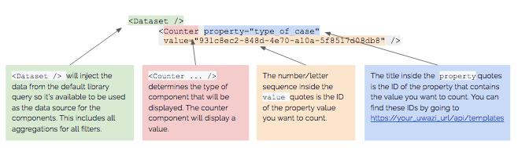

## Counter component

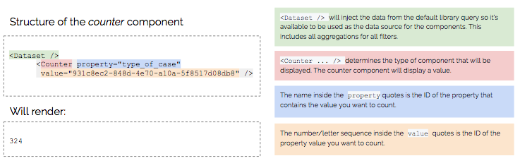

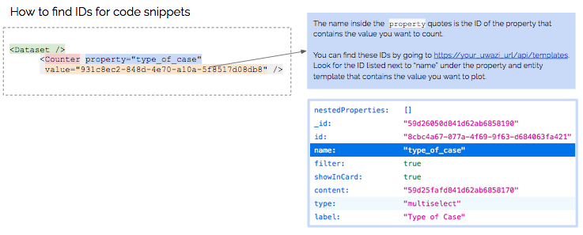

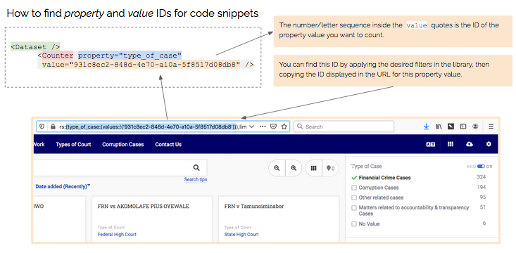

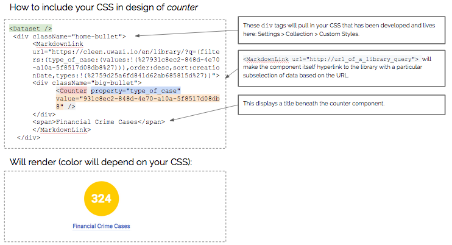

## Pie chart and list chart components

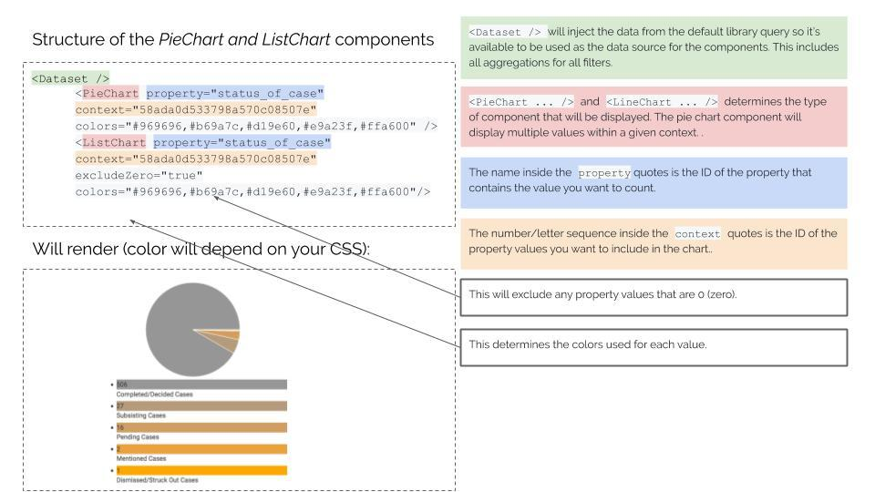

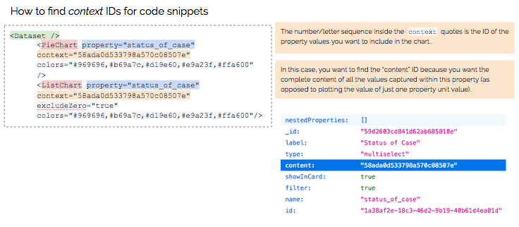

## Bar chart component

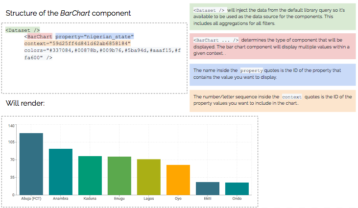

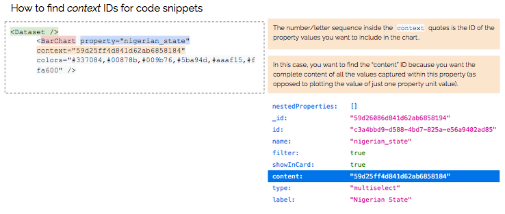

## Examples of analysis and data visualisation

Just to give you an idea of what is possible in Uwazi, please take a look at some of the public projects that are documenting human rights violations for advocacy, but please note that these require some technical proficiency in working with HTML, CSS and Javascript.

- TGEU works with 5 ProTrans partners from Eastern Europe and Central Asia on monitoring violence and human rights violations against trans people in this region. [https://tgeu.uwazi.io/](https://tgeu.uwazi.io/)

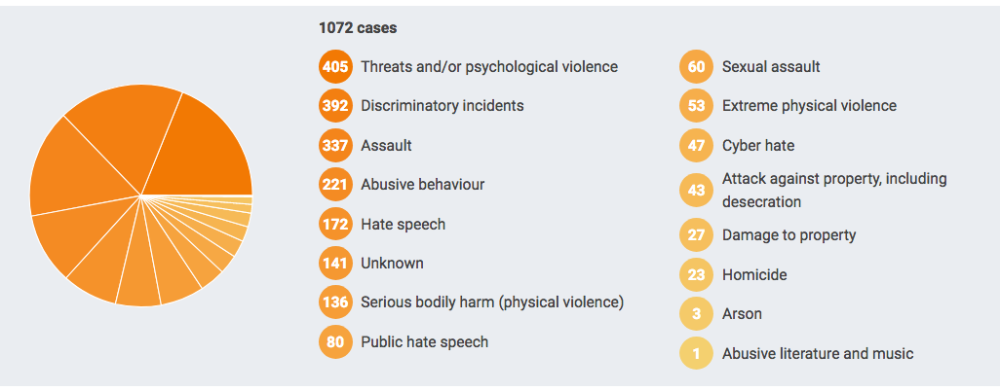

- Justice Project Pakistan shares open source data sets based on existing research on death row and on age determination under the Juvenile Justice Systems Ordinance. This project marks the beginning of the process of making the information publicly available, allowing the public and academic institutions to generate their own findings and base their campaigns on verified data. [https://data.jpp.org.pk](https://data.jpp.org.pk)

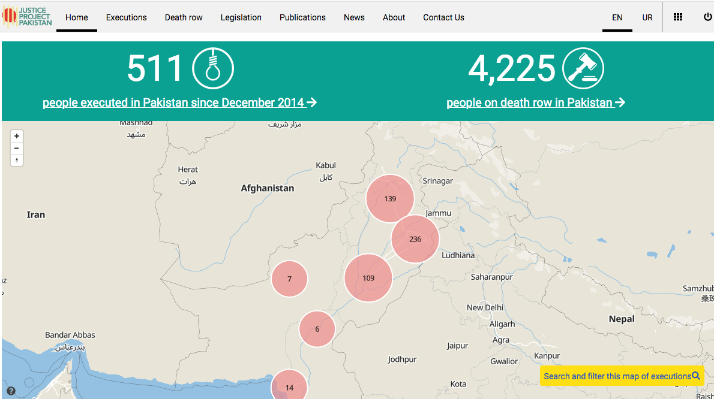
