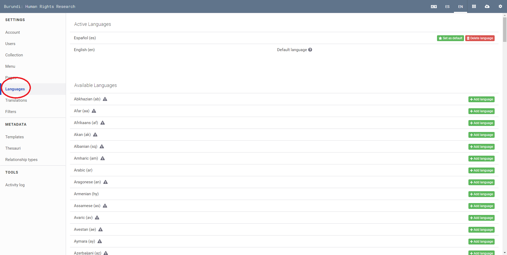

# How to Configure the Available Languages for Your Collection

You can increase the accessibility of your Uwazi collection by translating it into one or more languages.

Step 1: Login to your Uwazi instance.
Step 2: Under **Settings**, click **Languages**.

Step 3: Select the language(s) you want to add.
Step 4: Type **CONFIRM** (in all capital letters) in the confirmation dialog, and click **Accept**.

If your language is not in the list, please [get in touch with us](https://www.uwazi.io/contact/).

Note:
-   You can select any language for your user interface and content, including right-to-left languages.
-   Search functionality will only work for languages supported by [ElasticSearch](https://www.elastic.co/guide/en/elasticsearch/reference/current/analysis-lang-analyzer.html)

Step 5: At the top of the page in the **Active Languages** section, select which language will be the **Default language** for your collection.

When multiple languages are enabled for your collection, you will see the language abbreviation in the navigation menu of your site. The language options are at the top right on desktop and tablet devices, and on mobile they are at the bottom of the menu opened by the collapsed menu icon at the top left.
