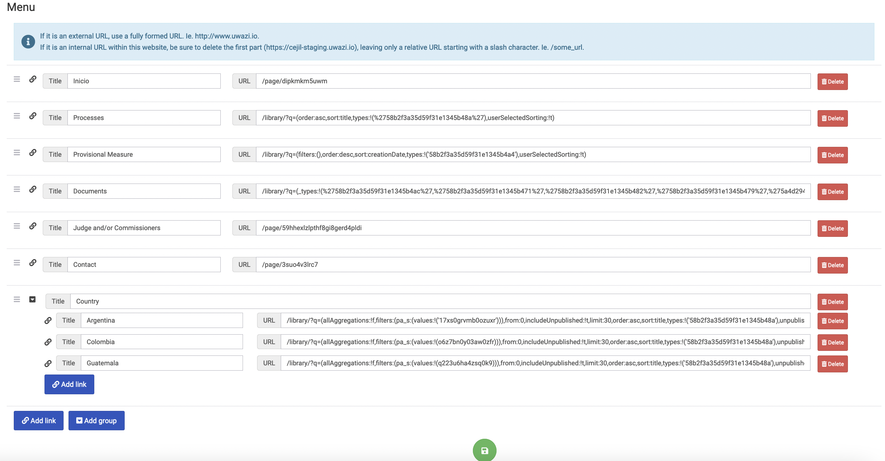

# How to Configure the Menu / Navigation Bar

## Add pages to the main header

Menu links are useful because they direct users to either the results of a specific filter or a static page. To configure links on the navigation bar of your website:

Step 1: Go to **Settings**, and click on **Menu**.

Step 2: Click on the **Add link** button, or **Edit** any of the existing links.

Step 3: Add a title for your item and the corresponding URL.

Step 4: Click **Save** when you are finished.

## Customise the header

At the moment, it is not possible to edit the header from the **Settings**. We hope to make this available soon, however if you need this, you can create a [Github issue](https://github.com/huridocs/uwazi/issue/) and we would be happy to upload a header background image for you. In order to do so, we require:

- Your logotype in PNG format (transparent background) and 72px height. Width is not fixed, but limited to 288px, so you can play until that size.

- Your brand colour if you would like to change the header background.
