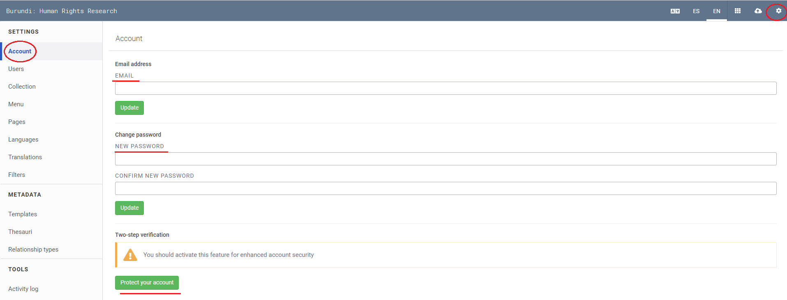
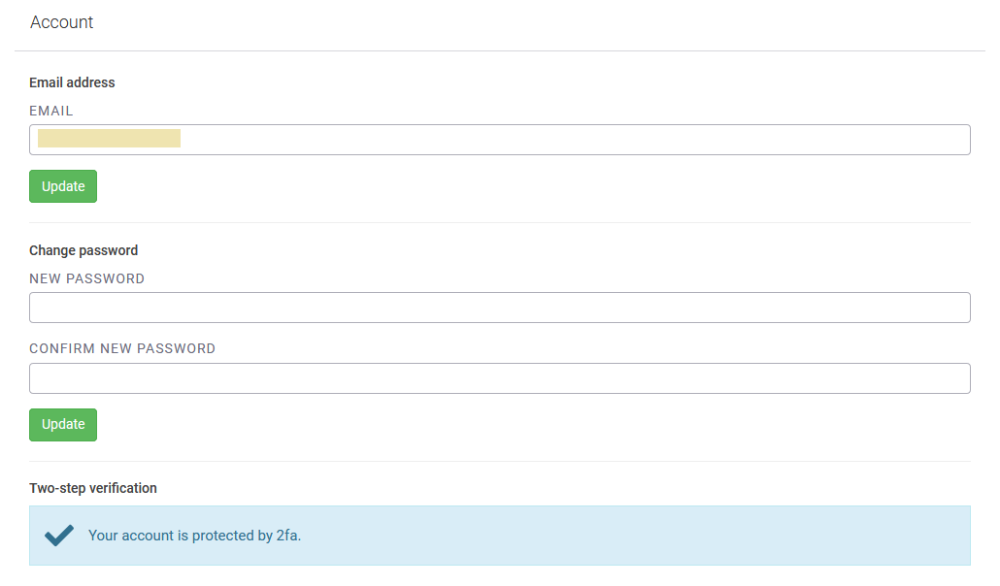

# How to Configure Your Account

## Change your account information

Step 1: Login to your Uwazi instance.

Step 2: Under **Settings**, click **Accounts**.

Step 3: You can change your email address here, as well as your account password.

## Recover your password ([screencast](https://drive.google.com/open?id=1fJcdhGPGRZEZMn6ExzS2csinH3FJwcBd))

Step 1: At the login screen, click **Forgot Password?**.

Step 2: You will receive an email from the [no-reply@uwazi.io](mailto:no-reply@uwazi.io) account. Follow the instructions.

- If you cannot find this recovery email, please check if it has been filtered into your ‘’Spam’’ folder.

- To reinforce your account’s security, we recommend that you use unique and long passwords (a-Z, 0-9, &%).

## Enable two-factor authentication ([screencast](https://drive.google.com/open?id=1G02gKDvIejl4NxwpyiIqiIU5KPjbamBE))

To add an extra layer of security to your Uwazi instance:

Step 1: Login to your Uwazi instance.

Step 2: Under **Settings**, click **Accounts**.

Step 3: You will see **Two-step verification**, click on **Protect your Account**.

Step 4: Open [Authy](https://authy.com/features/setup/) or [Google Authenticator](https://support.google.com/accounts/answer/1066447?co=GENIE.Platform%3DAndroid&hl=en) and generate your verification code.

Step 5: Enter the code and click **Confirm**.

- If you have successfully enabled two-factor authentication, your account settings will reflect this.

## Login with two-factor authentication ([screencast](https://drive.google.com/open?id=1lYbJHkDrDoAeYzoVcPcYQPoAWyUf3JmR))

Step 1: Login to Uwazi with your credentials..

Step 2: You will be prompted to input your authentication code. Enter the code from Authy or Google Authenticator.

- If the code is approved, you will be logged in.

FAQs related to two-factor authentication

- Google Authenticator: [https://support.google.com/accounts/answer/185834?hl=en](https://support.google.com/accounts/answer/185834?hl=en)

- Authy application: [https://authy.com/help/](https://authy.com/help/)
