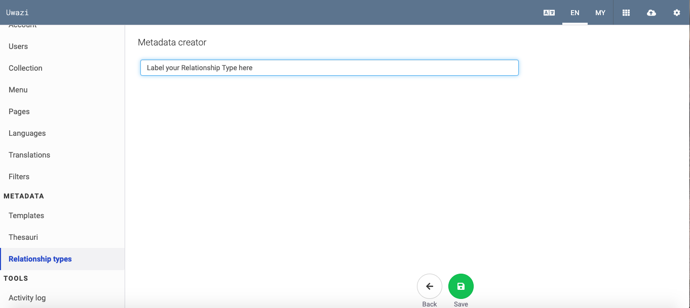
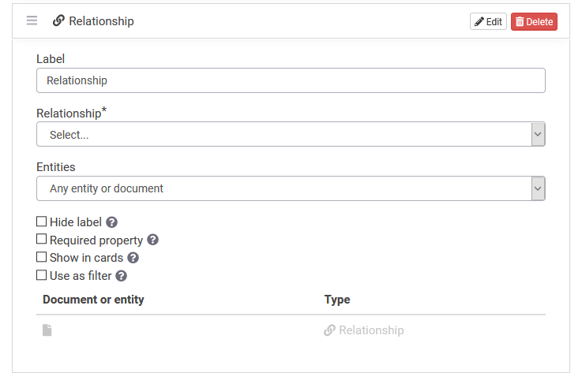
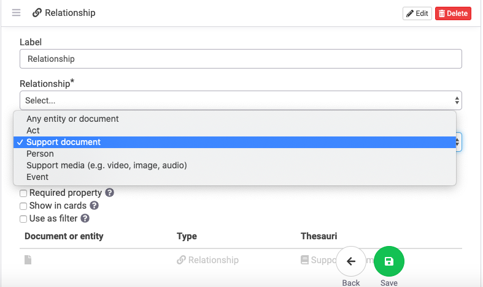
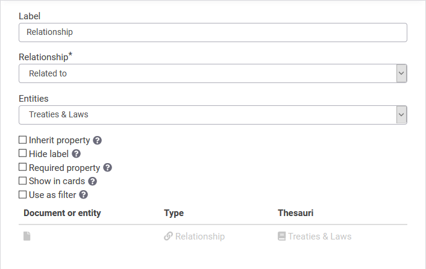
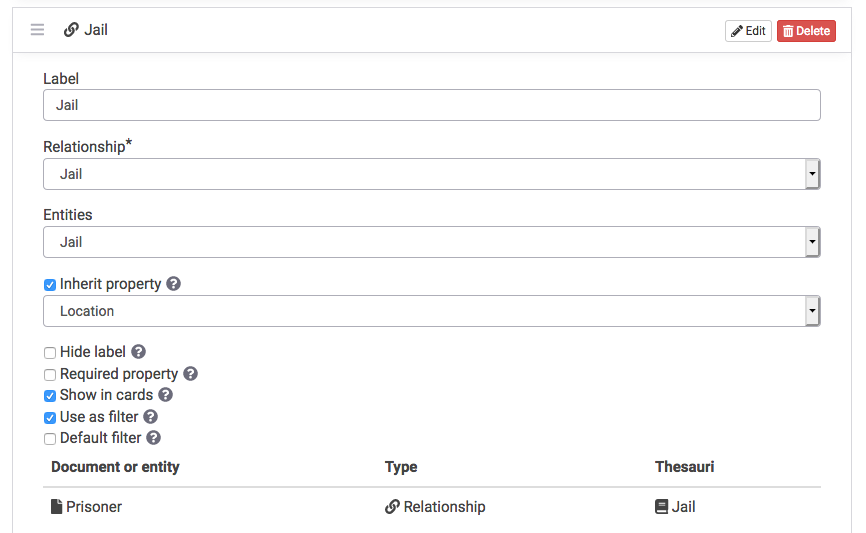
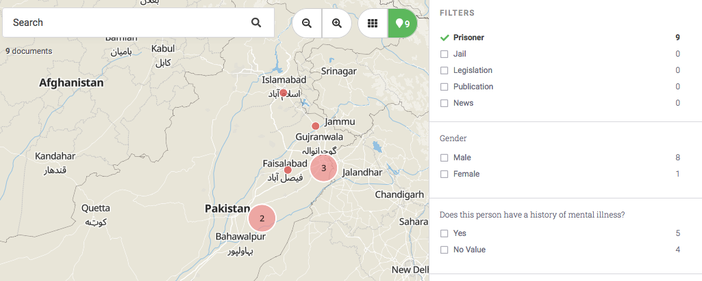

# How to Connect Properties on Different Templates

Uwazi has a relationship property that can be added as a field on a template. This will allow you to build a connection, or "relationship", with another entity.

Step 1: Go to **Settings** and click on **Relationship types** to add a "type of connection."

- **Note:** You must define your relationship type(s) first in order to connect properties. Doing Step 1 ensures that the relationship type(s)that you just created will appear as a dropdown option in the Relationship\* field on your template (see Step 3).

Step 2: Go back to **Settings**, and click on **Templates**. Click **Edit** next to the template you want to change, or click **Add template** to create a new template.

Step 3: Drag the **Relationship** property from the right sidebar onto your template, click **Edit** on the newly added line, and rename the **Label**.

Step 4: Now select the relationship type under the **Relationship\*** field. The **\*** indicates that this field is mandatory. This dropdown contains the relationship type(s) that have been defined in Step 1.

Step 5: In the Entities dropdown, you can select which template the template you’re currently editing will be connected to. You can either pick "Any entity or document" or you have the option to make the connection to only one specific template.

- Note: this dropdown does not contain the template that is currently being edited. If you want to connect entities of the same template (for example, connecting two Person entities), click [here](#bookmark=id.xx9qyx39lfd5) to see **How to Create Relationships**.

Step 6: If you choose a **specific template** in Step 5, another option will automatically appear -- it is a checkbox called **Inherit property**. If you select the **Inherit property** checkbox, a dropdown appears containing the properties of the template selected in Step 5. Once you choose a property from your options, this property will be inherited from the related entities and be visible as metadata for this type of entity.

## When to inherit properties from other entities

There are times when it is useful to display a property on more than one entity.

For example, if your data model includes an entity type that captures information about prisoners, and an entity type that captures information about the jail in which they detained, you may want to be able to display the location of the prisoners on a map via the location of the jails.

Instead of duplicating the geolocation property and collecting the same data twice (once in the **prisoner** entity template, and again in the **jail** template), Uwazi supports the ability to inherit a property from one entity type to another, via a relationship.

The first step is to create the property for which you want to be inherited. To use the example above, you will create the geolocation property on the **jail** entity template. This will serve as the one place to capture the geolocation of the jails.

The next step is to [create a relationship type](https://github.com/huridocs/uwazi/wiki/Create-Different-Relationships) that will represent the relationship between the **jail** and the **prisoner**. You may want to call this something like "location" or "jail". For this example, we'll use the name "jail".

The next step is to create a relationship property _from_ the entity template that you want to inherit a property, _to_ the entity type that has the property you want to inherit. To use the example above, you will edit the **prisoner** entity template to add a relationship property. The name of this relationship property is whatever you named the relationship in the previous step ("jail"). As you are creating this relationship property, you will be asked to select which entity type you want the relationship to include and you will select "Jail" because that is the entity type that has the geolocation property you want to inherit. Then you will be asked if you want to inherit a property from the "Jail" entity template. Here is where you can select the geolocation property.

Now that these two entity types have this relationship established and the inherited property, when you create a relationship between prisoner X and jail Y, the prisoner X entity will inherit the geolocation of jail Y, allowing you to show the location of the prisoner (or prisoners) on a map.

This is the equivalent to a foreign key in a relation database that gets resolved to a particular property of the linked record.
