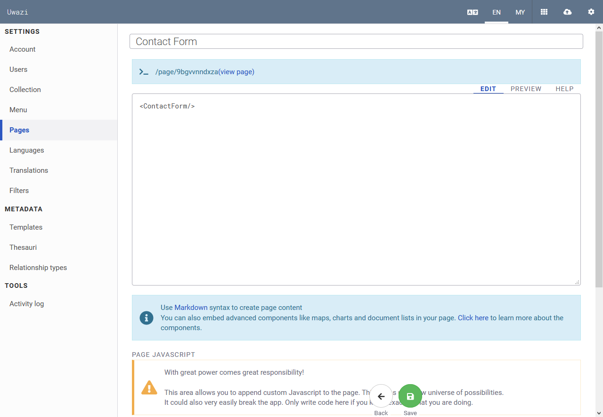

# How to Create a Contact Form

A contact form allows your users to message you and share their ideas.

You can quickly create a contact form on a page by placing this code snippet: `<ContactForm/>`. You may add additional text in HTML around the contact form, if you wish.

This form will send a message to the e-mail address that is configured in your **Settings** > **Collection** > **Contact Email**.

