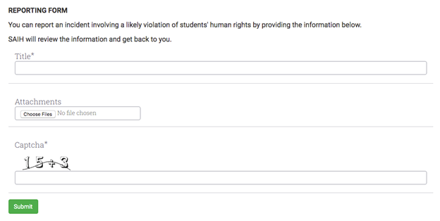

# How to Create a Public Intake Form on Your Website

An intake or submission form allows visitors to submit a form that creates an unpublished/private entity in your database.

Step 1: You need to define a template for this form in your instance.

Step 2: To any page, you can add this code snippet with the template ID (the numbers in your template URL): `<PublicForm template="ID_OF_THE_TEMPLATE" />`

Step 3 (_optional_):

- A document is a PDF that gets shown in the main section of Uwazi when an entity is viewed. To add a document field to the form, add this line of code: `<PublicForm template="ID_OF_THE_TEMPLATE" file />`

- Attachments are attached to an entity and available for download, but their contents are not visible in Uwazi. To add an attachment field, add this line of code: `<PublicForm template="ID_OF_THE_TEMPLATE" attachments />`

In order for the form to sync into its corresponding template, you must also do the following:

Step 1: Go to **Settings**, and click on **Collection**.

Step 2: Add the template ID (the number in the template URL) under **Allowed Public Templates**.

In the case of multiple _synced Uwazi instances_ (currently an experimental feature not available to all users), you can configure submissions from a public form on one Uwazi instance to create an unpublished entity in a different Uwazi instance. To accomplish this, do the following:

Step 1: Add the template ID under **Allowed Public Templates **(in **Settings** > **Collection**) for _both_ instances.

Step 2: In the Uwazi instance that has the public intake form:

- Add "remote" to the page’s code snippet, for example: `<PublicForm template="ID_OF_THE_TEMPLATE" remote />`

- Go to Settings, and click on Collection, add the URL of the _target_ Uwazi instance under **Public Form Destination**. (e.g. https://example.uwazi.io)
