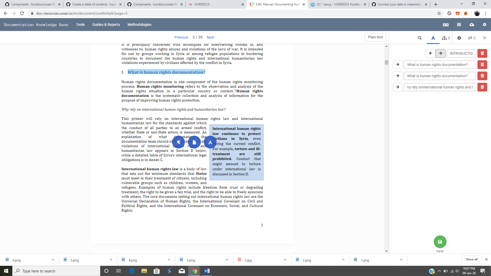

# How to Create a Table of Contents

Most documents have a defined structure through its pages. Creating a table of contents will allow your end-users to quickly navigate through the document’s contents. Alternatively, you can create your own structure that would be most useful to them.

Step 1: Click on the document that you want to add the table of contents to.

Step 2: Click on the **Table of Contents** button (the A icon) on the right side panel.

Step 3: Now you can highlight the text that you want to add. Three blue icons will appear. Choose the far right circle, **Add to Table of Contents**, and the highlighted text will appear on the right sidebar.

Step 4: Repeat this process until you have created a full table of contents. You can add as many headings and subheadings as you like.

- You can add indentation by clicking on the arrow buttons. Uwazi currently supports 6 levels of indentations with different styles for every level to improve readability.

Step 5: Once you are done, click **Save**. The table of contents will now be showing. Users can click on the heading and they will be directed to the relevant segment.

Step 6: You can always come back later to revise or add more contents by clicking the **Edit** button.
