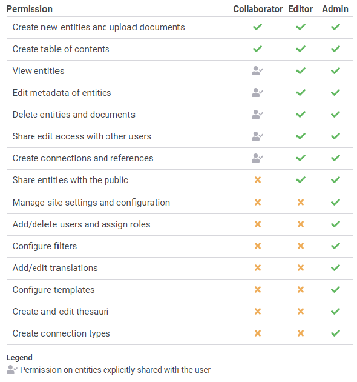

# How to Create, Edit and Delete Users

## Understanding user permissions

If you work in a team or in collaboration with other people, Uwazi allows administrators to create new users with specific permissions to help you update your collection of documents. Uwazi currently supports two different kinds of roles:

## Add new users to your instance ([screencast](https://drive.google.com/open?id=12Z-HtNoPU2vcS80CG30496ECAL5vEJI3))

Step 1: Only an Admin can create new users. Go to **Settings** and click on **Users**.

Step 2: You will see a list of all the current users who have access to your collection.

Step 3: You can create new users by clicking the green **Add user** button at the bottom. Here, you can also edit or delete users, as necessary.

Step 4: Enter a **username**, their **email address** and select a role (**Admin** or **Editor**) for them.

Step 5: Once this information is entered, click the green **Save** button and an email will be sent to that person with a link that allows them to set their own password.
