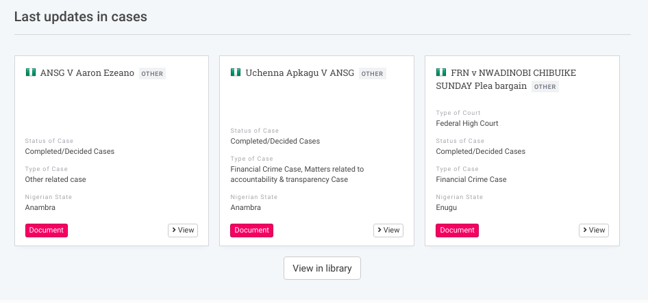

# How to Create New Web Pages

You can add static pages to your Uwazi collection in order to share information on what the purpose of your collection is, how the general public can contact you, etc.

Step 1: Go to **Settings**, and click **Pages**.

Step 2: Create a new page by clicking **Add Page**. Add your page content and click **Save**.

Step 3: After saving a new page, you will see the unique URL assigned to it in a blue box. You may, for example, want to copy this URL and add it to the [main menu / navigation bar](#bookmark=id.syabje1hn3th).

## Format the content of a page

When you create a new page, you will notice there is no content or design yet. It appears as a blank page. To add elements onto the page requires some understanding of HTML or [Markdown](https://guides.github.com/features/mastering-markdown/). This syntax can help you to add images, lists, charts, headers, quotes and other formatting preferences to your page. If you need help using Markdown, click on [**Help**](https://guides.github.com/features/mastering-markdown/) above the text box on the page.

We have also extended the Markdown options to include some custom syntax for Uwazi users. This allows users to embed lists of entity cards, based on filter results and embed YouTube Videos.

## Add a search box to a page

This code snippet `<SearchBox />` added to any page or rich text field will render a search box that will run queries on your collections of documents:

For example: `<SearchBox placeholder="Search corruption cases..." />`

Renders: 

## Display a selection of cards on a page

This code snippet added to any page or rich text field will render a card view:

{list}([https://your_uwazi_url/en/library/?q=(order:desc,sort:creationDate)](<https://your_uwazi_url/en/library/?q=(order:desc,sort:creationDate)>))(limit:3)

Renders: 

- This syntax will display an arbitrary number of cards, defined by the param "limit", based on a library query URL. In this case, the limit is 3 cards.
