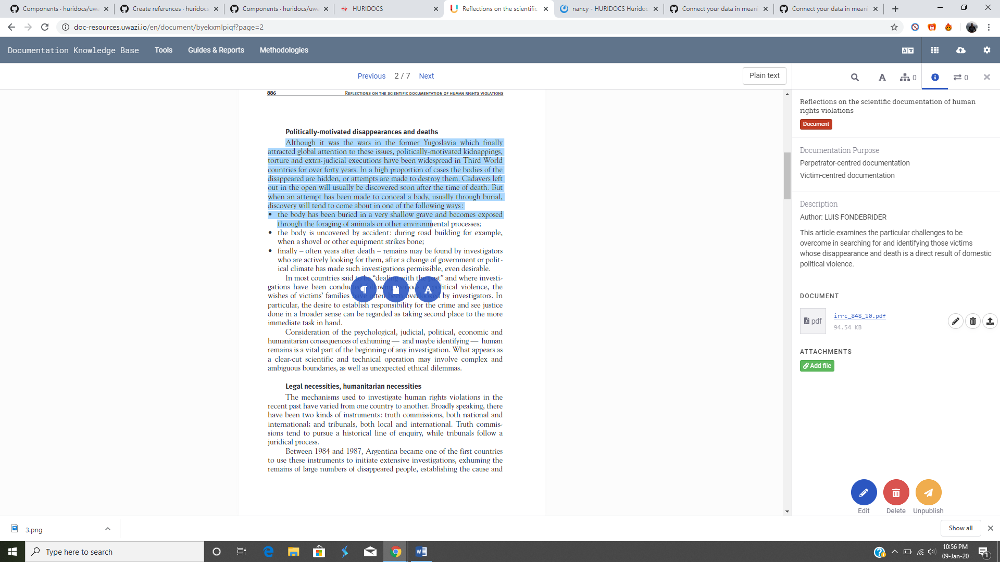
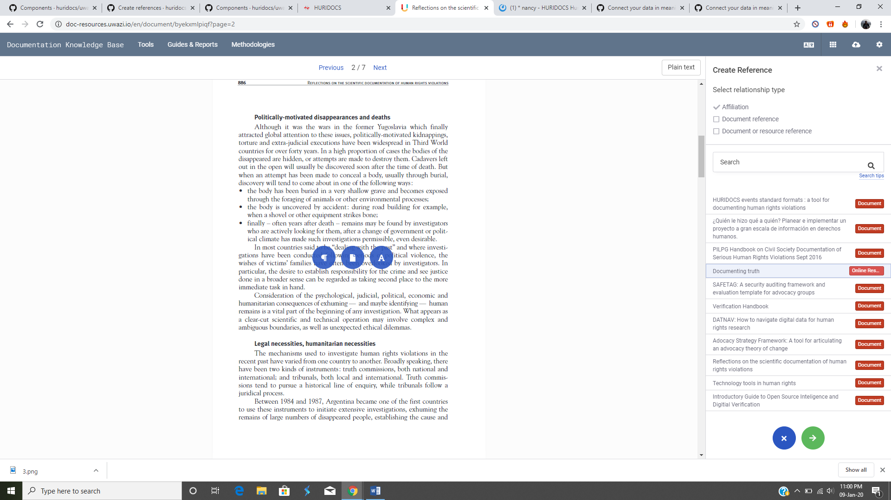
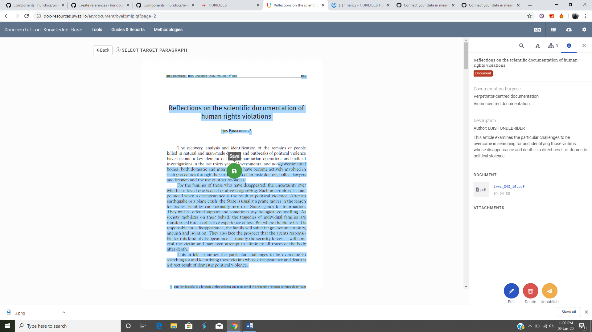
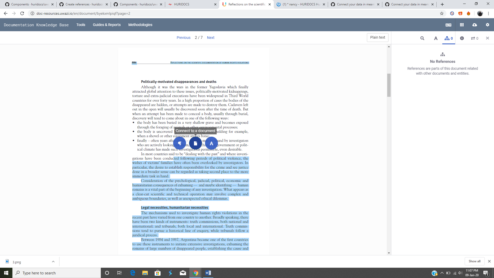

# How to Create References

> In Uwazi, a reference is a bookmark that connects highlighted content in one document to something else -- such as other selected content in the same document, other selected content in a different document, or even an entire document or an entity.

### Reference other text in the same or a different document

Step 1: Go to **Settings** and click on **Relationship types** to add a "type of connection."

- **Note:** You must define your relationship type(s) first in order to create references.

Step 2: Click **View** on the file for which you want to create the reference. Note that references can only be made from text selected in a PDF document.

Step 3: Select the text you want. Three options will appear. Click on **Connect to a paragraph**.

Step 4: Select the relationship type.

Step 5: Choose the document you want to refer to. You can manually search for it by title if you can't find the document you are looking for. You can also select the same document you’re currently editing.

- Note: only published entities appear in this list.

Step 6: Click **Next**, and this will take you to the document you have selected to refer to.

Step 5: Select the relevant part of the text you want to reference, highlight it and click **Save**.

- This will create the reference for you. Users will see this referenced text under the References tab  in the right sidebar.

### Reference another document

Step 1: Go to **Settings** and click on **Relationship types** to add a "type of connection."

- **Note:** You must define your relationship type(s) first in order to create references.

Step 2: Click **View** on the file for which you want to create the reference. Note that references can only be made from text selected in a PDF document.

Step 3: Highlight the segment of text you want and click on **Connect to a document**.

Step 3: Select the relationship type.

Step 4: Select the document you want to reference. You can manually search for it by title if you can't find the document you are looking for.

- Note: only published entities appear in this list.

Step 4: Click on **Save**.

Users will see the referenced document under the **References** tab in the right sidebar.

When the reference is selected, the highlighted text will be displayed in the PDF.
