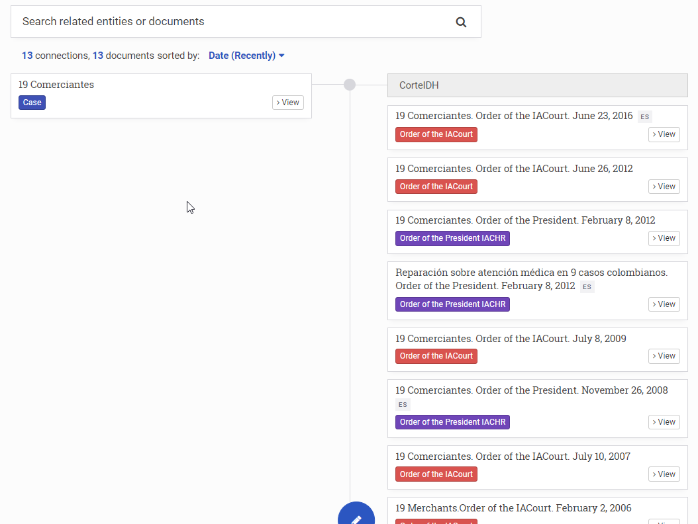
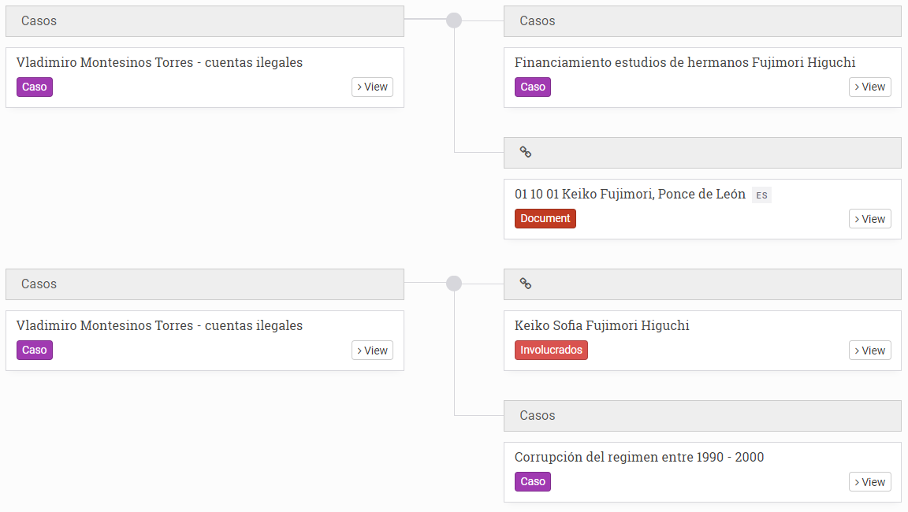
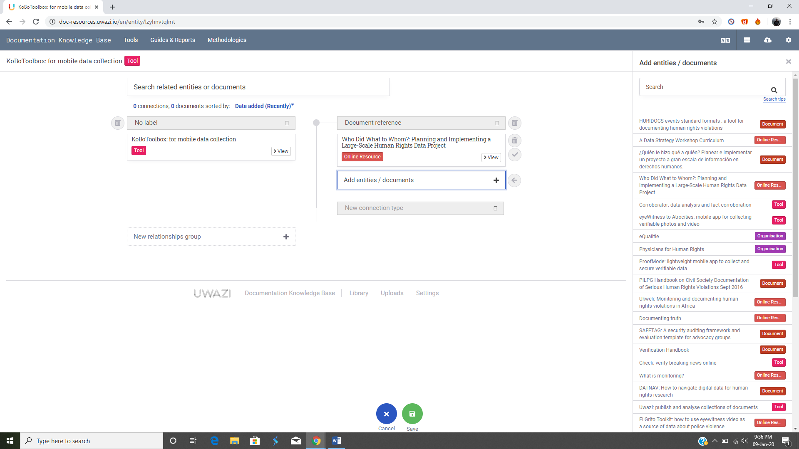
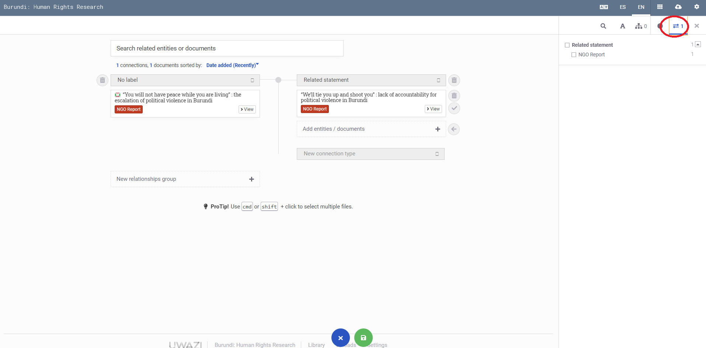
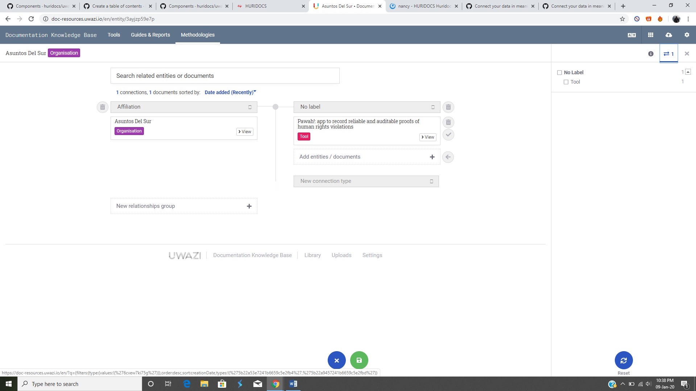

# How to Create Relationships

> In Uwazi, a relationship connects two or more entities to each other so that it’s possible to investigate and analyse "who did what to whom" (and when, and where, etc). Note: we use the terms “relationship” and “connection” interchangeably.

Uwazi supports connecting data in unstructured ways, meaning you don't need to follow a particular data structure or predefine a relational model upfront. Entities can be connected to each other in one-to-one or one-to-many relations arbitrarily:

## Understanding "information hubs"

Information hubs hold together a series of entities. These hubs allow you to see the relationships between your entities. They also help to infer other relationships that might have previously been overlooked.

There are two ways in Uwazi to create connections between entities in your collection.

## Create relationships when adding new entities

You can create relationships when adding new entities if you have defined a template with a "Relationship" property. Click [here](#bookmark=id.u42q2wwp7f4d) to learn how to add a “Relationship” property to a template.

When creating a new entity that has a "Relationship" property in its template, you will see the relevant options that can be linked to the new entity that you are adding. You can search for entities by title using the search box.

## Create relationships between existing entities

Step 1: Go to **Settings** and click on **Relationship types** to add a "type of connection."

- **Note:** You must define your relationship type(s) first in order to connect properties. Doing Step 1 ensures that the relationship type(s) that you just created will appear as a dropdown option in the **New relationships group** field in see Step 6.

Step 2: Select **View** on the entity that you want to add a connection with.

Step 3: At the right side menu, click on the **Connection** icon .

Step 4: Click on the blue **Edit** button.

Step 5: Here, you can make your connection. Click on **New relationships group +**.

Step 6: Select the type of relationship that you want to create in the **New connection type** dropdown.

Step 6: Select the entity from the right bar. You can search for it by title, if it has not been recommended by the system. You can add more connections in this hub by selecting **Add entities / documents +**.

Step 8: Click **Save** when you have made the connections you want. Your new connections will appear on the Connections tab.

- You can view the connections on an entity by clicking on **View**, then on **Connections** in the right side panel. You will see existing connections of that particular entity.

### Edit connections

Step 1: You can edit existing connections on an entity by clicking on **View** on the entity for which you want to edit existing connections.

Step 2: Click on **Connections** in the right side panel.

Step 3: Click on the blue **Edit** button. You can change the relationship type labels or remove a connection altogether by clicking on the **Delete** button.

Step 4: Click **Save** when you have completed editing your connections.
