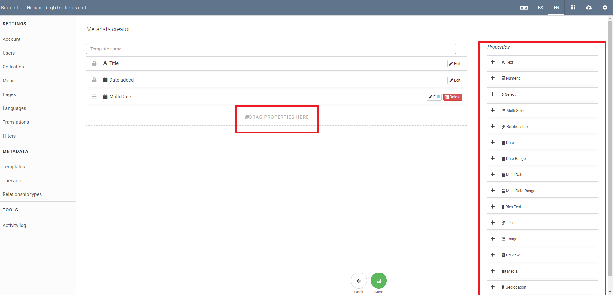
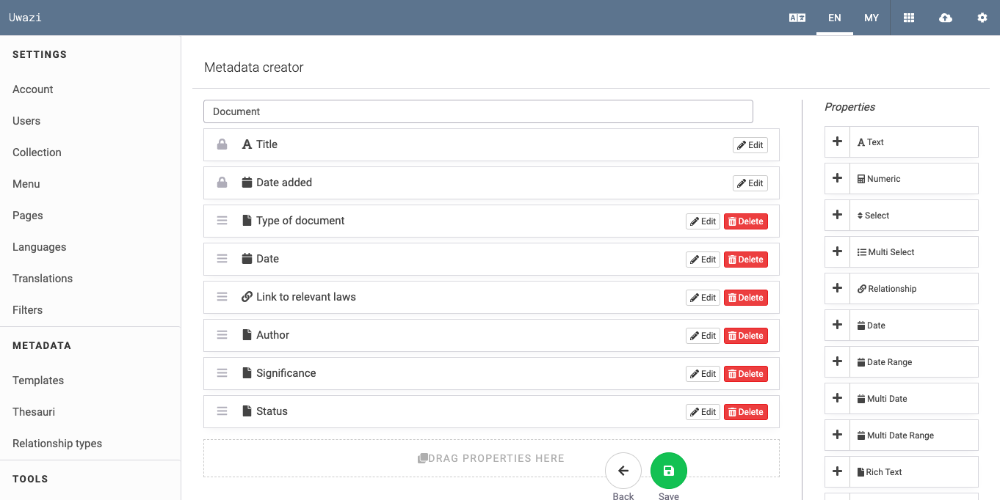

# How to Create Templates and Add Properties

Templates are the foundation of your Uwazi platform as they allow you to attribute consistent, structured metadata to your entities. Within each template, you can assign a variety of properties like:

- Text

- Numerics

- Select (needs thesaurus)

- Multi-select (needs thesaurus)

- Date, date range, multi date, multi date range

- Rich text

- Geolocation

- External links

- Media (for video and audio embedding or self hosting)

- Relationship - allow you to create connections between this entity and another one

## Add different properties to a template ([screencast](https://drive.google.com/open?id=1pqcKphveaHFJqrrBPT53b2jE5lo75BMf))

Properties provide an important way for users to view important metadata at a glance and filter the collection to better understand and analyse the collection.

Step 1: From **Settings**, click on **Templates**.

Step 2: Click on the green **Add Template** button.

- There will be two default properties: Title and Date Added.

Step 3: Name your template.

Step 4: On the right side of the template, there is the sidebar with different **Properties**. Each property will provide the user with more information about your document. You can add as few or as many as you wish.

Step 5: Drag and drop one property at a time onto the template, and give it a name.

Step 6: Remember to click on **Save** after you have created properties for each template.

> Note: When you add a select or multi-select property to a template, you will see a field entitled "Select list*" in which you are required to choose a Thesaurus from the dropdown. Related to: How to create thesauri.
> If you intend to do a CSV import to bring your metadata into Uwazi in bulk, remember that the property names on these templates must match your field names in the CSV file. This will allow the data migration to be imported successfully with all the metadata in the correct template.
> If your instance will be in Arabic by default, the templates and properties should be created in latin characters and then translated into Arabic. If this is not done, it will trigger a known bug. Our developers are working to fix it.
