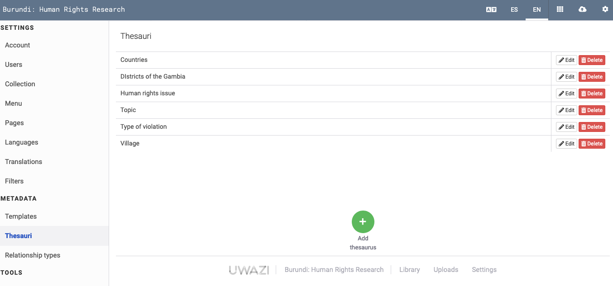
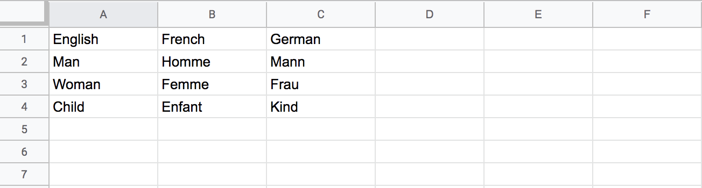

# How to Create Thesauri

> In Uwazi, a thesaurus is a list of terms that are referred to throughout an Uwazi instance to provide structured details. These terms are also referenced as properties within each entity. Thesauri is the plural form of thesaurus.

Using a thesaurus will make data entry and retrieval more precise, coherent and easy.

Step 1: Go to **Settings**, click on **Thesauri**.

- Here you will see all the thesauri that have been created so far.

Step 2: Click on the green **Add thesaurus** button.

Step 3: Name your thesaurus, then you can start typing items to include on this list.

- You can move items around by dragging and dropping.

- You can also use the **Sort** option to organize your list alphabetically.

- For certain thesauri, nesting values together with the **Add Group** option can make information more accessible.

Step 4: When you are finished, click **Save**.

## Import thesauri from csv files

This feature allows you to import terminology lists to use as an Uwazi thesaurus. The import feature can be used to include lists in new and existing thesauri.

Step 1: Prepare the csv file to import the thesaurus.

- If you have your data saved in a spreadsheet like Microsoft Excel or Google Sheets, be sure to convert the file to csv format before you import it into Uwazi.

- If you only have one language in your instance, then you will only have that one column in your file and the name of the column will be that language.

- However, if you are importing terminology lists in different languages all at once, the csv file should have a separate column for each language that you want to import.

- Please ensure the language is used as the name of the column. Use the name of the language written in English, e.g. "English," “Arabic,” “Spanish.”

- Each row should contain a term and its translations in different languages.

Here's a sample CSV file viewed as plain text:

English,French,German

Man,Homme,Mann

Woman,Femme,Frau

Child,Enfant,Kind

Here's the same file viewed in a spreadsheet program:

Step 2: Click the blue **Import** button, and locate and open the csv file.

Step 3: **Save** the thesauri.

**Note:**

- If your csv file has columns for languages that are not enabled in your Uwazi instance in the Languages section, they will be ignored.

- Be careful not to have rows with duplicate values in the same column as this will cause a validation error.

## View the newly imported thesauri

If you imported more than one language into a thesaurus. Then you can follow the next steps to look at your newly added thesaurus.

- Click on **Settings**, click on **Translations**.

- Select the thesaurus that you imported data into. It will display all the languages that have been imported.
