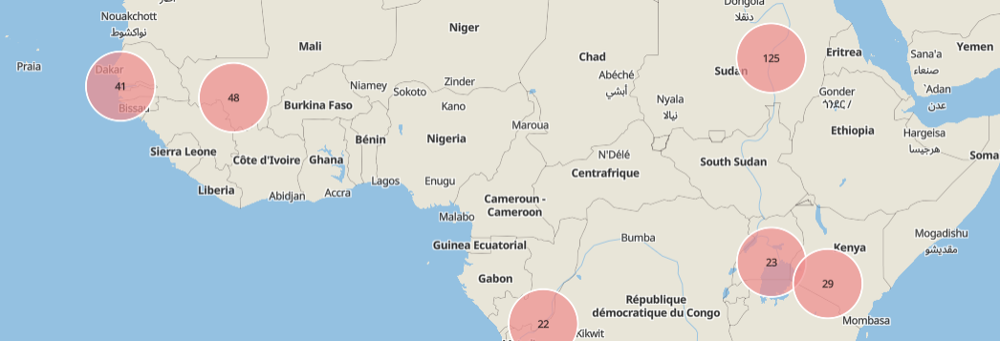

# How to Display Your Information on a Map

> In Uwazi, there are two ways to display your information on a geographic map: by using the map toggle in the Uwazi library, and by using a map visualisation component in a page. These instructions will help you configure your information to include geographic data and display that geographic data on a map.

## Configure your information to include geographic data

Step 1: Open the entity template that you want to be displayed on a map.

Step 2: To configure this entity template to include geolocation coordinates, you can drag and drop the **Geolocation** property to the entity template.


Step 3: **Save** the template.

Step 4: Create a new entity of the type you just configured. Geographic coordinates can be set via map-click or manually typing the coordinates.


## Display your information using the map toggle in the Uwazi library

When the database has entities with geolocation properties, the map toggle button  will appear as an option in Uwazi's library. Filters and searches can be used to narrow down the information displayed in the map. Users can toggle the filter/search results between map and card list view.


The map will automatically group pins in clusters. Clicking on a map pin or one of the results in the cluster,will display the entity details in the right side panel. Clicking on a cluster will display list of the included geolocated entities:


## Display your information using a map visualisation component in a page

Step 1: In your Uwazi library, narrow down the information that you want to display in your map by selecting the filters on the right side panel. When you have finished narrowing down the collection of cards in the library, copy the URL from ".../library/…"

Step 2: Open the page that you want to display your map

Step 3: The code snippet you will need to include in the page starts with:

```jsx
<Dataset geolocation="true" />

<Map />
```

Step 4: Then you will add the URL snippet that you copied from the library:

```jsx
<Dataset url="/library/?q=(_types:!(%275bfbb1a0471dd0fc16ada146%27,%275d2d9f4622220717a93dbfcd%27),limit:0,order:desc,sort:creationDate,types:!(%275bfbb1a0471dd0fc16ada146%27,%275d2d9f4622220717a93dbfcd%27))" geolocation="true" />

<Map />
```

Renders:


