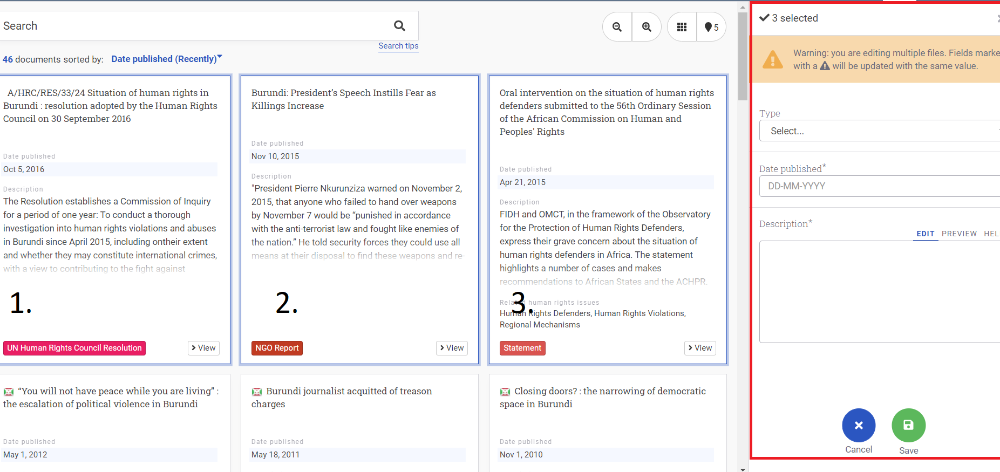

# How to Edit Properties on Multiple Entities

Step 1: Click on all the documents that you want to edit.

In the library of your instance, select the documents you want to edit using your operating system’s multi-select commands:

- Windows: Hold down the CTRL key and select the files

- Mac: Hold down the Command key and select the files

Step 2: Once you have selected all the cards, click **Edit**.

Step 3: You can edit any number of the metadata fields, then click **Save**.

