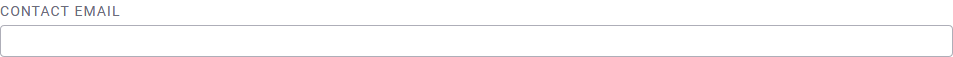

# How to Edit Your Site Settings

Step 1: Click on **Settings**, then click on **Collection**.

Step 2: After you have made all your changes, please ensure that you click **Save**.

## Change the name of your collection ([*screencast*](https://drive.google.com/open?id=1_6ele0a2bmdSbLD1-UjUfSd53JaUL54T))

- The name is "Uwazi" by default, but you can change it to anything you like.

## Make your collection private (or public)

- If you are handling sensitive information or you just want your collection to be accessible only via login, you can click the checkbox to make the instance private.

- By activating this option, your information will not be crawled by search engines, and users will be prompted with a login screen when trying to access your documents or entities.

## Change the date format

- You may change the date format, based on your preference.

## Set your landing page

- The landing page is the first thing users will see when visiting your Uwazi instance.

- By default, the landing page is set to the full Librarywithout any filters applied.

- But you can use any page from your Uwazi instance as the landing page instead. Copy and paste the URL on the text box, accordingly. These are some examples:
  
  - A static page: /page/dicxg0oagy3xgr7ixef80k9
  
  - A library query: /library/?searchTerm=test
  
  - A document or entity: /document/4y9i99fadjp833di /entity/9htbkgpkyy7j5rk9
  
  - Always use a URL relative to your site, starting with / and skipping the [https://yoursite.com](https://yoursite.com).

## Track web analytics

If you want to track analytics related to your collection visits, Uwazi supports both Google Analytics and Matomo.

- Find your unique ID
  
  - FAQ on how to set up a [Google Analytics ID](https://support.google.com/analytics/answer/3123666?hl=en) to track website visits
  
  - If you are hosting your Uwazi with HURIDOCS, we provide Matomo as part of the hosting. Please contact us to activate your account.

- Add this unique ID to Uwazi.

## Mailer configuration

This allows you to configure your own SMTP or any other mail server. Instances hosted by HURIDOCS have the mail system already configured.

- This is a JSON configuration object that should match the options values required by Nodemailer, as explained [here](http://nodemailer.com/smtp/).

- This setting takes precedence over all other mailer configuration. If left blank, then the configuration file in /api/config/mailer.js will be used.

## Contact form configuration

If you have added a contact form on one of your pages, this is where you would add the email address that receives the information from that form. Click [here](#heading=h.2foqgdkokzfp) to learn how to add and configure a contact form on a webpage.

## Public form configuration

If you have added a public intake or submission form on one of your pages, this is where you would add the template ID (representing the numbers in the template URL). You must white-list the template IDs for which public forms are expected. Please include a comma-separated list of template IDs without spaces. Click [here](#bookmark=id.7zow8h6oowf5) to learn how to add and configure a public submission form on a webpage.

## Show cookies policy on your site

Cookies are bits of information used by some websites you visit and stored on your computer’s hard drive. Uwazi uses cookies to deliver an optimal experience to users. If you would like users to see a notification about the use of cookies on your instance, check **Show Cookie Policy**.

## Advanced customisations

This area is reserved for changing the style or appearance of your Uwazi instance.

- To create your own customization using CSS language, click on **Custom Styles**.

- To add a logo or any other image files, click on **Custom Uploads**.
