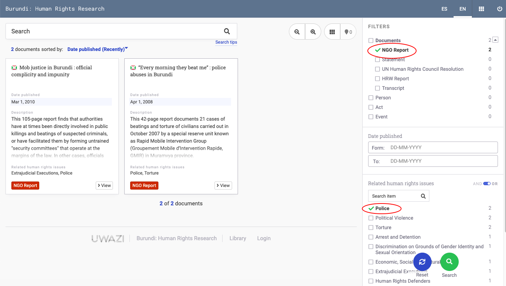

# How to Search Within Your Collection

Your Uwazi database offers a few different ways to search.

## Use filters to narrow your search

**Filters**: choose and combine filters to narrow down your search.

### Search the entire collection

**Text search**: a simple way to search entities in your collection is using the Search box on the top left side of your screen.

- You can perform a generic text search, which will show any terms mentioned in the search query.

- Or you can search for a specific term or phrase using **"**...**"** to find the exact match, e.g. ''United Nations Committee on Enforced Disappearances'’.

### Search only within a particular document

To search for a word or a phrase **within a particular document**.

- Select the document you want to search.

- Click on the search text function and input what you are looking for.

- You will see all the mentions of your search query listed in chronological order as they appear in the document.

- You can click on the number under document content to take you to the correct segment of the text.

### Advanced search queries

**Query string searches**: You can search for specific information using wildcards, boolean search and query strings.

- \* for wildcard search. i.e.: "juris*" will match words such as jurisdiction, jurisdictional, jurists, jurisprudence, etc.
- ? for one character wildcard. Ie: "198?" will match 1980 to 1989 and also 198a, 198b, etc.
- Exact term match by enclosing your search string with quotes. Ie. "Costa Rica" will toss different results compared to Costa Rica without quotes.
- ~ for proximity searches. Ie: "the status"~5 will find anything having "the" and "status" within a distance of 5 words, such as "the procedural status", "the specific legal status".
- AND, OR and NOT for boolean searches. Ie. "status AND women NOT Nicaragua" will match anything containing both the words status and women, and necessarily not containing the word Nicaragua.

> Please refer to Elasticsearch's [query string syntax page](https://www.elastic.co/guide/en/elasticsearch/reference/5.5/query-dsl-query-string-query.html#query-string-syntax) for more information on search options.
