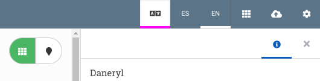
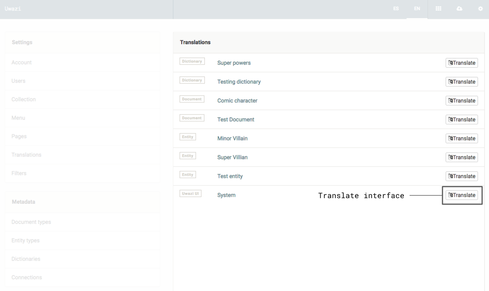

# How to translate the Uwazi interface

This guide describes how to translate the Uwazi interface -- all the text you see in buttons, menus, messages, etc. If you want to learn about how to translate your content, [click here](https://uwazi.readthedocs.io/en/initial-setup/admin-docs/how-to-translate-your-content.html).

There are two methods you can use to translate the Uwazi interface.

Option 1: Live Translation

This is the recommended translation method. It allows you to translate the interface directly in your Uwazi instance. This method allows you to explicitly see the context in which the text is used.

-   Step 1: Login to your Uwazi instance.
-   Step 2: Click on the **Translations** toggle in the top bar next to the language options. This will underline all translatable items in the current view.

Step 3: Click on the item you want to translate, add the translations, and click **Submit**.

 
Option 2: Settings

This option has the advantage of allowing you to translate all Uwazi interface text in a single place. However, it may be difficult to infer the context in which these phrases are used. Unless you are familiar with the Uwazi interface, we recommend Option 1.

-   Step 1: Login to your Uwazi instance.
-   Step 2: Under **Settings**, click **Translations**.
-   Step 3: Find the row called “System” and click the **Translate** button in that row.

-   Step 4: Translate each term and click **Save**.
