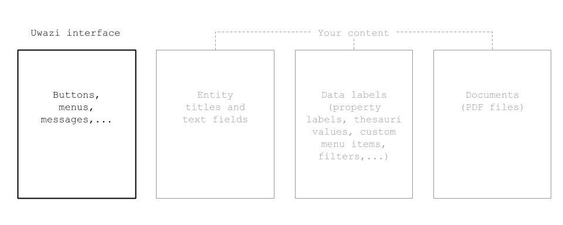
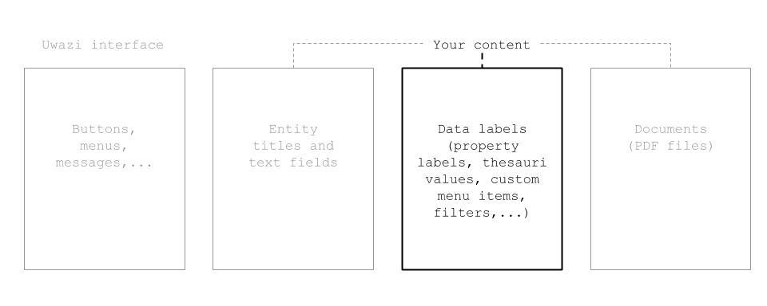
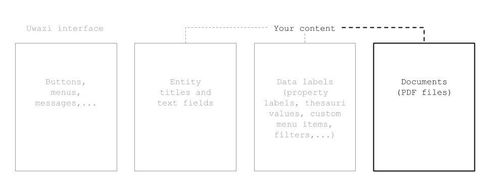

# HOW TO TRANSLATE YOUR CONTENT 

This guide describes how to translate your content in Uwazi. If you want to learn about how to translate the Uwazi interface -- all the text you see in buttons, menus, messages, etc, [click here](https://uwazi.readthedocs.io/en/initial-setup/admin-docs/how-to-translate-the-Uwazi-interface.html).

There are three aspects of translating your content:
1.  Translating entity titles and text values

2.  Translating data labels
-   [Click here](https://uwazi.readthedocs.io/en/initial-setup/admin-docs/how-to-create-templates-and-add-properties.html) to learn more about properties and metadata in Uwazi.

3.  Uploading translated documents (PDFs)
-   [Click here](https://uwazi.readthedocs.io/en/initial-setup/admin-docs/how-to-upload-and-publish-documents.html) to learn more about documents in Uwazi.

### 1. How to translate entity titles and text values

Entity titles and text-based metadata values need to be translated for each of your entities. Until they are translated, they will show in their original language regardless of the user’s interface language.

Step 1: Login to your Uwazi instance.

Step 2: Change the interface language to the language you want to translate to. The language options are at the top right on desktop and tablet devices, and on mobile they are at the bottom of the menu opened by the collapsed menu icon at the top left.

Step 3: Select the entity you want to translate.

Step 4: In the right side panel, update the title and other text-based metadata values that you want translated. Text-based fields include Text properties, Rich Text properties, and Media properties.

Step 5: Click **Save**.

### 2. How to translate data labels

For data labels such as property labels, thesauri values, relationship types, custom menu items or filters, you can translate the terms in Settings and don’t have to do any extra per-entity translation.

Step 1: Login to your Uwazi instance.

Step 2: Under **Settings**, click **Translations**.

Step 3: Click on the content that you want to translate.

Step 4: Translate each term and click **Save**.

### 3. How to upload translated documents (PDFs)

Step 1: Login to your Uwazi instance.

Step 2: Select the entity to which you want to attach documents (PDFs), or create a new entity.

Step 3: In the right side panel, under **Documents**, click **Upload new file**. If one or more documents are already attached to the entity, you’ll see them here. Perform this step for all the translated versions you have of the document.

Step 4: For each document now attached to the entity, click on Edit, select the language of the document, and click **Save**.
-   Note: If translations of a document aren’t available for all of your collection’s configured languages, users may see a document in a different language than the interface they’re using.

### Managing Translations Over Time

#### Creating a new entity
When you create a new entity, all of its metadata properties are synced to all languages when the entity is first saved. 

#### Editing an existing entity
When you edit an existing entity, changes to the following metadata properties will get synced to all languages:
* Thesaurus-based properties (select and multiselect fields)
* Relationships
* Date-based properties
* Geolocation
* Numeric properties
* The Table of Contents if the same source document is used in other languages (since it depends on the contents of the document)

Changes to the following metadata properties will NOT be synced, so you will need to make any necessary updates in other languages manually:
* Text references
* Media
* Text and Rich Text fields

