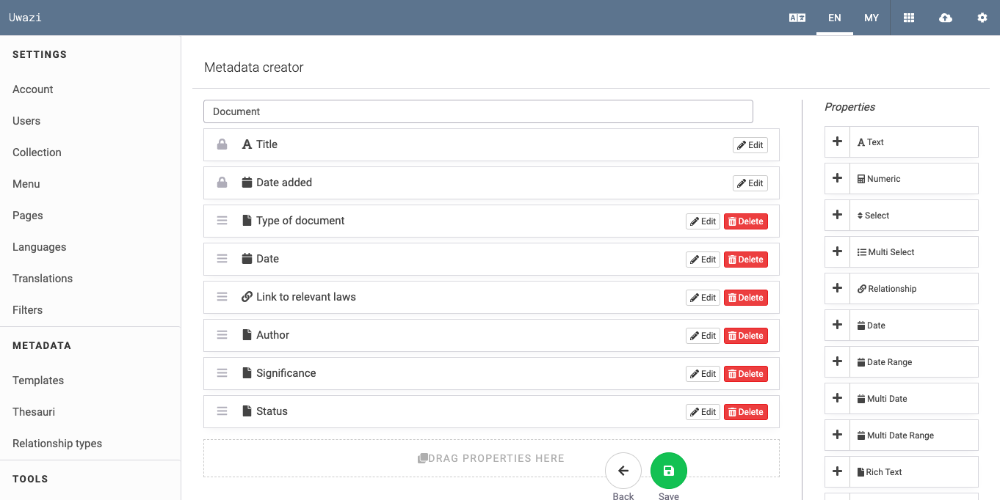
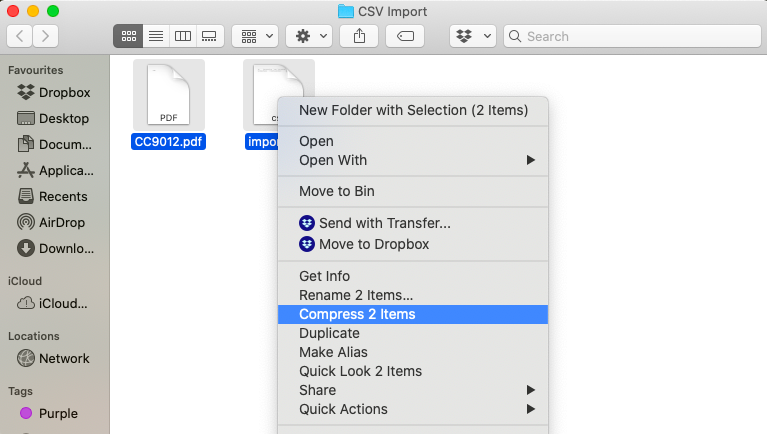
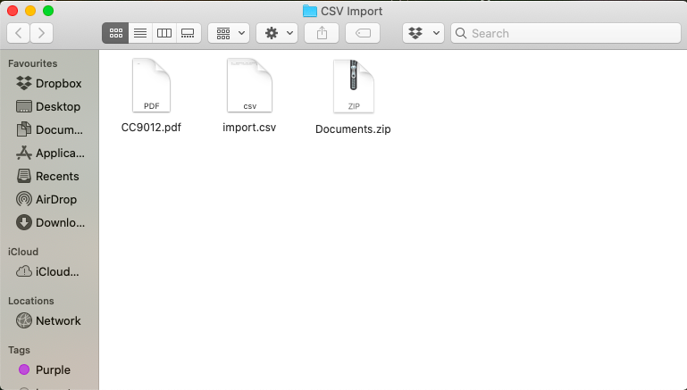
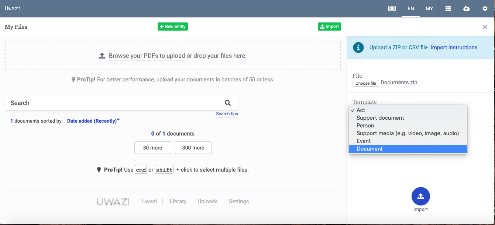

# How to Upload and Publish Documents

Uwazi currently supports document uploads in PDF format. This allows Uwazi to be able to carry out numerous functions on the document like conducting full text search, creating a table of contents, text references and other functions.

Other formats like .doc, .txt, .odt, .jpg can be included in your collection, but they must be uploaded as an attachment to your entity Please refer to Step 4 at the end of this section for further guidelines regarding this.

Step 1: Create or identify a template that will encapsulate the details of your document.

Step 2: Once you have collected your documents and created template(s) for them, you have to upload them. Go to the the private documents section on the navigation bar.

There are two ways in which documents can be uploaded onto Uwazi -- one is **a direct upload** (Step 2a) and second mode is through **a csv import** (Step 2b), which is helpful for a large migration of documents.

## Upload the document directly ([*screencast*](https://drive.google.com/open?id=1HVadM8ZHQdlDVGq5LBO_3k1abperX_8G))

Step 2a: You can either drag or drop your PDF files into the dotted box, or you can click on **Browse your files to upload** and select the file or files that you want to upload.

- Your files will be added to the upload section  of Uwazi, but they will remain in the private documents section until you click on **Publish**, which will make them public.

- Skip to Step 3 to learn more about how to publish your document(s).

### Import your documents through csv import (data migration)

Step 2b: Organise your PDFs that are ready to be imported, and create a **Comma-Separated Values (CSV) file** with each of the field names you had earlier entered as properties in Uwazi.

- Migration works with matching field names – therefore, be meticulous in using the same column header names in the csv file as the field names in Uwazi.

- **Note:** Field names are not case sensitive, which means you can use either lowercase, capitals or a combination of both. It is also possible to rename fields in Uwazi after the import.

- The "**Title**" field is required in your CSV file. It serves to identify the document or entity, but does not have to be unique.

- There is no need to include the "**Date Added**" field because it is filled automatically during the import into Uwazi.

- The CSV file must contain a **File** column with the names of each **main document** (as illustrated in column H in the above screenshot).

- To do your CSV import, the main PDF file(s) and this csv file should be compressed within a single ZIP file. See the illustration below:

 

- To import the CSV file, click on the Private Documents icon  and then **Import**. Select your compressed ZIP file, and ensure that you choose the correct template before clicking import (as illustrated in the screenshot below).

- All your PDF files along with the corresponding metadata will be imported into Uwazi.

### 

### Publish your documents

.

- If you have chosen to upload your documents using Step 2(a), you will need to choose a template and assign metadata to your documents before they will be ready to be published.

- Select the document you want to publish, and click **Edit**. This will open a sidebar (as outlined in the red box here).

- Choose the **Type** of template you want to assign it and fill in the corresponding metadata. Unless a specific field is mandatory, you may skip field(s) if you do not currently have that information or if it is not relevant.

- Ensure that you click **Save** after you are done.

- Once the document is ready with all its metadata in place, you can click on **Publish**. Users will now be able to view your document publicly in the Library.
