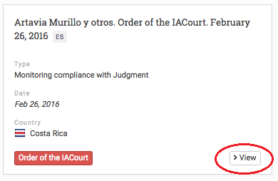
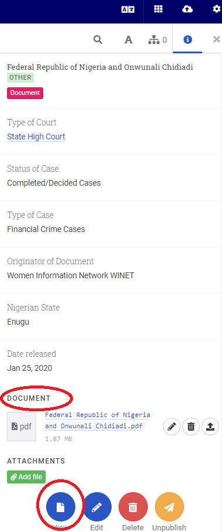

# How to View a Document from a Card

In the library section, you will find your entire collection. Each entity will be displayed in this library as a card. To open and view the full document or more information about the record, you can either:

- hover over the document card and click the **View** button, which will open or

- click on the card to open the right side panel. From there, you can click on **View,** or you can click on a document itself to download it as a PDF.

