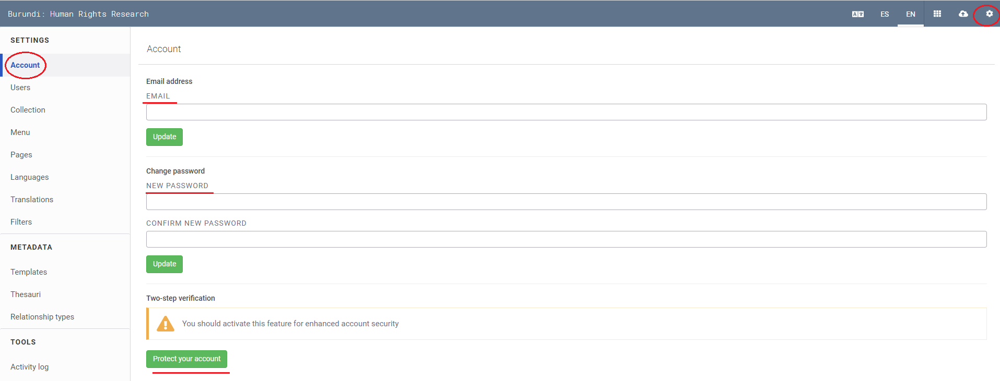
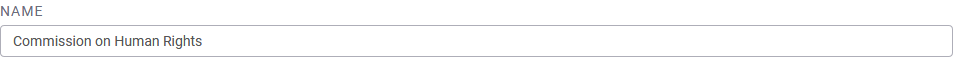
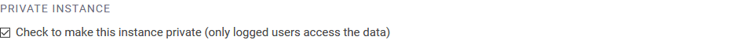

# MANAGING SETTINGS

## How to configure your account

### Change your account information

Step 1: Login to your Uwazi instance.

Step 2: Under **Settings**, click **Accounts**.

Step 3: You can change your email address here, as well as your account password.

### Recover your password

Step 1: At the login screen, click **Forgot Password?**.

Step 2: You will receive an email from the [no-reply@uwazi.io](mailto:no-reply@uwazi.io) account. Follow the instructions.

- If you cannot find this recovery email, please check if it has been filtered into your ‘’Spam’’ folder.

- To reinforce your account’s security, we recommend that you use unique and long passwords (a-Z, 0-9, &%).

Watch a [screencast](https://drive.google.com/open?id=1fJcdhGPGRZEZMn6ExzS2csinH3FJwcBd).

### Enable two-factor authentication

To add an extra layer of security to your Uwazi instance:

Step 1: Login to your Uwazi instance.

Step 2: Under **Settings**, click **Accounts**.

Step 3: You will see **Two-step verification**, click on **Protect your Account**.

Step 4: Open [Authy](https://authy.com/features/setup/) or [Google Authenticator](https://support.google.com/accounts/answer/1066447?co=GENIE.Platform%3DAndroid&hl=en) and generate your verification code.

Step 5: Enter the code and click **Confirm**.

- If you have successfully enabled two-factor authentication, your account settings will reflect this.

Watch a [screencast](https://drive.google.com/open?id=1G02gKDvIejl4NxwpyiIqiIU5KPjbamBE).

### Login with two-factor authentication

Step 1: Login to Uwazi with your credentials..

Step 2: You will be prompted to input your authentication code. Enter the code from Authy or Google Authenticator.

- If the code is approved, you will be logged in.

Watch a [screencast](https://drive.google.com/open?id=1lYbJHkDrDoAeYzoVcPcYQPoAWyUf3JmR).

FAQs related to two-factor authentication

- Google Authenticator: [https://support.google.com/accounts/answer/185834?hl=en](https://support.google.com/accounts/answer/185834?hl=en)

- Authy application: [https://authy.com/help/](https://authy.com/help/)

## How to create, edit and delete users

### Understanding user permissions

If you work in a team or in collaboration with other people, Uwazi allows administrators to create new users with specific permissions to help you update your collection of documents. Uwazi currently supports three different kinds of roles:

### Add new users to your instance

Step 1: Only an Admin can create new users. Go to **Settings** and click on **Users**.

Step 2: You will see a list of all the current users who have access to your collection.

Step 3: You can create new users by clicking the green **Add user** button at the bottom. Here, you can also edit or delete users, as necessary.

Step 4: Enter a **username**, their **email address** and select a role (**Admin**, **Editor** or **Collaborator**) for them.

Step 5: Once this information is entered, click the green **Save** button and an email will be sent to that person with a link that allows them to set their own password.

Watch a [screencast](https://drive.google.com/open?id=12Z-HtNoPU2vcS80CG30496ECAL5vEJI3).

### Create new user groups

Step 1: Only an Admin can create new users. Go to **Settings** and click on **Users**.

Step 2: On the Users tab, you will see a list of all the current users who have access to your collection. Switch to the Groups tab.

Step 3: You can create new groups by clicking the green **Add Group** button at the bottom. Here, you can also edit or delete users in that group, as necessary.

Step 4: Assign a **Name of the group** and add the usernames that you want to include.

Step 5: Once this information is entered, click the green **Create Group** button.

## How to edit your site settings

- Click on **Settings**, then click on **Collection**.
- After you have made all your changes, please ensure that you click **Save**!

### Change the name of your collection

- The name is "Uwazi" by default, but you can change it to anything you like. ([*screencast*](https://drive.google.com/open?id=1_6ele0a2bmdSbLD1-UjUfSd53JaUL54T))

### Customise the favicon

If you want to replace the Uwazi icon for your own:
-   Convert your logo/image into .ico (icon) format. To do so, search the internet for an .ico converter and convert the image you want as your icon. Save this file on your local drive.
-   On the left sidebar under **Tools** , click on **Uploads**. Select **Browse files to upload** and upload the logo/image that you converted to the .ico format. Once your image uploads, copy the URL. (It will begin with “/assets”.)   
-   Navigate back to the **Collections** settings, and toggle on where it says **Custom Favicon** and paste the above URL.
-   Click **Save**, and be sure to reload the webpage after updating your favicon.

### Make your collection private (or public)

- If you are handling sensitive information or you just want your collection to be accessible only via login, you can click the checkbox to make the instance private.
- By activating this option, your information will not be crawled by search engines, and users will be prompted with a login screen when trying to access your entities.

### Change the date format

- You may change the date format, based on your preference.

### Set your landing page

- The landing page is the first thing users will see when visiting your Uwazi instance.

- By default, the landing page is set to the full Library  without any filters applied.

- However, you can use any page from your Uwazi instance as the landing page instead. Toggle on where it says **Use custom landing page** and paste the URL in the box, accordingly. These are some examples:
  
  - A static page: /page/dicxg0oagy3xgr7ixef80k9
  
  - A library query: /library/?searchTerm=test
  
  - A document or entity: /document/4y9i99fadjp833di /entity/9htbkgpkyy7j5rk9
  
  - Always use a URL relative to your site, starting with / and skipping the [https://yoursite.com](https://yoursite.com).

### Show cookies policy on your site

Cookies are bits of information used by some websites you visit and stored on your computer’s hard drive. Uwazi uses cookies to deliver an optimal experience to users. If you would like users to see a notification about the use of cookies on your instance, toggle on **Show Cookie Policy**.

### Support non-Latin characters in property names

Toggling this on will update non-latin languages as default languages and properties, automatically. In addition, the links or URLS will be updated as well.

## How to track your site's analytics

If you want to track analytics related to your collection visits, Uwazi supports both Google Analytics and Matomo.

- Find your unique ID.
  
  - FAQ on how to set up a [Google Analytics ID](https://support.google.com/analytics/answer/3123666?hl=en) to track website visits.
  
  - If you are hosting your Uwazi with HURIDOCS, we provide [Matomo Analytics](https://matomo.org/) as part of the hosting. Please contact us to activate your account.

- Add this unique ID to Uwazi.

## How to configure your site's mailer and forms

### Mailer configuration

This allows you to configure your own SMTP or any other mail server. Instances hosted by HURIDOCS have the mail system already configured.

- This is a JSON configuration object that should match the options values required by Nodemailer, as explained [here](http://nodemailer.com/smtp/).

- This setting takes precedence over all other mailer configuration. If left blank, then the configuration file in /api/config/mailer.js will be used.

### Contact form configuration

If you have added a contact form on one of your pages, this is where you would add the email address that receives the information from that form. Click [here](https://uwazi.readthedocs.io/en/latest/admin-docs/designing-your-website.html#how-to-create-a-contact-form) to learn how to add and configure a contact form on a webpage.

### Public form configuration

If you have added a public intake or submission form on one of your pages, this is where you would add the template ID (representing the numbers in the template URL). You must white-list the template(s) for which public form(s) are expected. Click [here](https://uwazi.readthedocs.io/en/latest/admin-docs/designing-your-website.html#how-to-create-a-public-intake-form-on-your-website) to learn how to add and configure a public submission form on a webpage.

## How to change your site's map configurations

### Map starting point

To set your own geolocation default, drag the map and click to select the destination, or enter the latitude and longitude, if known.

### Maptiler key

We provide a default MapTiler key, but you can change it to your own if you wish to.
