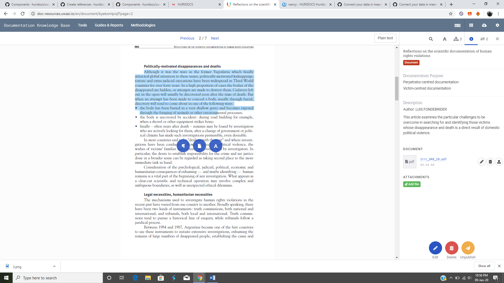
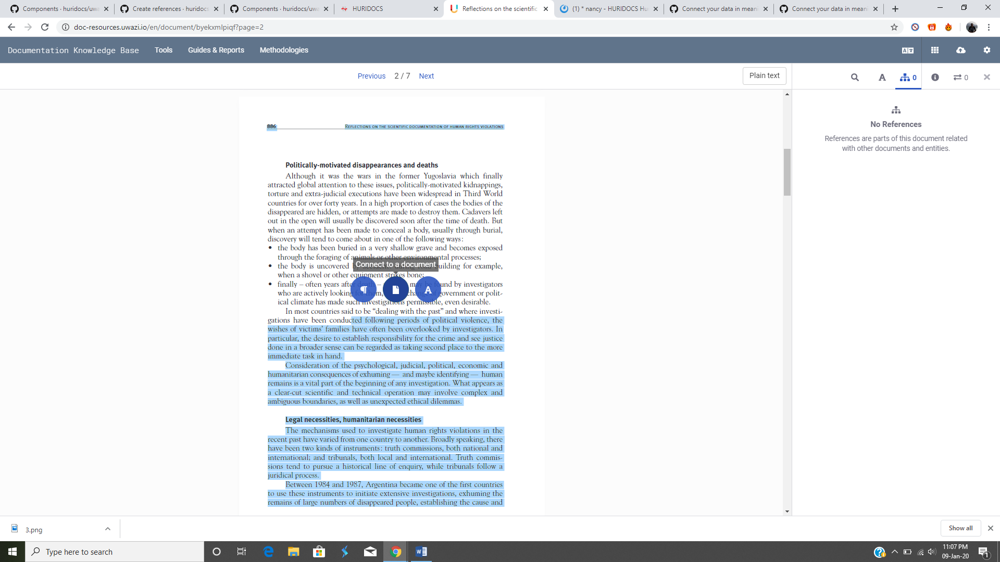
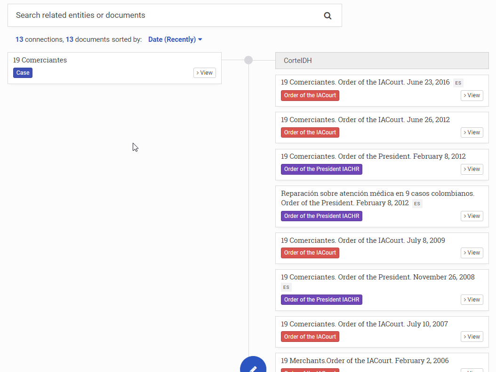
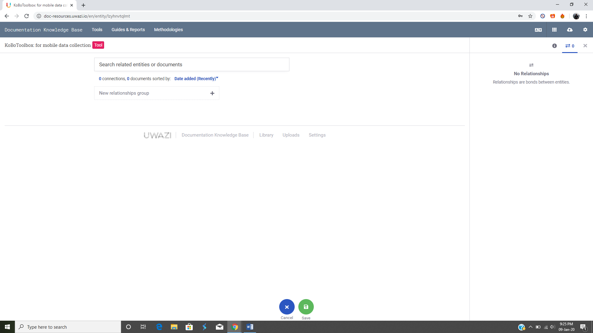

# ORGANISING and EXPLORING YOUR COLLECTION

## How to view entities as cards, in a table or on a map

All of the entities in an Uwazi collection live in an area called the **Library** , where they can be viewed as cards, in a table or on a map (as long as entities have an associated geolocation). Learn more about how to customise the default Library view.

When exploring your collection, you can freely switch between the different views by toggling the icons found along the top of the Library area:

- Click the cards icon  to turn on **Cards View**. When **Cards View** is activated, simply click on the entity card to expand the right sidebar and see more details about the entity. You can also click the **View** button on the card itself or from within the right sidebar to open the entity in full.
- Click the table icon to turn on **Table View**. You can customise which columns are shown by using the dropdown menu found along the top of the Library area. When **Table View** is activated, simply select the checkbox next to the entity to expand the right sidebar and see more details. You can also click the **View** button from within the right sidebar to open the entity in full. 
- Click on the map icon to turn on **Map View**. (This icon will only appear if the entities in your collection have an associated geolocation. Learn more about adding properties to entities.) When **Map View** is activated, simply click on a point within the map to expand the right sidebar and see more details about the entity. You can also click the **View** button from within the right sidebar to open the entity in full.

## How to configure main and secondary filters

Filters appear on the righthand sidebar of the Library. They help users quickly navigate an Uwazi collection as well as generate basic conclusions about its contents.

### Configure main filters

The main filters are derived from the types of entity templates that exist in your collection. You can define which ones can be used as filters in the **Library**’s sidebar, customize the order in which the filters appear, and group certain ones together under a label of your choosing.  

Step 1: Click on the **Settings** icon in the top navigation menu and then click on **Filters**.

Step 2: On the righthand side in an area named **Entity types**, you will see a list of your templates. For each template that you want to be able to filter in the **Library**, drag and drop the corresponding item into the space labeled **Drag items here** in the order in which you would like it to appear.

Step 3: If you would like to group certain filters together, click on the **Create group** button. Give the group a descriptive label. Underneath the label, drag and drop the items that you would like to appear in the group. 

Step 4: Once finished, **Save** the changes you have made.

### Configure a second tier of filters on the sidebar

Besides using the types of templates as filters, you can also select which specific properties on the entities act as filters.

Step 1: Click on the **Settings** icon in the top navigation menu and then click on **Templates**.

Step 2: Select the **Edit** button on the type of template you would like to edit.   

Step 3: Find the property that you want to include as a filter in the **Library** and click on the **Edit** button.

Step 4: Select whichever filter options match your needs: 
- **Use as filter** checkbox: This activates the ability to filter entities according to this property. When a user visits the **Library** and selects the corresponding type of template among the main filters in the Library’s sidebar, the option to further filter all of the entities by this property will then appear.     
- **Default filter** checkbox: This additional option makes it so the property always shows as a filter in the Library’s sidebar by default, no matter if the corresponding type of template among the main filters is selected or not. 
- **Show in cards** checkbox: While not technically a filter, this additional option makes it so the property appears in the entity card within the Library’s **Cards View**. Selecting this option on a few key properties can make it easier for users to quickly skim through your collection by sight and identify specific entities.    

Step 5: Click on **Save**. You can now go to the **Library** and view the filters you have configured. For multi-select properties that you have activated as filters, you will see an **And/Or** toggle next to the filter: 
- Using the **AND** operator will display the entities that contain all the properties for which you are filtering.
- Using the **OR** operator will display the entities that contain at least one of the properties for which you are filtering.

## How to search within your collection

There are a few different types of search that you can conduct in your Uwazi collection.

### Search the entire collection

You can perform a search using the search bar found along the top of the Library area.  It can be a generic text search, which will show any terms mentioned in the search query. Or you can search for a specific word or phrase by enclosing it in quotation marks to find the exact match (e.g.‘’United Nations Committee on Enforced Disappearances”).

### Search only within a particular document

You can also perform a search within  PDFs that are uploaded as the **Primary Document** of an entity. Learn more about adding Primary Documents.

Step 1: Navigate to the **Library** and locate the entity that contains the document you want to search. Click the **View** button to see the document in full.

Step 2: Click on the **Search** icon in the right sidebar. A search bar will appear.

Step 3: Input your search query. All of the mentions within the document of the word or phrase you searched for will appear in chronological order.

Step 4: Click on any of the search results to be taken to the specific segment of the document.

### Advanced search queries

To make your search queries more targeted, you can use several different advanced techniques: 

- An asterisk * added to a query will conduct a **multiple character wildcard search**. The asterisk stands in for any number of characters in your query. For example, a search for **juris*** will match words such as jurisdiction, jurisdictional, jurists, jurisprudence, etc. 
- A question mark ? added to a query will conduct a **one character wildcard search**. The question mark stands in for one single character only. For example, **198?** will match any of the years between 1980 and 1989 as well as 198a, 198b, etc. 
- Question marks enclosing a query like this “...” will conduct a search that looks for exact term match. For example, **"Costa Rica"** will return different results compared to **Costa Rica** without quotation marks. 
- A tilde ~ added after a phrase in quotation marks will conduct a **proximity search**. The tilde indicates that you want to look for results that match your query approximately, but not exactly. You can accompany the tilde with a number to set a maximum number of words that separate the original terms in your query. For example, **“the status”~5** will find anything having “the” and “status” within a distance of 5 words, such as “the procedural status” or “the specific legal status”. 
- **AND**, **OR** and **NOT** added to a query will conduct a **boolean search**. AND indicates that all words searched for must be present; OR indicates that only one of the words searched for must be present; and NOT excludes results that contain the word included. For example, **status AND women NOT Nicaragua** will match anything that contains both the words status and women and does not contain the word Nicaragua. 

Please refer to Elasticsearch’s [query string syntax page](https://www.elastic.co/guide/en/elasticsearch/reference/5.5/query-dsl-query-string-query.html#query-string-syntax) for more information on search options.

## How to create a table of contents

Most documents have a defined structure through its pages. Creating a table of contents will allow your end-users to quickly navigate through the document’s contents. Alternatively, you can create your own structure that would be most useful to them.

Step 1: Click on the document that you want to add the table of contents to.

Step 2: Click on the **Table of Contents** button (the A icon) on the right side panel.

Step 3: Now you can highlight the text that you want to add. Three blue icons will appear. Choose the far right circle, **Add to Table of Contents**, and the highlighted text will appear on the right sidebar.

Step 4: Repeat this process until you have created a full table of contents. You can add as many headings and subheadings as you like.

- You can add indentation by clicking on the arrow buttons. Uwazi currently supports 6 levels of indentations with different styles for every level to improve readability.

Step 5: Once you are done, click **Save**. The table of contents will now be showing. Users can click on the heading and they will be directed to the relevant segment.

Step 6: You can always come back later to revise or add more contents by clicking the **Edit** button.

## How to create references

> In Uwazi, a **reference** is a bookmark that connects highlighted content in one document to something else -- such as other selected content in the same document, other selected content in a different document, or even an entire document or an entity.

### Reference other text in the same or a different document

Step 1: Go to **Settings** and click on **Relationship types** to add a "type of connection."

- **Note:** You must define your relationship type(s) first in order to create references.

Step 2: Click **View** on the file for which you want to create the reference. Note that references can only be made from text selected in a PDF document.

Step 3: Select the text you want. Three options will appear. Click on **Connect to a paragraph**.

Step 4: Select the relationship type.

Step 5: Choose the document you want to refer to. You can manually search for it by title if you can't find the document you are looking for. You can also select the same document you’re currently editing.

- Note: only published entities appear in this list.

Step 6: Click **Next**, and this will take you to the document you have selected to refer to.

Step 5: Select the relevant part of the text you want to reference, highlight it and click **Save**.

- This will create the reference for you. Users will see this referenced text under the References tab  in the right sidebar.

### Reference another document

Step 1: Go to **Settings** and click on **Relationship types** to add a "type of connection."

- **Note:** You must define your relationship type(s) first in order to create references.

Step 2: Click **View** on the file for which you want to create the reference. Note that references can only be made from text selected in a PDF document.

Step 3: Highlight the segment of text you want and click on **Connect to a document**.

Step 3: Select the relationship type.

Step 4: Select the document you want to reference. You can manually search for it by title if you can't find the document you are looking for.

- Note: only published entities appear in this list.

Step 4: Click on **Save**.

Users will see the referenced document under the **References** tab  in the right sidebar.

When the reference is selected, the highlighted text will be displayed in the PDF.

## How to create relationships 

> In Uwazi, a **relationship** connects two or more entities to each other so that it’s possible to investigate and analyse "who did what to whom" (and when, and where, etc). Note: we use the terms “relationship” and “connection” interchangeably.

Uwazi supports connecting data in unstructured ways, meaning you don't need to follow a particular data structure or predefine a relational model upfront. Entities can be connected to each other in one-to-one or one-to-many relations arbitrarily:

### Understanding "information hubs"

Information hubs hold together a series of entities. These hubs allow you to see the relationships between your entities. They also help to infer other relationships that might have previously been overlooked.

There are two ways in Uwazi to create connections between entities in your collection.

### Create relationships when adding new entities

You can create relationships when adding new entities if you have defined a template with a "Relationship" property. Click [here](https://uwazi.readthedocs.io/en/latest/admin-docs/building-info-architecture.html#how-to-connect-properties-on-different-templates) to learn how to add a “Relationship” property to a template.

When creating a new entity that has a "Relationship" property in its template, you will see the relevant options that can be linked to the new entity that you are adding. You can search for entities by title using the search box.

### Create relationships between existing entities

Step 1: Go to **Settings** and click on **Relationship types** to add a "type of connection."

- **Note:** You must define your relationship type(s) first in order to connect properties. Doing Step 1 ensures that the relationship type(s) that you just created will appear as a dropdown option in the **New relationships group** field in see Step 6.

Step 2: Select **View** on the entity that you want to add a connection with.

Step 3: At the right side menu, click on the **Connection** icon .

Step 4: Click on the blue **Edit** button.

Step 5: Here, you can make your connection. Click on **New relationships group +**.

Step 6: Select the type of relationship that you want to create in the **New connection type** dropdown.

Step 6: Select the entity from the right bar. You can search for it by title, if it has not been recommended by the system. You can add more connections in this hub by selecting **Add entities / documents +**.

Step 8: Click **Save** when you have made the connections you want. Your new connections will appear on the Connections tab.

- You can view the connections on an entity by clicking on **View**, then on  **Connections** in the right side panel. You will see existing connections of that particular entity.

### Edit connections

Step 1: You can edit existing connections on an entity by clicking on **View** on the entity for which you want to edit existing connections.

Step 2: Click on  **Connections** in the right side panel.

Step 3: Click on the blue **Edit** button. You can change the relationship type labels or remove a connection altogether by clicking on the **Delete** button.

Step 4: Click **Save** when you have completed editing your connections.

