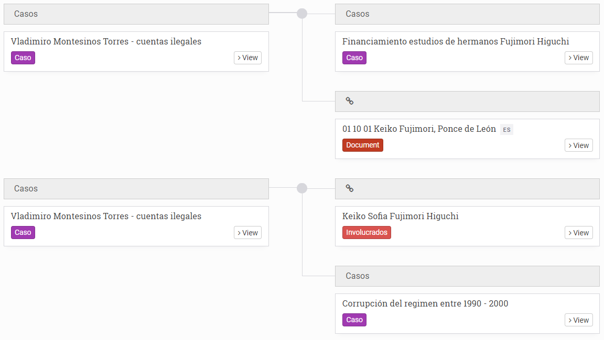

# ORGANISING & EXPLORING YOUR COLLECTION

## How to view entities and documents

### View entities as cards, in a table or on a map

All of the entities in an Uwazi collection live in an area called the **Library** , where they can be viewed as cards, in a table or on a map (as long as entities have an associated geolocation). Learn more about how to customise the default Library view.

When exploring your collection, you can freely switch between the different views by toggling the icons found along the top of the Library area:

- Click the cards icon  to turn on **Cards View**. When **Cards View** is activated, simply click on the entity card to expand the right sidebar and see more details about the entity. You can also click the **View** button on the card itself or from within the right sidebar to open the entity in full.
- Click the table icon to turn on **Table View**. You can customise which columns are shown by using the dropdown menu found along the top of the Library area. When **Table View** is activated, simply select the checkbox next to the entity to expand the right sidebar and see more details. You can also click the **View** button from within the right sidebar to open the entity in full. 
- Click on the map icon to turn on **Map View**. (This icon will only appear if the entities in your collection have an associated geolocation. Learn more about adding properties to entities.) When **Map View** is activated, simply click on a point within the map to expand the right sidebar and see more details about the entity. You can also click the **View** button from within the right sidebar to open the entity in full.

### Read PDFs within Uwazi

If an entity has a PDF attached as its **Primary Document**, you can view and explore it directly within Uwazi without having to download anything. To do so: 

Step 1: Navigate to the **Library** and locate the entity that contains the Primary Document you want to read. 

Step 2: Either on the entity card or within the right sidebar, click the **View** button. The PDF will be displayed in full.

## How to configure main and secondary filters

Filters appear on the righthand sidebar of the Library. They help users quickly navigate an Uwazi collection as well as generate basic conclusions about its contents.

### Configure main filters

The main filters are derived from the types of entity templates that exist in your collection. You can define which ones can be used as filters in the **Library**’s sidebar, customize the order in which the filters appear, and group certain ones together under a label of your choosing.  

Step 1: Click on the **Settings** icon in the top navigation menu and then click on **Filters**.

Step 2: On the righthand side in an area named **Entity types**, you will see a list of your templates. For each template that you want to be able to filter in the **Library**, drag and drop the corresponding item into the space labeled **Drag items here** in the order in which you would like it to appear.

Step 3: If you would like to group certain filters together, click on the **Create group** button. Give the group a descriptive label. Underneath the label, drag and drop the items that you would like to appear in the group. 

Step 4: Once finished, **Save** the changes you have made.

### Configure a second tier of filters on the sidebar

Besides using the types of templates as filters, you can also select which specific properties on the entities act as filters.

Step 1: Click on the **Settings** icon in the top navigation menu and then click on **Templates**.

Step 2: Select the **Edit** button on the type of template you would like to edit.   

Step 3: Find the property that you want to include as a filter in the **Library** and click on the **Edit** button.

Step 4: Select whichever filter options match your needs: 
- **Use as filter** checkbox: This activates the ability to filter entities according to this property. When a user visits the **Library** and selects the corresponding type of template among the main filters in the Library’s sidebar, the option to further filter all of the entities by this property will then appear.     
- **Default filter** checkbox: This additional option makes it so the property always shows as a filter in the Library’s sidebar by default, no matter if the corresponding type of template among the main filters is selected or not. 
- **Show in cards** checkbox: While not technically a filter, this additional option makes it so the property appears in the entity card within the Library’s **Cards View**. Selecting this option on a few key properties can make it easier for users to quickly skim through your collection by sight and identify specific entities.    

Step 5: Click on **Save**. You can now go to the **Library** and view the filters you have configured. For multi-select properties that you have activated as filters, you will see an **And/Or** toggle next to the filter: 
- Using the **AND** operator will display the entities that contain all the properties for which you are filtering.
- Using the **OR** operator will display the entities that contain at least one of the properties for which you are filtering.

## How to search within your collection

There are a few different types of search that you can conduct in your Uwazi collection.

### Search the entire collection

You can perform a search using the search bar found along the top of the Library area.  It can be a generic text search, which will show any terms mentioned in the search query. Or you can search for a specific word or phrase by enclosing it in quotation marks to find the exact match (e.g.‘’United Nations Committee on Enforced Disappearances”).

### Search only within a particular document

You can also perform a search within PDFs that are uploaded as the **Primary Document** of an entity. Learn more about adding Primary Documents.

Step 1: Navigate to the **Library** and locate the entity that contains the document you want to search. Click the **View** button to see the document in full.

Step 2: Click on the **Search** icon in the right sidebar. A search bar will appear.

Step 3: Input your search query. All of the mentions within the document of the word or phrase you searched for will appear in chronological order.

Step 4: Click on any of the search results to be taken to the specific segment of the document.

### Advanced search queries

To make your search queries more targeted, you can use several different advanced techniques: 

- An asterisk * added to a query will conduct a **multiple character wildcard search**. The asterisk stands in for any number of characters in your query. For example, a search for **juris*** will match words such as jurisdiction, jurisdictional, jurists, jurisprudence, etc. 
- A question mark **?** added to a query will conduct a **one character wildcard search**. The question mark stands in for one single character only. For example, **198?** will match any of the years between 1980 and 1989 as well as 198a, 198b, etc. 
- Question marks enclosing a query like this “...” will conduct a search that looks for exact term match. For example, **"Costa Rica"** will return different results compared to **Costa Rica** without quotation marks. 
- A tilde ~ added after a phrase in quotation marks will conduct a **proximity search**. The tilde indicates that you want to look for results that match your query approximately, but not exactly. You can accompany the tilde with a number to set a maximum number of words that separate the original terms in your query. For example, **“the status”~5** will find anything having “the” and “status” within a distance of 5 words, such as “the procedural status” or “the specific legal status”. 
- **AND**, **OR** and **NOT** added to a query will conduct a **boolean search**. AND indicates that all words searched for must be present; OR indicates that only one of the words searched for must be present; and NOT excludes results that contain the word included. For example, **status AND women NOT Nicaragua** will match anything that contains both the words status and women and does not contain the word Nicaragua. 

Please refer to Elasticsearch’s [query string syntax page](https://www.elastic.co/guide/en/elasticsearch/reference/5.5/query-dsl-query-string-query.html#query-string-syntax) for more information on search options.

## How to sort entities in the Library

Whether you have applied filters, have conducted a keyword search, or are looking at the collection in its entirety, you can sort entities that are shown in the Library according to different criteria by using the dropdown list located beneath the search bar. Default sorting options include: 

- By entity title, in alphabetical order or reverse alphabetical order 
- By date the entity was added to the collection, from newest to oldest or from oldest to newest
- By date the entity was modified, from newest to oldest or from oldest to newest

You can add more criteria to the default options by utilising the Priority sorting checkbox when configuring properties on a template. Learn more about creating templates.

## How to create a table of contents

Within Uwazi, you can create an interactive table of contents for a PDF that is uploaded to an entity as a **Primary Document**, which will make it easier to quickly navigate through its contents. You can access this table of contents by clicking on the **Table of Contents** icon in the right sidebar of an entity.

Step 1: Navigate to the **Library** and locate the entity that contains the document for which you want to create a table of contents. Click the **View** button to see the document in full. 

Step 2: Within the document, use the cursor to highlight the text that you want to add as the first heading in the table of contents. Three blue buttons will appear.  Click on **Add to table of contents**, and the highlighted text will appear on the right sidebar.

  - Note: You may need to make small edits to the heading, such as restoring spaces between words. 

Step 3: Repeat this process until you have created a full table of contents. You can add as many headings and subheadings as you like. You can nest subheadings under headings by clicking on the arrow buttons to the left of the table of content entries. Uwazi currently supports six degrees of such indentations; each is styled differently to improve readability. 

Step 4: Once you have finisheds, click **Save**. The table of contents will now be accessible to anyone who views the document. Clicking on any heading  will take you  to the related section of the document. If you ever need to revise or add more contents in the future, simply click the Edit button.

## How to create references

In Uwazi, a **Reference** connects selected content in a **Primary Document** to other selected content within the same document, to other selected content in a different **Primary Document**, or to an entity (which may or may not have a **Primary Document** attached). You can see all of the **References** that a document has by clicking on the References icon in the right sidebar of its entity.

But before you can configure a **Reference**, you must first define the type(s) of relationship that will be used in your collection.

### Reference other text in the same or a different document

Step 1: Navigate to the **Settings** area and click on click on **Relationship types**. 

Step 2: Click on the **Add connection** button. Give the relationship a descriptive name and click **Save**. 

Step 3: Navigate to the **Library** and locate the entity that contains the document for which you want to create a **Reference**. Click the **View** button to see the document in full. 

Step 4: Within the document, use the cursor to highlight the text to which you want to add a Reference. Three blue buttons will appear. Click on the **Connect to a paragraph** button and an area called **Create Reference** will open in the right sidebar.

Step 5: Using the checkboxes, select the previously defined **type of relationship** that you would like to use as part of this Reference. 

Step 6: Choose the document from the list which contains the text that you want to refer to. If the list is long, you can use the search by to manually search by title to locate the document more quickly. You are free to select the same document that you are currently editing. 

Step 7: Click the green arrow button to proceed. You will then be taken to the document you have selected. Using the cursor, highlight the text that you want to reference.

Step 8: Click the green **Save** button.. The referenced text in both documents will be highlighted in yellow, indicating that it is associated with a Reference. Clicking on the document icon shown alongside the reference in the right sidebar will take you to the related paragraph.

### Reference another entity (with or without a Primary Document)

Step 1: Navigate to the **Settings** area and click on **Relationship types**. 

Step 2: Click on the **Add connection** button. Give the relationship a descriptive name and click **Save**. 

Step 3: Navigate to the **Library** and locate the entity that contains the document for which you want to create a **Reference**. Click the **View** button to see the document in full.

Step 4: Within the document, use the cursor to highlight the text to which you want to add a Reference. Three blue buttons will appear. Click on the **Connect to a document** button and an area called **Create Reference** will open in the right sidebar.

Step 5: Using the checkboxes, select the previously defined **type of relationship** that you would like to use as part of this Reference.

Step 6: Choose the entity from the list that you want to refer to. If the list is long, you can use the search bar to manually search by title to locate it more quickly. 

Step 7: Click the green **Save** button. The referenced text will be highlighted in yellow, indicating that it is associated with a Reference. Clicking on the document icon shown alongside the reference in the right sidebar will take you to the related entity.

## How to create relationships 

In Uwazi, a **Relationship** connects two or more entities in your collection so that it’s possible to  scrutinise how they interact with one another. You don’t have to predefine a relational model upfront or follow a rigid structure. Uwazi allows you to arbitrarily create Relationships between entities on a one-to-one basis or on a one-to-many basis.

These Relationships are displayed in a tree called an **Information Hub**. You can see all of the Relationships associated with an entity by clicking on the **Connections** 
 icon in the right sidebar.

Note: We sometimes use the term **Connection** to mean **Relationship**. In practice, these refer to the same feature.

There are two ways in Uwazi to create Relationships between entities in your collection.

### Understanding "information hubs"

Information hubs hold together a series of entities. These hubs allow you to see the relationships between your entities. They also help to infer other relationships that might have previously been overlooked.

There are two ways in Uwazi to create connections between entities in your collection.

### Create relationships when adding new entities

You can create Relationships when adding new entities if you have first created a template that includes a **Relationship** property. Learn more about how to add a **Relationship** property.

### Create relationships between existing entities

Step 1: Before you can configure a **Relationship**, you must first define the type(s) of relationship(s) that will be used in your collection. Navigate to the **Settings** area and click on **Relationship types**.

Step 2: Click on the **Add connection** button. Give the relationship a descriptive name and click **Save**.

Step 3: Navigate to the **Library** and locate the entity for which you want to create a **Relationship**. Click the **View** button to see the entity in full.

Step 4: Within the right sidebar, click on the **Connections**  icon to open up the **Information Hub**. Then near the bottom of the screen, click on the blue **Edit** button.

Step 5:  To start building the Relationship, click on the **New relationships group** button on the left side of the **Information Hub**.

Step 6: Using the dropdown list on the left side, select one of the previously defined Relationship types. Whichever you choose should appropriately describe the role that the current entity plays in this Relationship.

Step 7: Moving to the right side of the **Information Hub**, use the dropdown to once again select one of the previously defined **Relationship types**. Whichever you choose should appropriately describe the role that the other entity plays in this Relationship.

Step 8: Remaining on the right side of the Information Hub, click the **Add entities / documents** button. Then, within the right sidebar select the entity from the list that should form the other half of this Relationship. If the list is long, you can use the search bar to manually search by title to locate it more quickly.

Step 9: You can add more entities to this Relationship by repeating the same process as above.

Step 10: Once you have finished, click **Save**.

### Edit relationships

Step 1: Navigate to the **Library** and locate the entity whose **Relationships** you want to edit. Click the **View** button to see the entity in full.

Step 2: Within the right sidebar menu, click on the **Connections**  icon to open up the **Information Hub**.

Step 3: Click on the blue **Edit** button. You can change the **Relationship type** labels or remove a Relationship altogether by clicking on the **Delete** button.

Step 4: Click **Save** when you have finished.
