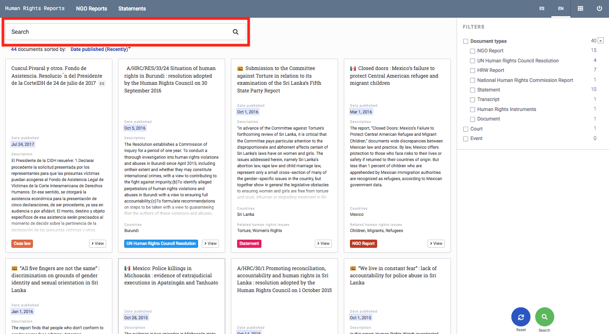
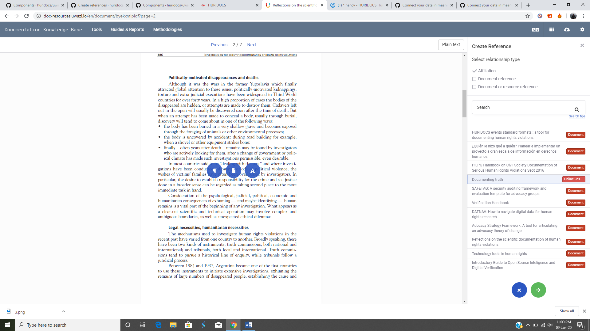

# ORGANISING YOUR COLLECTION

## How to View a Document from a Card

In the library section , you will find your entire collection. By default, each entity will be displayed in this library as a card. To open and view the full document or more information about the record, you can either:

- hover over the document card and click the **View** button, which will open out into the full entity view, or

- click on the card to open the right side panel. From there, you can click on **View,** or you can click on a document itself to download it as a PDF.

## How to Search Within Your Collection

Your Uwazi database offers a few different ways to search.

### Use filters to narrow your search

**Filters**: choose and combine filters to narrow down your search.

### Search the entire collection

**Text search**: a simple way to search entities in your collection is using the Search box on the top left side of your screen.

- You can perform a generic text search, which will show any terms mentioned in the search query.

- Or you can search for a specific term or phrase using **"**...**"** to find the exact match, e.g. ''United Nations Committee on Enforced Disappearances'’.

### Search only within a particular document

To search for a word or a phrase **within a particular document**.

- Select the document you want to search.

- Click on the search text function and input what you are looking for.

- You will see all the mentions of your search query listed in chronological order as they appear in the document.

- You can click on the number under document content to take you to the correct segment of the text.

### Advanced search queries

**Query string searches**: You can search for specific information using wildcards, boolean search and query strings.

- \* for wildcard search. i.e.: "juris*" will match words such as jurisdiction, jurisdictional, jurists, jurisprudence, etc.
- ? for one character wildcard. Ie: "198?" will match 1980 to 1989 and also 198a, 198b, etc.
- Exact term match by enclosing your search string with quotes. Ie. "Costa Rica" will toss different results compared to Costa Rica without quotes.
- ~ for proximity searches. Ie: "the status"~5 will find anything having "the" and "status" within a distance of 5 words, such as "the procedural status", "the specific legal status".
- AND, OR and NOT for boolean searches. Ie. "status AND women NOT Nicaragua" will match anything containing both the words status and women, and necessarily not containing the word Nicaragua.

Please refer to Elasticsearch's [query string syntax page](https://www.elastic.co/guide/en/elasticsearch/reference/5.5/query-dsl-query-string-query.html#query-string-syntax) for more information on search options.

## How to Create a Table of Contents

Most documents have a defined structure through its pages. Creating a table of contents will allow your end-users to quickly navigate through the document’s contents. Alternatively, you can create your own structure that would be most useful to them.

Step 1: Click on the document that you want to add the table of contents to.

Step 2: Click on the **Table of Contents** button (the A icon) on the right side panel.

Step 3: Now you can highlight the text that you want to add. Three blue icons will appear. Choose the far right circle, **Add to Table of Contents**, and the highlighted text will appear on the right sidebar.

Step 4: Repeat this process until you have created a full table of contents. You can add as many headings and subheadings as you like.

- You can add indentation by clicking on the arrow buttons. Uwazi currently supports 6 levels of indentations with different styles for every level to improve readability.

Step 5: Once you are done, click **Save**. The table of contents will now be showing. Users can click on the heading and they will be directed to the relevant segment.

Step 6: You can always come back later to revise or add more contents by clicking the **Edit** button.

## How to Create References

> In Uwazi, a **reference** is a bookmark that connects highlighted content in one document to something else -- such as other selected content in the same document, other selected content in a different document, or even an entire document or an entity.

### Reference other text in the same or a different document

Step 1: Go to **Settings** and click on **Relationship types** to add a "type of connection."

- **Note:** You must define your relationship type(s) first in order to create references.

Step 2: Click **View** on the file for which you want to create the reference. Note that references can only be made from text selected in a PDF document.

Step 3: Select the text you want. Three options will appear. Click on **Connect to a paragraph**.

Step 4: Select the relationship type.

Step 5: Choose the document you want to refer to. You can manually search for it by title if you can't find the document you are looking for. You can also select the same document you’re currently editing.

- Note: only published entities appear in this list.

Step 6: Click **Next**, and this will take you to the document you have selected to refer to.

Step 5: Select the relevant part of the text you want to reference, highlight it and click **Save**.

- This will create the reference for you. Users will see this referenced text under the References tab  in the right sidebar.

### Reference another document

Step 1: Go to **Settings** and click on **Relationship types** to add a "type of connection."

- **Note:** You must define your relationship type(s) first in order to create references.

Step 2: Click **View** on the file for which you want to create the reference. Note that references can only be made from text selected in a PDF document.

Step 3: Highlight the segment of text you want and click on **Connect to a document**.

Step 3: Select the relationship type.

Step 4: Select the document you want to reference. You can manually search for it by title if you can't find the document you are looking for.

- Note: only published entities appear in this list.

Step 4: Click on **Save**.

Users will see the referenced document under the **References** tab  in the right sidebar.

When the reference is selected, the highlighted text will be displayed in the PDF.

## How to Create Relationships 

> In Uwazi, a **relationship** connects two or more entities to each other so that it’s possible to investigate and analyse "who did what to whom" (and when, and where, etc). Note: we use the terms “relationship” and “connection” interchangeably.

Uwazi supports connecting data in unstructured ways, meaning you don't need to follow a particular data structure or predefine a relational model upfront. Entities can be connected to each other in one-to-one or one-to-many relations arbitrarily:

### Understanding "information hubs"

Information hubs hold together a series of entities. These hubs allow you to see the relationships between your entities. They also help to infer other relationships that might have previously been overlooked.

There are two ways in Uwazi to create connections between entities in your collection.

### Create relationships when adding new entities

You can create relationships when adding new entities if you have defined a template with a "Relationship" property. Click [here](https://uwazi.readthedocs.io/en/latest/admin-docs/building-info-architecture.html#how-to-connect-properties-on-different-templates) to learn how to add a “Relationship” property to a template.

When creating a new entity that has a "Relationship" property in its template, you will see the relevant options that can be linked to the new entity that you are adding. You can search for entities by title using the search box.

### Create relationships between existing entities

Step 1: Go to **Settings** and click on **Relationship types** to add a "type of connection."

- **Note:** You must define your relationship type(s) first in order to connect properties. Doing Step 1 ensures that the relationship type(s) that you just created will appear as a dropdown option in the **New relationships group** field in see Step 6.

Step 2: Select **View** on the entity that you want to add a connection with.

Step 3: At the right side menu, click on the **Connection** icon .

Step 4: Click on the blue **Edit** button.

Step 5: Here, you can make your connection. Click on **New relationships group +**.

Step 6: Select the type of relationship that you want to create in the **New connection type** dropdown.

Step 6: Select the entity from the right bar. You can search for it by title, if it has not been recommended by the system. You can add more connections in this hub by selecting **Add entities / documents +**.

Step 8: Click **Save** when you have made the connections you want. Your new connections will appear on the Connections tab.

- You can view the connections on an entity by clicking on **View**, then on  **Connections** in the right side panel. You will see existing connections of that particular entity.

### Edit connections

Step 1: You can edit existing connections on an entity by clicking on **View** on the entity for which you want to edit existing connections.

Step 2: Click on  **Connections** in the right side panel.

Step 3: Click on the blue **Edit** button. You can change the relationship type labels or remove a connection altogether by clicking on the **Delete** button.

Step 4: Click **Save** when you have completed editing your connections.

