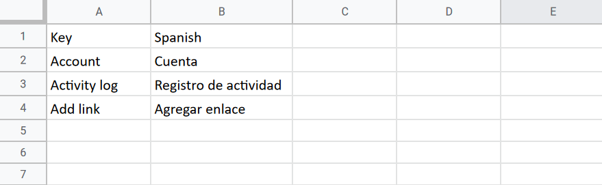

# Translating your Collection

An Uwazi collection can be made available in one or more languages. In fact, Uwazi supports the localisation of its interface and a collection’s entities into more than 180 different languages. This ranges from the world’s most commonly spoken languages such as Chinese, French, Hindi and Spanish, to less widespread but no less important languages such as Burmese, Kurdish, Quechua and Yoruba.

## How to configure the available languages for your collection

The first step to making your Uwazi collection multilingual is to enable your desired language options. When multiple languages are enabled for your collection, you will see the languages included as items in the main navigation menu of your collection.

It’s important to note that enabling a language does not mean that the interface of your collection or the contents of entities in the **Library**  will automatically be translated into that language. The processes of translating the interface and contents are explained further along in this section.

To configure the available languages for your collection:

Step 1: Navigate to the **Settings**  area and click on **Languages**.

Step 2: Click on **Install Language(s)**. A pop-up will appear where you can choose the language(s) you want to add. Select the language(s) you want from the available list. You can also quickly locate the language(s) using the search box.

:::{tip}
If your language is not in the list, [get in touch with us](how-to-report-bugs-or-problems-in-uwazi.md).
:::

Step 3: Click on **Install** after selecting all the language(s) you want to add.

Step 4: You should see the language(s) you have added at the top of the page under **Active languages**. If not, simply refresh your browser. Finally, select which language will be the default one for your collection by clicking on the button with the star next to each displayed language.

:::{attention}
Except for the default language, you are able to uninstall languages from your **Active languages** list. When you do, however, make sure that you are not currently navigating your Uwazi collection in the same language that you’re trying to delete. If you try to delete a language while the matching language option is selected within the main navigation menu, deletion will not work.
:::

## How to translate the Uwazi interface

The collective of buttons, menu items, system messages, etc. that you interact with while using the Uwazi software is called the interface. The Uwazi interface is available by default in English, as well as Arabic, Burmese, French, Korean, Russian, Spanish, Thai and Turkish. However, you are free to customise the default translations of any interface terms found within your Uwazi collection. Furthermore, the interface can be manually translated into any of the [languages that you have previously enabled](#how-to-configure-the-available-languages-for-your-collection), even if they don’t have an available default translation.

All interface translations that are currently configured in your instance can be consulted and edited at any time by navigating to the **Settings**  area, clicking **Translations** and then clicking the **Translate** button next to **User Interface** under **System translations**. At the top of the screen, you can toggle on the filter **Untranslated Terms** to quickly see what terms require a translation.

### How to load and edit available default translations of the interface

If you wish to edit translations of the Uwazi interface, first follow the previously explained [process for enabling the desired languages in your collection](#how-to-configure-the-available-languages-for-your-collection). The languages that you have enabled will now appear in the language dropdown menu found within your collection’s main navigation menu along the top of the screen. When you select a language from the dropdown menu, your collection’s button, system messages, etc. will now appear in that language.

If you would like to amend the translation of any particular term, you can do so in two different ways:

1. Navigate to the **Settings**  area and click **Translations**. Under **System Translations**, click **User Interface**, locate the term or terms that you want to modify, input the translation in the space provided, and click **Save**.

2. Remain in the same place where you have seen the term in context. Along the top of the screen, open the language dropdown menu within your collection’s main navigation menu and click to activate the **Live Translate** feature. Consequently, all of the terms on the screen that are translatable will be underlined in orange, and the circle next to **Live Translate** will turn green. Click on the term that you want to translate, add its corresponding translation(s) in the pop-up, and click **Submit**. Repeat this process for any of the other underlined terms on the screen that you would like to translate. When you have finished, click on the green circle next to **Live Translate** in the interface language dropdown menu to deactivate the feature.

:::{tip}
If at any moment, you would like to reset your interface translations and return to the default state, navigate to the **Settings**  area, click **Languages** and click the **Reset** button next to the language in question.
:::

### Translate interface terms in bulk with CSV import

The majority of Uwazi’s interface can be translated all in one go by importing a **Comma-Separated Values (CSV) file** that includes the list of terms in English and their corresponding translations. This method can be especially convenient when setting up your collection for the first time and the language that you require is not available as a default translation in Uwazi.

:::{note}
A CSV file of the English-language interface terms is available for [download on the Uwazi GitHub repository](https://github.com/huridocs/uwazi/blob/development/contents/ui-translations/en.csv).
:::

To translate the Uwazi interface using CSV import:

Step 1: If you aren't already in possession of a CSV file containing the translated interface terms, then you must first create a CSV file on your computer. The first column within the file should be labeled “Key” and include the list of terms in English. Each term should occupy its own row.

Step 2: The next column should be labeled with the name of the target language, as written in English (e.g. “Russian”, “Spanish”, “Swahili”), and include the corresponding translations of the English-language terms. For example, here’s a sample CSV file viewed as plain text:

```text
Key,Spanish
Account,Cuenta
Activity log,Registro de actividad
Add link,Agregar enlace
```

And here’s the same file viewed in a spreadsheet program:



Step 3: Save the **CSV file** in UTF-8 format on your computer.

Step 4: Navigate to the **Settings**  area, click **Translations** and then click **User Interface**.

Step 5: Click the **Import** button. Using the file browser to navigate your computer’s storage, find and select the **CSV file**. Once the import has finished, the translations will appear on screen.

Step 6: Click the **Save** button.

## How to translate the contents of your collection

An Uwazi collection is made up of **Entities** that live in the **Library** . An entity has **Properties**, can hold **Primary Documents** and/or **Supporting Files**, and can have **Relationships** to other entities. A collection might also feature **Pages** with important information or components like a **Contact Form**.

It’s possible to translate the contents of your collection into any and all of the [languages that you have previously enabled](#how-to-configure-the-available-languages-for-your-collection). This means that when you toggle from one language option to another using the links within the main navigation menu, the contents of the **Library** or a **Page** will consequently be presented in the language that corresponds to your selection.

There are four main aspects of translating the contents of your Uwazi collection:

- Translating the **Name** or **Label** of properties, **Thesauri**, **Relationship Types**, custom **Filters** and custom navigation menu items  
- Translating the contents of entity names and **Text**, **Rich Text**, **Image** and **Media** properties
- Uploading translated **Primary Documents** and recreating **Table of Contents** and **References**
- Translating custom **Pages**

### Translate the Name / Label of properties, Thesauri, Relationship Types, custom Filters and custom navigation menu items

Until you translate the various data labels that appear within an entity or around your collection, such as the **Name** or **Label** of properties, **Thesauri** terms, **Relationship Types**, custom **Filters** or custom navigation menu items, they will appear in their original language regardless of whichever language option is currently selected in the main navigation menu.

Step 1: Navigate to the **Settings**  area and click **Translations**.

Step 2: Click on the entity template, **Thesauri**, **Relationship** (Connection), etc. which contains the data labels that you want to translate.

Step 3: Translate each term.

Step 4: When you have finished, click **Save**.

### Translate the contents of Text, Rich Text, Image and Media properties

Until you translate the contents of **Text**, **Rich Text**, **Image** and **Media** properties, they will appear in their original language regardless of whichever language option is currently selected in the main navigation menu.

Step 1: Using the links within the main navigation menu, switch to the language into which you want to translate.

Step 2: Navigate to the **Library**  and locate the entity that you want to translate.

Step 3: Click on the entity to expand the right sidebar and see more details about the entity. Click the **Edit** button and replace the contents of these properties with the translation.

Step 4: Click **Save**.

### Upload translated Primary Documents

Until you upload a translated version(s) of an entity’s **Primary Document**, it will appear in the original language regardless of whichever language option is currently selected in the main navigation menu.

Step 1: Navigate to the **Library**  and locate the entity to which you want to upload a translated version of its **Primary Document**.

Step 2: Click on the entity to expand the right sidebar and see more details about the entity. You will see the file name of the entity’s **Primary Document** alongside a label indicating the language of its contents (e.g. English).

Step 3: Click the **Add PDF** button and select the translated version of the **Primary Document** from within the file browser.

Step 4: To the best of its ability, Uwazi will automatically detect the language of the uploaded file and attach a corresponding label. (You are free to modify the resulting label if it does not match the document’s language accurately.) If the language of an uploaded **Primary Document** matches a language that is enabled in your collection, then Uwazi will load it by default when that language option is selected in the main navigation menu.

For example, imagine that you have English and Spanish enabled in your collection, and that you have an entity with a **Primary Document** in English and a version in Spanish. When you navigate the English-language collection and click the **View** button on this entity, Uwazi will load the English-language version of **Primary Document**. If you switch to the Spanish-language collection and click the **View** button on this same entity, Uwazi will instead load the Spanish-language version of the **Primary Document**.

:::{note}
Uwazi is only able to automatically detect languages that are supported by ElasticSearch, and any other languages will be labeled as “Other”. For further information, consult [ElasticSearch’s website](https://www.elastic.co/guide/en/elasticsearch/reference/current/analysis-lang-analyzer.html).
:::

Step 5: If the original **Primary Document** has any **References** connecting parts of its text to other parts of its own text, to other text in a different **Primary Document**, or to a different entity entirely, these will need to be configured manually in any of the translated versions of the **Primary Document**. This is because **References** depend on the particular contents of an individual document. [Learn more about configuring **References**](organising-your-collection.md#how-to-create-references).

Step 6: **Table of Contents** for a **Primary Document** function in the same way as **References**. When you upload a translated version of a **Primary Document**, you will need to create a **Table of Contents** manually for the translated version. This is because **Table of Contents** depend on the particular contents of an individual document.[Learn more about configuring **Table of Contents**](organising-your-collection.md#how-to-create-a-table-of-contents).

### Translate Pages

Until you translate the contents of a **Page**, they will appear in their original language regardless of whichever language option is currently selected in the main navigation menu.

Step 1: Using the links within the main navigation menu, switch to the language into which you want to translate.

Step 2: Navigate to the **Settings**  area and click **Pages**. Locate the Page that you want to translate and click **Edit**.

Step 3: Translate the contents of the **Page**. When you have finished, click **Save**.

:::{note}
Depending on the specific components incorporated in the design, it may or may not be necessary to adjust the **Page**’s code. For example, if you have properly translated the entities in your **Library**  following the [steps explained in the previous sections](#how-to-translate-the-contents-of-your-collection), then any data visualisations included within the **Page** that are configured using information from your collection’s API will automatically render in whichever language option is currently selected in the main navigation menu. [Learn more about designing pages and about data visualisations](designing-your-website.md).
:::

## Managing translations over time

### Creating a new entity

Whenever you create and save a new entity or **Page**, all of its contents are synced across all of your collection’s available languages. If the entity has any **Text**, **Rich Text**, **Image** and **Media** properties or has a translated **Primary Document**, make sure to follow the [previously explained process for translating them](#translate-the-contents-of-text-rich-text-image-and-media-properties). Otherwise, they will appear in their original language regardless of whichever language option is currently selected in the main navigation menu.

### Edit an existing entity or page

Whenever you edit the contents of an existing entity or **Page**, some changes will be synced across all of the languages of your collection, while others will not.

Changes made to the contents of the following will be automatically synced to all languages:

- **Select** properties
- **Relationship** property and any other arbitrary **Relationships** that an entity may have
- **Date** properties
- **Geolocation** property
- **Numeric** property
- **Link** property
- **Generated ID** property
- **Table of Contents** of a **Primary Document**. Keep in mind, however, that a **Table of Contents** is specific to an individual document because it depends on its particular contents. If you have multiple language versions of a **Primary Document**, each has its own **Table of Contents**. Changes to one language version won’t affect the others.
- **References** connecting text in a **Primary Document** to text in the same or a different **Primary Document**. Keep in mind, however, that **References** are specific to an individual document because they depend on its particular contents. If you have multiple language versions of a **Primary Document**, each has its own set of configured **References**. Changes to one language version won’t affect the others.
**References** connecting text in a **Primary Document** to other entities. Keep in mind, however, that **References** are specific to an individual document because they depend on its particular contents. If you have multiple language versions of a **Primary Document**, each has its own set of configured **References**. Changes to one language version won’t affect the others.

Changes made to the contents of the following will not be automatically synced, so you will need to make any necessary updates in other languages manually:

- **Name** property
- **Text** property
- **Rich Text** property
- **Media** property
- **Image** property
- **Pages**
