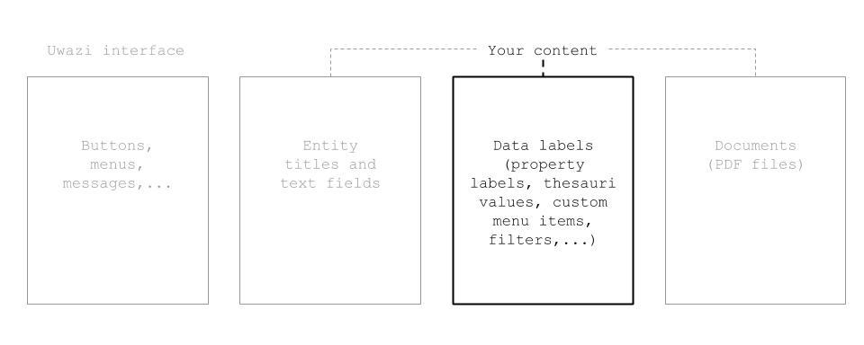
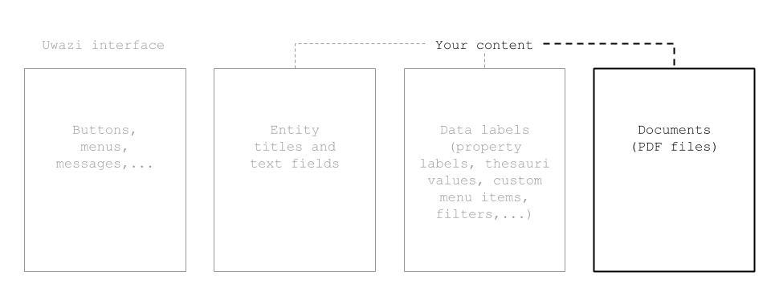

# TRANSLATING YOUR COLLECTION

An Uwazi collection can be made available in one language or in multiple languages. In fact, Uwazi supports the localisation of its interface and a collection’s entities into more than 180 different languages. This ranges from the world’s most commonly spoken languages such as Chinese, French, Hindi and Spanish, to less widespread but no less important languages such as Burmese, Kurdish, Quechua and Yoruba.

## How to configure the available languages for your collection

The first step to making your Uwazi collection multilingual is to enable your desired language options. When multiple languages are enabled for your collection, you will see the languages included as items in the main navigation menu of your collection.

It’s important to note that enabling a language does not mean that the interface of your collection or the contents of entities in the Library will automatically be translated into that language. The processes of translating the interface and contents are explained further along in this section.

To configure the available languages for your collection:

Step 1: Navigate to the **Settings** area and click on **Languages**.

Step 2: Locate the language(s) you want and click **Add language**. (If your language is not in the list, please get in touch with us.)

Step 3: Type **CONFIRM** (in all capital letters) in the confirmation dialog and click **Accept**.
- Note:  Search functionality within the Library will be limited for languages that aren’t supported by ElasticSearch. For further information, consult [ElasticSearch’s website](https://www.elastic.co/guide/en/elasticsearch/reference/current/analysis-lang-analyzer.html).

Step 4: At the top of the page under **Active Languages**, select which language will be the default language for your collection.
- Except for the default language, you are free to delete languages from your **Active Languages** list. When you do, however, make sure that you are not currently navigating your Uwazi collection in the same language that you’re trying to delete. If you try to delete a language while the matching language option is toggled on within the main navigation menu, deletion will not work.

## How to translate the Uwazi interface 

The collective of buttons, menu items, system messages, etc. that you interact with while using the Uwazi software is called the interface.  The Uwazi interface is available by default in English, but it can be translated into any of the languages that you have previously enabled.

All interface translations that are currently configured in your instance can be consulted and edited at any time by navigating to the **Settings** area, clicking **Translations** and then clicking **User Interface**.

## Translate interface terms in bulk

The majority of Uwazi’s interface can be translated all in one go by importing a **Comma-Separated Values (CSV) file** that includes the list of terms in English and their corresponding translations. This method can be especially convenient when setting up your Uwazi instance for the first time.

A CSV file of the English-language interface terms is available for download on the Uwazi website. We also offer CSV files of already translated interface terms for the following languages: Arabic, French, Spanish and Russian.

To translate the Uwazi interface using CSV import:

Step 1: If you aren't already in possession of a **CSV file** containing the translated interface terms, then you must first create a **CSV file** on your computer. The file should include one column for the terms in English and then separate columns for each language into which you wish to translate the interface. Column head names for all columns should be the name of the language written in English (e.g. English, Russian, Spanish).

Step 2: Populate the **CSV file** with the interface terms and their corresponding translations. Each term should occupy its own row.

Step 3: Save the **CSV file** in UTF-8 format on your computer.

Step 4: Navigate to the **Settings area**, click **Translations** and then click **User Interface**.

Step 5: Click the blue **Import** button. Using the file browser to navigate your computer’s storage, find and select the **CSV file**. Once the import has finished, the translations will appear on screen.

Step 6: Click the green **Save** button.

## Translate interface terms via the Live Translation feature

In Uwazi, you have the option to translate interface terms one by one as you encounter them while navigating the software. This feature, which is called Live Translation, allows you to see how a term is used in context. It can be useful for easily translating interface terms that are added to the software as part of newly released development or for quickly correcting an existing translation that isn’t quite right.

To use Live Translation: 

Step 1: When you encounter an interface term that you would like to translate, click on the **Translation** icon found in Uwazi’s main navigation menu. This activates Live Translation. All of the terms on the screen that are translatable will be underlined in orange.

Step 2: Click on the term that you want to translate, add its corresponding translation(s) , and click **Submit**. Repeat this process for any of the other underlined terms on the screen that you would like to translate.

Step 3: When you have finished, click on the **Translation** icon in the main navigation menu once more to deactivate Live Translation.

## How to translate your content	

This guide describes how to translate your content in Uwazi. If you want to learn about how to translate the Uwazi interface -- all the text you see in buttons, menus, messages, etc, [click here](hhttps://uwazi.readthedocs.io/en/latest/admin-docs/translating-your-collection.html#how-to-translate-the-uwazi-interface).

There are three aspects of translating your content:
1.  Translating entity titles and text values
2.  Translating data labels
3.  Uploading translated documents (PDFs)

### 1. How to translate entity titles and text values

Entity titles and text-based metadata values need to be translated for each of your entities. Until they are translated, they will show in their original language regardless of the user’s interface language.

Step 1: Login to your Uwazi instance.

Step 2: Change the interface language to the language you want to translate to. The language options are at the top right on desktop and tablet devices, and on mobile they are at the bottom of the menu opened by the collapsed menu icon at the top left.

Step 3: Select the entity you want to translate.

Step 4: In the right side panel, update the title and other text-based metadata values that you want translated. Text-based fields include Text properties, Rich Text properties, and Media properties.

Step 5: Click **Save**.

### 2. How to translate data labels

For data labels such as property labels, thesauri values, relationship types, custom menu items or filters, you can translate the terms in Settings and don’t have to do any extra per-entity translation.

Step 1: Login to your Uwazi instance.

Step 2: Under **Settings**, click **Translations**.

Step 3: Click on the content that you want to translate.

Step 4: Translate each term and click **Save**.

-   [Click here](https://uwazi.readthedocs.io/en/latest/admin-docs/building-info-architecture.html#how-to-create-templates-and-add-properties) to learn more about properties and metadata in Uwazi.

### 3. How to upload translated documents (PDFs)

Step 1: Login to your Uwazi instance.

Step 2: Select the entity to which you want to attach documents (PDFs), or create a new entity.

Step 3: In the right side panel, under **Documents**, click **Upload new file**. If one or more documents are already attached to the entity, you’ll see them here. Perform this step for all the translated versions you have of the document.

Step 4: For each document now attached to the entity, click on Edit, select the language of the document, and click **Save**.
-   **Note**: If translations of a document aren’t available for all of your collection’s configured languages, users may see a document in a different language than the interface they’re using.

-   [Click here](https://uwazi.readthedocs.io/en/latest/admin-docs/working-with-entities-in-your-collection.html#how-to-upload-and-publish-entities) to learn more about documents in Uwazi.

### Managing translations over time

#### Creating a new entity
When you create a new entity, all of its metadata properties are synced to all languages when the entity is first saved. 

#### Editing an existing entity
When you edit an existing entity, changes to the following metadata properties will get synced to all languages:
* Thesaurus-based properties (select and multiselect fields)
* Relationships
* Date-based properties
* Geolocation
* Numeric properties
* The Table of Contents if the same source document is used in other languages (since it depends on the contents of the document)

Changes to the following metadata properties will NOT be synced, so you will need to make any necessary updates in other languages manually:
* Text references
* Media
* Text and Rich Text fields
