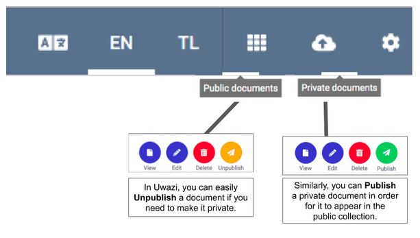

# Understanding "Public" versus “Private” Entities

In Uwazi, there are two areas where entities can be stored:

1. The public documents sectionare published entities.

2. The private documents section are unpublished entities.

