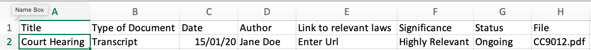
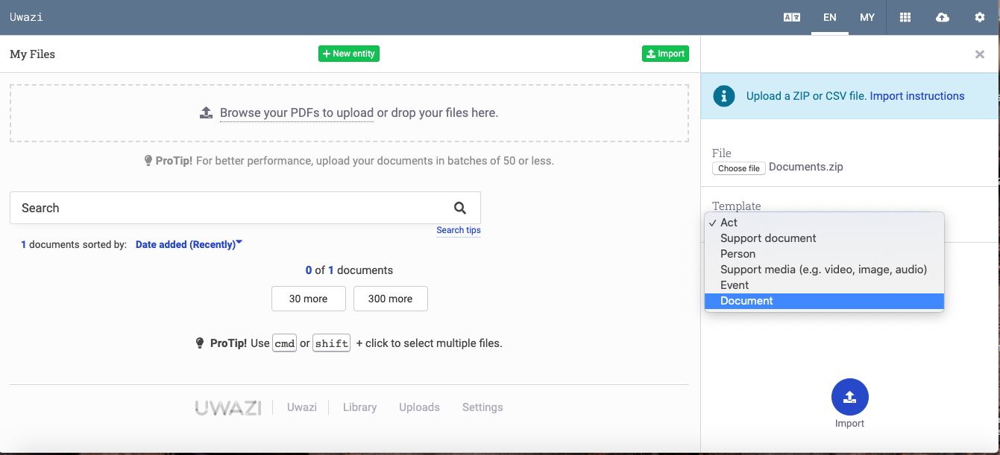
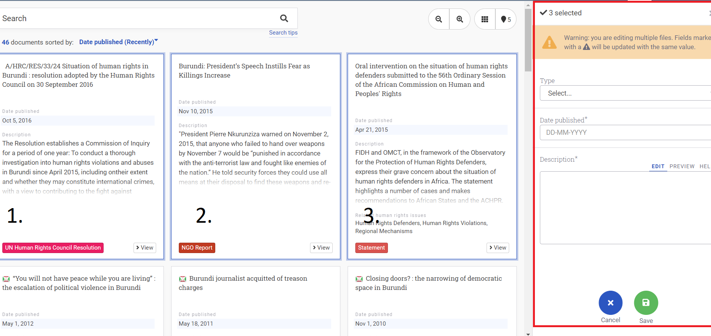

# ADDING DOCUMENTS AND ENTITIES TO YOUR COLLECTION 

## Understanding "Public" versus "Private" Entities

In Uwazi, there are two areas where entities can be stored:

1. The public documents section  are published entities.

2. The private documents section  are unpublished entities.

## How to Add New Entities

> Entity:  Something that has properties, is filterable, and can have connections. Some examples of entities may include a court, a case, a specific person or event. Before you can create a new entity, make sure you have already created a corresponding template!

To create a new entity:

Step 1: Go to the the private documents section  on the navigation bar.

Step 2: Click on the **New entity** button.

Step 3: Select which template to use, and give the entity a title and add other metadata that you want to include. (You may always come back to add, edit or delete this information later.)

Step 4: Click the **Save** button once you are finished.

When you are ready to share your entity in the Public documents section , select **Publish** on the entity.

(**Note:** if your Uwazi instance is set to Private, the entities are only shared with other logged in users who have the permission to view this information.)

## How to Upload and Publish Documents

Uwazi currently supports document uploads in PDF format. This allows Uwazi to be able to carry out numerous functions on the document like conducting full text search, creating a table of contents, text references and other functions.

Other formats like .doc, .txt, .odt, .jpg can be included in your collection, but they must be uploaded as an attachment to your entity. Please refer to [the next section](https://uwazi.readthedocs.io/en/initial-setup/admin-docs/how-to-add-attachments-to-entities.html) for further guidelines regarding this. 

Step 1: Create or identify a template that will encapsulate the details of your document.

Step 2: Once you have collected your documents and created template(s) for them, you have to upload them. Go to the the private documents section  on the navigation bar.

There are two ways in which documents can be uploaded onto Uwazi -- one is **a direct upload** (Step 2a) and second mode is through **a csv import** (Step 2b), which is helpful for a large migration of documents.

### Upload the document directly

Step 2a: You can either drag or drop your PDF files into the dotted box, or you can click on **Browse your files to upload** and select the file or files that you want to upload.

- Your files will be added to the upload section  of Uwazi, but they will remain in the private documents section until you click on **Publish**, which will make them public.

- Skip to Step 3 to learn more about how to publish your document(s).

Watch a [screencast](https://drive.google.com/open?id=1HVadM8ZHQdlDVGq5LBO_3k1abperX_8G).

### Import your documents through csv import (data migration)

Step 2b: Organise your PDFs that are ready to be imported, and create a **Comma-Separated Values (CSV) file** with each of the field names you had earlier entered as properties in Uwazi.

- Migration works with matching field names – therefore, be meticulous in using the same column header names in the csv file as the field names in Uwazi.

- **Note:** Field names are not case sensitive, which means you can use either lowercase, capitals or a combination of both. It is also possible to rename fields in Uwazi after the import.

- The "**Title**" field is required in your CSV file. It serves to identify the document or entity, but does not have to be unique.

- There is no need to include the "**Date Added**" field because it is filled automatically during the import into Uwazi.

- The CSV file must contain a **File** column with the names of each **main document** (as illustrated in column H in the above screenshot).

- To do your CSV import, the main PDF file(s) and this csv file should be compressed within a single ZIP file. See the illustration below:

 

- To import the CSV file, click on the Private Documents icon  and then **Import**. Select your compressed ZIP file, and ensure that you choose the correct template before clicking import (as illustrated in the screenshot below).

- All your PDF files along with the corresponding metadata will be imported into Uwazi.

### 

### Publish your documents

- If you have chosen to upload your documents using Step 2(a), you will need to choose a template and assign metadata to your documents before they will be ready to be published.

- Select the document you want to publish, and click **Edit**. This will open a sidebar (as outlined in the red box here).

- Choose the **Type** of template you want to assign it and fill in the corresponding metadata. Unless a specific field is mandatory, you may skip field(s) if you do not currently have that information or if it is not relevant.

- Ensure that you click **Save** after you are done.

- Once the document is ready with all its metadata in place, you can click on **Publish**. Users will now be able to view your document publicly in the Library .

## How to Add Attachments to Entities

### Add attachment(s) to your entity

If you wish, you can also add a .doc, .txt, .odt, .jpg file to your entity as an attachment. This could contain additional information that you would like attached to your entity.

The difference between documents and attachments in Uwazi is that a document is a PDF that gets shown in the main section of Uwazi when an entity is viewed, whereas attachments are visible an filenames only (and are available for download), but their actual contents are not visible in Uwazi.

Step 1: Open and view the entity.

Step 2: In the sidebar, scroll down and you will see an option for **Attachments**.

Step 3: You can add a file that will be visible along with your entity.

- You can use the **Add to all languages** option if you would like your attachment to be accessible to those viewing the entity in any of the languages Uwazi supports. **Note:** This option will only be available if your instance has more than one UI language.

### Import your attachments through csv import (data migration)

Step 1: To import multiple attachments to a single entity, use the pipe symbol | as the separator and do not include spaces between (e.g. example.doc|sample.jpg).

**Note:** All attachments using import are going to be assigned to the entity in all languages. *(This option is only available if your instance has more than one UI language.)*

Step 2: Otherwise, follow the rest of the csv import guidelines as outlined [here](https://uwazi.readthedocs.io/en/initial-setup/admin-docs/how-to-upload-and-publish-documents.html#import-your-documents-through-csv-import-data-migration).

## How to Edit Properties on Multiple Entities 

Step 1: Click on all the documents that you want to edit.

In the library of your instance, select the documents you want to edit using your operating system’s multi-select commands:

- Windows: Hold down the CTRL key and select the files

- Mac: Hold down the Command key and select the files

Step 2: Once you have selected all the cards, click **Edit**.

Step 3: You can edit any number of the metadata fields, then click **Save**.

## How to Configure Main and Secondary Filters

Filter options will depend on the metadata properties you have included on each entity in your collection. In Uwazi, you can choose which fields that you want to show as filters.

While configuring the filters in your instance, remember this can help users find information or direct them to specific analysis within the collection.

### Configure main filters

First, determine which templates types are going to be displayed in the right hand menu in the library:

Step 1: Go to **Settings**, and click on **Filters**.

Step 2: For each template you want the users to be able to filter, drag and drop that item from the **Document and Entity types** to the Filters area.

Step 3: You can click on the **Create group** option to further organise filters by creating groups under one label.

Step 4: Once you finish, click on **Save**.

Now, the users of your collection will be able to use the filters that you have defined.

### Configure a second tier of filters on the sidebar

Besides having the templates as filters, you can also add which metadata properties you would like to have shown on the right hand menu, for more specific filter options. These filters come from the properties assigned to each entity on a corresponding template.

Step 1: Go to **Settings**, click on **Templates**.

Step 2: Click on the field (e.g. Pais) that you want to include as a filter.

Step 3: Click on the **Edit** button of the property.

Step 4: Check the **Use as filter** and the **Default filter** options.

Step 5: You may optionally want to check the **Show in cards** option, as well.

Step 5: Click on **Save**. You can now go to the library section  and view the filters you have just configured.

These filters are presented to the users of your collection when no entity is selected. This option is best used when you want to apply relevant filters to several templates.

**Note:** You will see the And/Or toggle only on metadata that have multi-select properties.

- Using the AND operator will display the entities that contain all the properties for which you are filtering.

- Using the OR operator will display the entities that contain at least one of the properties for which you are filtering.

# Understanding "Public" versus "Private" Entities

In Uwazi, there are two areas where entities can be stored:

1. The public documents section  are published entities.

2. The private documents section  are unpublished entities.

