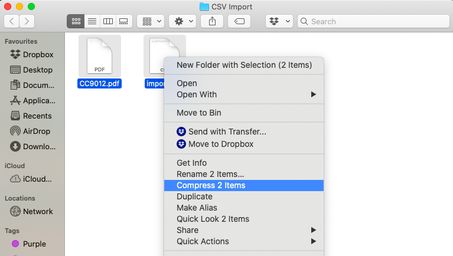
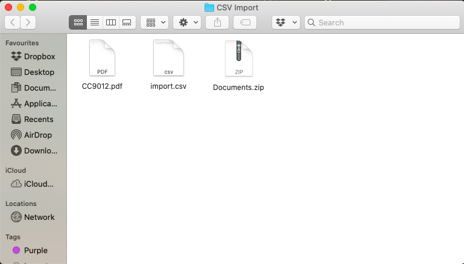

# WORKING WITH ENTITIES IN YOUR COLLECTION 

## Understanding entities

An Uwazi collection is made up of entities, which contain properties, can feature attached documents or supporting files, and can have connections to one another. Some examples of entities might include a court, a case, a specific person or an event. 

All of the entities in an Uwazi collection live in an area called the Library , where they can be viewed as cards, in a table or on a map (as long as entities have an associated geolocation), and can also be filtered according to their properties.

By default, the visibility of newly created entities is restricted. In practice, this means that only the user who created an entity as well as all users with admin or editor permissions can see and edit it. In order to make an entity visible to everyone who has access to your Uwazi collection, it must be shared accordingly with the “Public”. 

(Keep in mind that if your entire Uwazi collection is configured to be private, “Public” in this case strictly refers to everyone who possesses log-in credentials.)

Users with admin and editor permissions have the ability to filter all entities in the Library by their corresponding visibility: 
- “Restricted”, meaning that only a selected subset of users are able to see and/or edit the entity
- “Published”, meaning that everyone with access to the collection is able to see the entity

## How to add new entities to the Library

Remember, before you can create a new entity, make sure you have already created a corresponding template.

To create a new entity:

Step 1: Click on the Library icon  in the top navigation menu. 

Step 2: On the bottom right hand side of the screen, click on the **Create entity** button.

Step 3: Select which template to use, give the entity a title and fill in any of the properties that you want to include. (You may always come back to add, edit or delete this information later.)

Step 4: Click the **Save** button once you are finished.

Step 5: If the entity is intended to feature a PDF (“[Primary document](https://uwazi.readthedocs.io/en/latest/admin-docs/glossary-of-terms.html#)”), click the **Upload PDF** button in the entity pane and select the desired PDF from within the file browser. 

If the entity is intended to feature any other attached materials (“[Supporting files](https://uwazi.readthedocs.io/en/latest/admin-docs/glossary-of-terms.html#)”), click the **Add supporting file** button and select the desired file(s) from within the file browser. 

Step 6: Decide who should be able to see and edit the entity. By default, the new entity is only visible to you and other users with admin or editor permissions. 

To change these settings, click on the Share button in the entity pane. Add any new users who should have access to the entity, choose if they should be able to see and/or edit the entity, and click **Save changes**. 

Remember, if you’d like the entity to be available to everyone who has access to your Uwazi collection, make sure to share it with the “Public”.

## How to directly add PDFs to the Library

Uwazi particularly supports the management of collections of documents in PDF format. Numerous functions can be carried out when a PDF is uploaded as the "[Primary document](https://uwazi.readthedocs.io/en/latest/admin-docs/glossary-of-terms.html#)" within an entity, such as conducting full text search, creating a clickable table of contents, creating text references, and more.

If many of the entities in your collection feature a "Primary" PDF document, it could become tedious to create entity after entity, giving them a title and filling in any properties, and only after they are saved, finally adding a PDF.

For situations such as these, Uwazi makes it possible to upload PDF(s) directly into the Library as a first step without the prior creation of an entity.

To directly add PDF(s) to the Library:

Step 1: Click on the Library icon  in the top navigation menu. 

Step 2: On the bottom righthand side of the screen, click on the **Upload PDF(s) to create** button.

Step 3: Select the desired PDF(s) from within the file browser. (To select more than one file, hold down the CTRL key or the Command key before clicking.)

Step 4: Once uploaded, the PDF will appear attached to a new entity in the Library with a title property that is automatically filled in with the PDF file name. To edit the title and other aspects of the entity, click on the **Edit** button in the entity pane. Make sure to save any changes you make.  

Step 5: Decide who should be able to see and edit the entity. By default, the new entity is only visible to you and other users with admin or editor permissions. 

To change these settings, click on the **Share** button in the entity pane. Add any new users who should have access to the entity, choose if they should be able to see and/or edit the entity, and click **Save changes**. 

Remember, if you’d like the entity to be available to everyone who has access to your Uwazi collection, make sure to share it with the “Public”.

### Import your documents through csv import (data migration)

Step 2b: Organise your PDFs that are ready to be imported, and create a **Comma-Separated Values (CSV) file** with each of the field names you had earlier entered as properties in Uwazi.

- Migration works with matching field names – therefore, be meticulous in using the same column header names in the csv file as the field names in Uwazi.

- **Note:** Field names are not case sensitive, which means you can use either lowercase, capitals or a combination of both. It is also possible to rename fields in Uwazi after the import.

- The "**Title**" field is required in your CSV file. It serves to identify the document or entity, but does not have to be unique.

- There is no need to include the "**Date Added**" field because it is filled automatically during the import into Uwazi.

- The CSV file must contain a **File** column with the names of each **main document** (as illustrated in column H in the above screenshot).

- To do your CSV import, the main PDF file(s) and this csv file should be compressed within a single ZIP file. See the illustration below:

 

- To import the CSV file, click on the Private Documents icon  and then **Import**. Select your compressed ZIP file, and ensure that you choose the correct template before clicking import (as illustrated in the screenshot below).

- All your PDF files along with the corresponding metadata will be imported into Uwazi.

### 

### Publish your documents

- If you have chosen to upload your documents using Step 2(a), you will need to choose a template and assign metadata to your documents before they will be ready to be published.

- Select the document you want to publish, and click **Edit**. This will open a sidebar (as outlined in the red box here).

- Choose the **Type** of template you want to assign it and fill in the corresponding metadata. Unless a specific field is mandatory, you may skip field(s) if you do not currently have that information or if it is not relevant.

- Ensure that you click **Save** after you are done.

- Once the document is ready with all its metadata in place, you can click on **Publish**. Users will now be able to view your document publicly in the Library .

## How to add supporting files to entities

### Add supporting file(s) to your entity

If you wish, you can also add a .doc, .txt, .odt, .jpg file to your entity as an attachment. This could contain additional information that you would like attached to your entity.

The difference between documents and attachments in Uwazi is that a document is a PDF that gets shown in the main section of Uwazi when an entity is viewed, whereas attachments are visible an filenames only (and are available for download), but their actual contents are not visible in Uwazi.

Step 1: Open and view the entity.

Step 2: In the sidebar, scroll down and you will see an option for **Supporting Files**.

Step 3: You can add a file that will be visible along with your entity.

- You can use the **Add to all languages** option if you would like your attachment to be accessible to those viewing the entity in any of the languages Uwazi supports. **Note:** This option will only be available if your instance has more than one UI language.

### Import your supporting files through csv import (data migration)

Step 1: To import multiple attachments to a single entity, use the pipe symbol **|** as the separator and do not include spaces between (e.g. example.doc|sample.jpg).

**Note:** All attachments using import are going to be assigned to the entity in all languages. *(This option is only available if your instance has more than one UI language.)*

Step 2: Otherwise, follow the rest of the csv import guidelines as outlined [here](https://uwazi.readthedocs.io/en/latest/admin-docs/working-with-entities-in-your-collection.html#import-your-documents-through-csv-import-data-migration).

## How to edit properties on multiple entities 

Step 1: Click on all the documents that you want to edit.

In the library of your instance, select the documents you want to edit using your operating system’s multi-select commands:

- Windows: Hold down the CTRL key and select the files

- Mac: Hold down the Command key and select the files

Step 2: Once you have selected all the cards, click **Edit**.

Step 3: You can edit any number of the metadata fields, then click **Save**.

## How to configure main and secondary filters

Filter options will depend on the metadata properties you have included on each entity in your collection. In Uwazi, you can choose which fields that you want to show as filters.

While configuring the filters in your instance, remember this can help users find information or direct them to specific analysis within the collection.

### Configure main filters

First, determine which templates types are going to be displayed in the right hand menu in the library:

Step 1: Go to **Settings**, and click on **Filters**.

Step 2: For each template you want the users to be able to filter, drag and drop that item from the **Document and Entity types** to the Filters area.

Step 3: You can click on the **Create group** option to further organise filters by creating groups under one label.

Step 4: Once you finish, click on **Save**.

Now, the users of your collection will be able to use the filters that you have defined.

### Configure a second tier of filters on the sidebar

Besides having the templates as filters, you can also add which metadata properties you would like to have shown on the right hand menu, for more specific filter options. These filters come from the properties assigned to each entity on a corresponding template.

Step 1: Go to **Settings**, click on **Templates**.

Step 2: Click on the field (e.g. Pais) that you want to include as a filter.

Step 3: Click on the **Edit** button of the property.

Step 4: Check the **Use as filter** and the **Default filter** options. You may optionally want to check the **Show in cards** option, as well.

Step 5: Click on **Save**. You can now go to the library section  and view the filters you have just configured.

These filters are presented to the users of your collection when no entity is selected. This option is best used when you want to apply relevant filters to several templates.

**Note:** You will see the And/Or toggle only on metadata that have multi-select properties.

- Using the AND operator will display the entities that contain all the properties for which you are filtering.

- Using the OR operator will display the entities that contain at least one of the properties for which you are filtering.

## How to use Copy From

The copy from feature allows you to copy certain fields from one entity to another.

Step 1: Click on the ‘private library’ view on the top right navigation.

Step 2: When you are in “Private Documents” mode, click on “+New Entity”. (A blank form will slide left and appear) 

Step 3: When the blank form appears, click on ‘copy from’ on the bottom right corner.

Step 4: Under “Title”, select the “Type” of template that you would like to copy data to.

Step 5: Using the search bar, search for any part of the title of the entity that you would like to copy fields from. As you search, options will appear containing the searched keyword and the matching templates. In the image below, the word “Federal” was typed into the search bar.

Step 6: Select the entity that you are searching for. The system will automatically recognise the overlapping fields in the source and the destination entities. These fields will be highlighted in light blue. Once you have entered a new “Title”, click “Copy Highlighted” then click “Save”.

Step 7: Notice that the overlapping information (i.e. the victim’s information) has been copied into the destination template. Your new entry will appear first underneath your files.

## How to export entities

The CSV export feature allows users to export data for further analysis and visualisation.  

Step 1: Use the filter bar to export specific data, or even export the entire collection if you need to. [Use the different filters](https://uwazi.readthedocs.io/en/latest/admin-docs/working-with-entities-in-your-collection.html#how-to-configure-main-and-secondary-filters) to select the entities you want to export. If you want a smaller subset of data, be sure to click on the specific filters to construct the specific dataset that you want. If you want, however, to export the entire collection, do not click on any filters. This will enable you to export all the entities in the collection. 

Step 2: Navigate to the lower part of the filters panel. There is a blue button labelled **Export CSV**. Once you have selected the data you want to export in Step 1 (above), click on this button. A CSV file will automatically get downloaded on your computer for your use. This file will be automatically exported in **UTF-8 csv format**.
